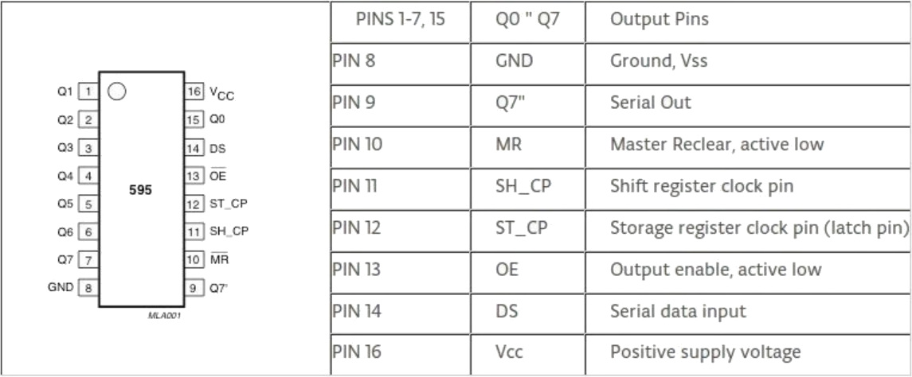
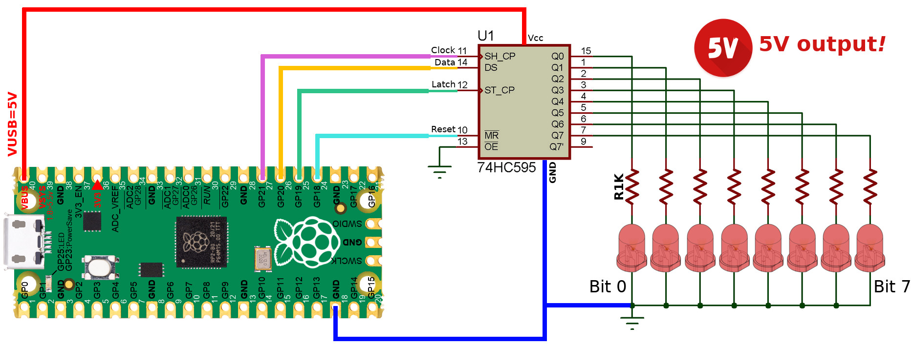
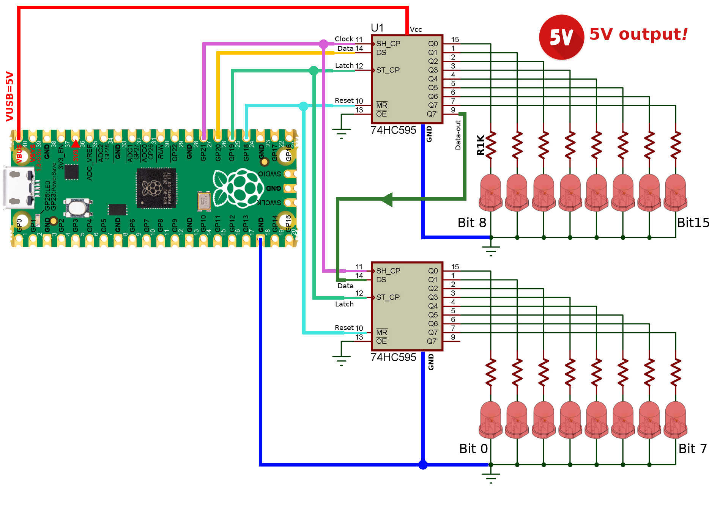
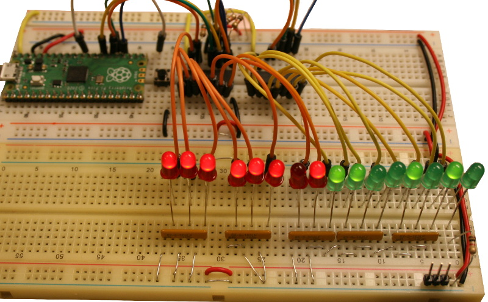

[This file also exists in ENGLISH](readme_ENG.md)

# Utiliser un registre à décalage 74HC595 sous MicroPython

Ce type de composant est très pratique pour transformer des données série vers une sortie parallèle.

Les 74HC595 peuvent également être chaînés pour obtenir une sortie parallèle en multiple de 8bits.



Le 74HC595 peut également être utilisé pour ajouter des sorties complémentaires sur un projet microcontrôleur.


# Bibliothèque

 Cette bibliothèque doit être copiée sur la carte MicroPython avant d'utiliser les exemples.

 Sur une plateforme connectée:

 ```
 >>> import mip
 >>> mip.install("github:mchobby/esp8266-upy/74HC595")
 ```

 Ou via l'utilitaire mpremote :

 ```
 mpremote mip install github:mchobby/esp8266-upy/74HC595
 ```

# Brancher

## Brancher sur Pico

Avec une simple 74HC595 offrant 8 bits.



Avec une double 74HC595 offrant 16 bits.



# Tester

## write_byte

L'exemple le plus simple [write_byte.py](examples/write_byte.py) consiste à envoyer 8 bits (un octet ou un _byte_) sur registre à décalage.

``` python
from sn74hc595 import ShiftReg
from machine import Pin

# broches Data, Clock, Latch, Reset
reg = ShiftReg( Pin(20), Pin(21), Pin(19), Pin(18)  )
# Allume une LED sur deux
reg.write_byte( 0b01010101 )
# Reinitialisation du buffer 74HC595 + mise-à-jour des sortie
reg.reset( latch=True ) #
```

## write_word

L'exemple [write_word.py](examples/write_word.py) à envoyer 16 bits (deux octet) dans le bon ordre pour en afficher le contenu sur deux 74HC565 chaînés ensembles.

``` python
from sn74hc595 import ShiftReg
from machine import Pin

reg = ShiftReg( Pin(20), Pin(21), Pin(19), Pin(18)  )
# écrit une valeur 16bits en MSBF (Most Significatif Bit First)
# Allumera les LED dans cet ordre 1111110111001010 (bit 15 a gauche, bit 0 à droite)
reg.write_word( 0xFDCA )
```

Ce qui produit le résultat suivant



## write_bytes

L'exemple [write_bytes.py](examples/write_bytes.py) permet d'envoyer un nombre arbitraire d'octets (multiples de 8bits) vers une chaine de 74HC595.
