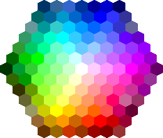

[Ce fichier existe également en FRANCAIS](readme.md)

# Color library

This library groups tools (function, list, etc) reharding color manipulation related to RGB888 color format

Do not hesitate to browse the libraries and ressources for more information.

# Library

The library must be copied on the MicroPython board before using the examples.

On a WiFi capable plateform:

```
>>> import mip
>>> mip.install("github:mchobby/esp8266-upy/COLORS")
```

Or via the mpremote utility :

```
mpremote mip install github:mchobby/esp8266-upy/COLORS
```

# Source of inspiration

## W3School Color Picker

Works will be done around the wonderful W3School color picker available @ [www.w3schools.com/colors/colors_picker.asp](https://www.w3schools.com/colors/colors_picker.asp)


