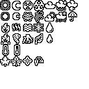
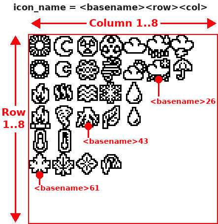

# Icones 1bit pixel art

Ce répertoire conteint des ressouces/icones pouvant être utilisé dans vos propres projets.

Ces ressources (souvent des images) seront seront converties en fichiers Python et pourrons être dessinés avec la bibliothèque {{fname|icontls.py}} .

## Les ressources 

Les ressources des icones on été collecté sur itch.io et stockés sous leur forme originale dans un sous-répertoire. Le sous répertoire contient un fichier texte contenant une description, URL source, la licence, etc.

Exemples:

* mystery-icons
* one-bit-dog-puppy
* one-bit pixel-icons
* one-bit-prison
* one-bit-space-arcade
* one-bit-tileset
* ...

Les icones sont généralement disponibles sous forme d'image regroupant plusieurs icones:

__Remarque:__ Toutes les icones sélectionnée sont libre d'usage.

## Fichier icones PBM

PBM signifie _Portable Bit Map_ et est utilisé pour encoder des images en deux couleurs (1 bit par pixel). Les fichiers convertits au format PBM sont stockés dans le répertoire __sub-folder.bpm__ .

MicroPython peut lire un fichier PBM en utilisant la [bibliothèque FILEFORMAT](https://github.com/mchobby/esp8266-upy/tree/master/FILEFORMAT) . Cette bibliothèque peut ouvrir l'image et en transférer le contenu vers le FrameBuffer d'un afficheur. Ce qu'il y a de bien avec la bibliothèque FILEFORMAT c'est la classe __ClipReader__ permettant la __selection d'une zone__ dans l'image avant de copier son contenu vers le FrameBuffer de destination. Exactement ce dont nous avons besoin pour copier une icone.

## Fichier icones en Python

Les ressources originales sont __converties__ en leur représentation python en utilisant des scripts.

Les fichiers Python résultant sont stockés dans le __sous-répertoire.lib__ .

Les icones sont automatiquement nommées en fonction de leur position dans l'image ressource originale.

__Recommandation:__ Etant donné que les scripts Python générés peuvent être très long (ex: 63Ko pour les icones logicielles), il est préférable de copier/coller, dans votre projet, les définitions qui vous intéressent. cela évitera de surcharger la mémoire avec une opération de parsing et le stockage de définition qui ne seront pas utilisée.

__Par exemple:__ l'image [one-bit-pixel-icons/Icons_Weather.png](one-bit-pixel-icons/Icons_Weather.png) sera converti en icones stockés dans le script [one-bit-pixel-icons.lib/iweather.py](one-bit-pixel-icons.lib/iweather.py)

## Outils de conversion
__Les fichiers pbm binaires__ sont créés à l'aide du programme Gimp.

__Les icones sont créée__ à l'aide de script Python tel que {{fname|convert-to-fbgfx-icon.py}}. Ce script découpe l'image en icone et crée le fichier python cuble.

Le processus de conversion est prit en charge par le script shell nommé [generate.sh](generate.sh) . 