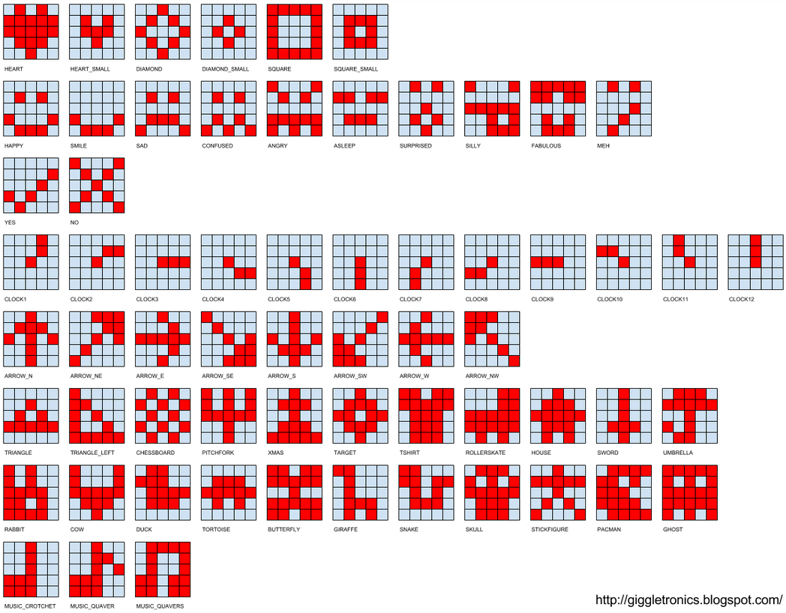

[This file also exists in ENGLISH](readme_ENG.md)

# FrameBuffer GFX - Utilitaires pour FrameBuffer
Cette section contient des classes et exemples permettant manipuler le contenu de FrameBuffer.

* __[fbutil.py](lib/fbutil.py)__ :  circle, fill_circle, oval, fill_oval, rrect, fill_rrect, etc. Exemple: [ici](https://github.com/mchobby/esp8266-upy/tree/master/ili934x/examples/fbutil)
* __[icons.py](lib/icons.py)__ :  définition d'icone du Micro:bit en 5x5 (provient du projet sense-hat).
* __[icons8.py](lib/icons8.py)__ :  définition d'icone style Micro:bit en 8x8 pixels.
* __[icontls.py](lib/icontls.py)__ : Quelques fonctions pour dessiner une icone dans un FramBuffer (pour afficheurs), dans un terminal ou retourner les points True/False de l'icone sous forme de listes.

# Bibliothèque

Cette bibliothèque doit être copiée sur la carte MicroPython avant d'utiliser les exemples.

Sur une plateforme connectée:
```
>>> import mip
>>> mip.install("github:mchobby/esp8266-upy/FBGFX")
```

Ou via l'utilitaire `mpremote` :
```
mpremote mip install github:mchobby/esp8266-upy/FBGFX
```

# Tester fbutil

Voir [les exemples disponibles pour le pilote ili934x](https://github.com/mchobby/esp8266-upy/tree/master/ili934x/examples/fbutil) .

# Tester les icons

Les fichiers d'icones sont:
* [icons.py](lib/icons.py) : Icones 5x5 pixels identiques au Micro:bit
* [icons8.py](lib/icons8.py) : Icones 8x8 pixels (similaires au Micro:bit)


Le graphique ci-dessous permet d'identifier le nom des icones





Les exemples [view_icons8.py](examples/view_icons8.py) et [list_icons8.py](examples/list_icons8.py) permettent respectivement d'afficher les icones sur la console et d'inspecter les données sous forme de de liste.


Voici le contenu du script  `view_icons8.py`

``` python
""" affiche toutesles icones disponibles dans icons8.py sur la session REPL """
from icons8 import all_icons
from icontls import icon_as_text

for icon in all_icons:
	for line in icon_as_text( icon ):
		print( line )
	print( '' )
	print( '' )
	print( '' )
```

Et le résultat qu'il produit lorsqu'il est exécuté:

```
MicroPython v1.14 on 2021-02-05; Raspberry Pi Pico with RP2040
Type "help()" for more information.
>>>
>>> import view_icons8
  *  *  
 ******
********
********
 ******
  ****  
   **   
    *   


  *  *  
 ******
 ******
  ****  
   **   
    *   


   **   
  *  *  
 *    *
*      *
*      *
 *    *
  *  *  
   **   

...
```

Il est aussi possible d'inspecter le contenu d'une icone sous forme de liste de valeurs booléennes.

```
MicroPython v1.14 on 2021-02-05; Raspberry Pi Pico with RP2040
Type "help()" for more information.
>>>
>>> from icons8 import GHOST
>>> from icontls import icon_as_list
>>> icon_as_list( GHOST )
[[False, True, True, True, True, True, True, False], [False, True, False, True, True, False, True, False], [True, True, False, True, True, False, True, True], [True, True, True, True, True, True, True, True], [True, True, True, True, True, True, True, True], [True, True, True, True, True, True, True, True], [True, False, True, False, False, True, False, True], [True, False, True, False, False, True, False, True]]
>>>
>>> from icontls import icon_as_text
>>> icon_as_text( GHOST )
[' ****** ', ' * ** * ', '** ** **', '********', '********', '********', '* *  * *', '* *  * *']
>>> for line in icon_as_text( GHOST ):
...     print( line )
...
 ******
 * ** *
** ** **
********
********
********
* *  * *
* *  * *
```

# Afficher dans un FrameBuffer

De nombreux pilotes d'écrans suivent les recommandations officielles de MicroPython en exploitant l'API FrameBuffer de MicroPython.


Voici un exemple de code affichant le PacMan sur un écran OLED 128x64 ([voyez ce tutoriel sur le pilote SSD1306](https://github.com/mchobby/esp8266-upy/tree/master/oled-ssd1306#code-de-test)).

``` python
from machine import Pin, I2C
i2c = I2C( sda=Pin(4), scl=Pin(5) )
import ssd1306
lcd = ssd1306.SSD1306_I2C( 128, 32, i2c )

from icontls import draw_icon
from icons5 import PACMAN
# Dessine PacMan dans le Framebuffer du OLED
# a partir de x=2, y=5 avec la couleur 1
# (monochrome C=0->noir, C=1->Blanc)
draw_icon( lcd, PACMAN, 2, 5, 1 )
```


A noter qu'il est également possible d'utiliser la fonction `draw_icon()` avec des couleurs 16bits (sous forme d'entier 16 bits). La valeur de la couleur est communiquée telle quelle à l'API FrameBuffer.
