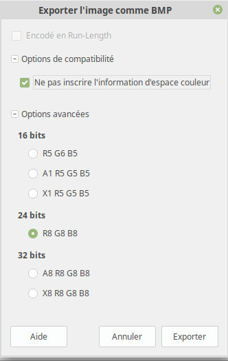
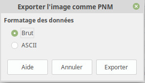
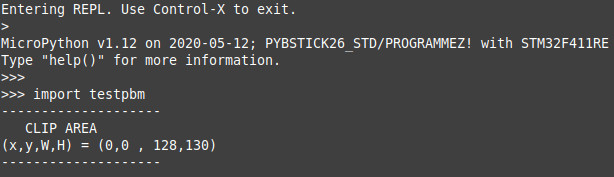
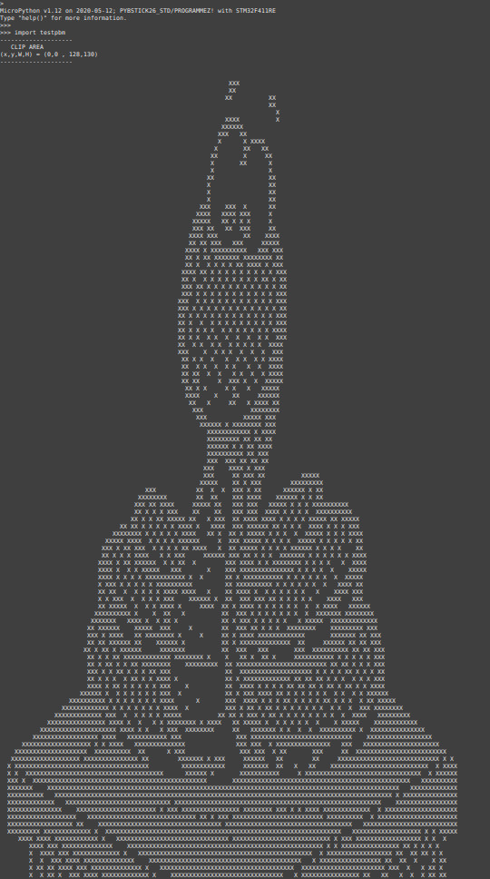
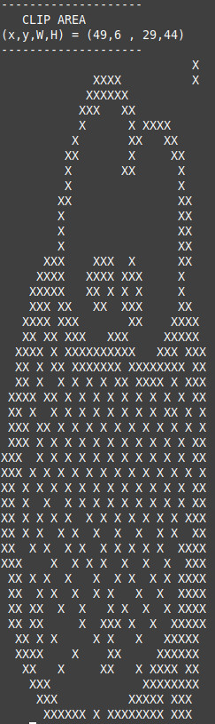
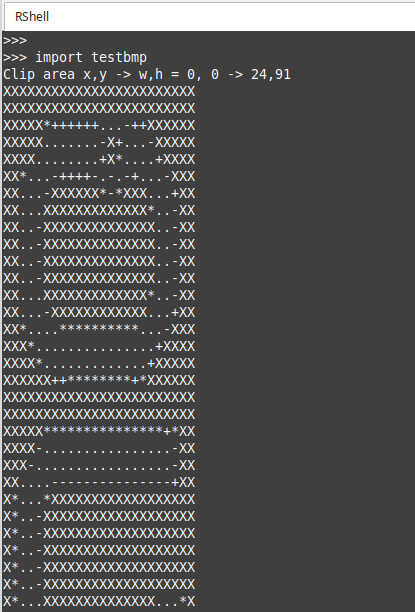

[This file also exists in ENGLISH](readme_ENG.md)

# Support de format de fichiers pour MicroPython
Cette section contient des classes et exemples permettant de lire différents format.

Ces outils sont basés sur le principe du READER qui déplace un curseur dans un fichier afin de ne lire QUE l'information nécessaire.

Cela évite de charger le fichier en mémorie et de saturer celle-ci (un avantage sur MicroContrôleur).

En contrepartie, cela impique aussi plus d'accès fichiers et plus de transfert octet par octet (et donc un code moins performant).

# Bibliothèque

Cette bibliothèque doit être copiée sur la carte MicroPython avant d'utiliser les exemples.

Sur une plateforme connectée:

```
>>> import mip
>>> mip.install("github:mchobby/esp8266-upy/FILEFORMAT")
```

Ou via l'utilitaire mpremote :

```
mpremote mip install github:mchobby/esp8266-upy/FILEFORMAT
```


# IMAGES (format supportés)

## Le format bmp
BMP est le format d'image Bitmap de Windows qui couvre une grande variété d'encodage (Bits par couleur, couleurs indexée ou pas, compression ou pas, etc).
Cette bibliothèque supporte le format BMP encodé en RGB888 (24 bits par Pixel).

Le format RGB888 doit être sauvé avec la configuration suivante (cfr Gimp):



La classe `BmpReader` de `imglib/bmp.py` peut lire un fichier bitmap (pour autant qu'il n'est pas compressé!).

Fichiers d'exempels
* [color-palette.bmp](examples/color-palette.bmp): Exemple d'image 24 bits non compressée.<br /> 
* [olimex.bmp](examples/olimex.bmp): Exemple d'image 24 bits non compressée.<br /> 

Voir l'exemple [testbmp.py](examples/testbmp.py) qui indique comment utiliser le `BmpReader`, `ClipReader` et l'outil `open_image()` pour lire les données d'un fichier bmp.

``` python
from img import open_image

# open_image() retourne un objet ClipReader
clip = open_image( 'olimex.bmp' )
clip.show() # Affiche sous format texte dans la console

# Sélectionner un zone sur l'image (clipping)
clip.clip( 2,2,20,16 ) # x,y, w, h
# Afficher les informations des pixels
for y in range( clip.height ):
	print( "--- Clip Line %i ---------" % y )
	for x in range( clip.width ):
		print( "(%i,%i) : %s" % (x,y,clip.read_pix()) ) #x,y, couleur
clip.close()
```

Ressources:
* [bmp_file_format @ www.ece.ualberta.ca](http://www.ece.ualberta.ca/~elliott/ee552/studentAppNotes/2003_w/misc/bmp_file_format/bmp_file_format.htm) de Nathan Liesch


## Le format PBM (Portable Bit Map)
Le format PBM permet d'encoder des images en 2 couleurs (1 bit, noir/blanc). Il existe au format texte (plus verbeux) et binaire (plus compacte).

Créer un fichier PBM est très facile en utilisant Gimp. Charger une image puis sélectionner le menu `Fichier | Exporter comme...` puis nommer le fichier avec l'extension `.pbm`. __Pas besoin de faire traitement des couleurs, Gimp applique automatiquement un filtre pour dégrader une image couleur en noir et blanc__.

Juste avant la sauver le fichier Gimp demande de sélectionner le format à utiliser.

Sélectionnez simplement l'option RAW (format Brute) :




La bibliothèque `imglib/pbm.py` expose la classe `PbmReader` permettant de lire un tel fichier. Voyez l'exemple [examples/mpy.pbm](examples/mpy.pbm) visible ci-dessous (converti en Jpeg pour le rendre visible).


Le script d'exemple [testpbm.py](examples/testpbm.py) charge le fichier `mpy.pbm` depuis le système de fichier puis en affiche le contenu dans la console.

``` python
from img import open_image

reader = open_image( 'mpy.pbm' )
reader.show() # Affiche la zone de clipping  --> toute l'image
```





L'exemple contient également une opération de clipping pour sélectionner la tête du serpent dans l'image... puis afficher le contenu de cette zone dans la console.

``` python
from img import open_image

reader = open_image( 'mpy.pbm' )
# reader.show() Exemple ci-dessus

# Selectionner la tete du serpent
reader.clip( 49,6, 29, 44 ) # x, y, w, h
reader.show()
```



L'exemple [testpbmlcd.py](examples/testpbmlcd.py) charge les 128*64 premiers pixels de l'image [mpy.pbm](examples/mpy.pbm) sur un afficheur LCD (en passant par le FrameBuffer du LCD).

Plus d'information sur le montage dans le dépôt [esp8266-upy/lcdspi-lcd12864](https://github.com/mchobby/esp8266-upy/tree/master/lcdspi-lcd12864/lib)

``` python
from machine import SPI, Pin
from lcd12864 import SPI_LCD12864
from img import open_image
import time

# PYBStick: S19=mosi, S23=sck, S26=/ss
cs = Pin( 'S26', Pin.OUT, value=0 )
spi = SPI( 1 )
spi.init( polarity=0, phase=1 )

lcd = SPI_LCD12864( spi=spi, cs=cs )


def color_transform( rgb ):
	# Transformer la couleur du clipreader (rgb) vers la couleur du FrameBuffer de
	# destination (l'afficheur LCD -> 2 coleurs)
	return 0 if rgb==(0,0,0) else 1

reader = open_image( 'mpy.pbm' )
# Selection la partie de l'image (à la taille du LCD)
reader.clip(0,0,lcd.width,lcd.height)
# Copier la section Clipée dans le FrameBuffer du LCD à partir de sa coordonnée
# 0,0 et pour la taille du clipping (largeur,hauteur)
reader.copy_to(lcd, 0,0, color_transform )
lcd.update()
```


Ressource:
* http://netpbm.sourceforge.net/doc/pbm.html
* https://en.wikipedia.org/wiki/Netpbm#PBM_example

# IMAGE bibliothèque helper (img)
La bibliothèque `imglib/img.py` contient des classes et fonctions outils.

## open_image()

La fonction helper `open_image()` identifie le type d'image sur base de l'extension de fichier. Cette fonction instancie la classe `Reader` appropriée  et l'encapsule dans un `ClipReader` pour bénéficier des possibilités de clipping (découpage), lecture de pixel et copie dans un FrameBuffer.

* `.bmp` : classe `BmpReader`
* `.pbm` : classe `PbmReader`

## Autre fonctions

* `grayscale( r,g,b )` : Calcule un niveau de gris (0..232) depuis une couleur RGB888, un tuple (r,g,b).
* `charpix( r,g,b )` : tire un caractère parmi (' ', '.' '-', '+', '*', 'X') correspondant à la couleur RGB888 du tuple (r,g,b) . La couleur est d'abord dégradée eb niveau de gris avant la conversion.

## Classe ClipReader

La classe `ClipReader` offre un service de clipping sur une image (pour extraire une sous-section d'une image). Elle s'appuie sur l'une des classes de lecture `xxxReader`.

Cette classe est pratique pour afficher une petite portion d'une grande image sur un afficheur LCD/OLED/TFT ;-)

* `ClipReader.clip( self, x, y, width, height )` : permet de faire une sélection de zone (clipping area) sur l'image pour la lecture des pixels. Modifie les propriétés `height` et `width` .


* `ClipReader.read_pix( pos=None )` : permet de lire le prochain pixel dans la zone de clipping avec un retour automatique de ligne en ligne. La méthode retourne un tuple (r,g,b) RGB888 tel que renvoyé par le Reader. Si `pos` contient un tuple (x,y) le curseur est déplacé au pixel x,y dans la zone de clipping avant la lecture de la valeur du pixel.

* `ClipReader.copy_to( self, target_fb, x,y, color_fn )` : permet de copier la zone de clipping vers le FrameBuffer `target_fb`. La copie est insérée dans `target_fb` à partir de sa coordonnées x,y . La fonction `color_fn( rgb_tuple )` passée en paramètre lors de l'appel permet de transformer le tuple (r,g,b) en valeur numérique à insérer dans le FrameBuffer de destination.

* `ClipReader.show()` : permet d'inspecter le contenu du clipping dans le terminal (image au format texte, très pratique pour le débogage)!


