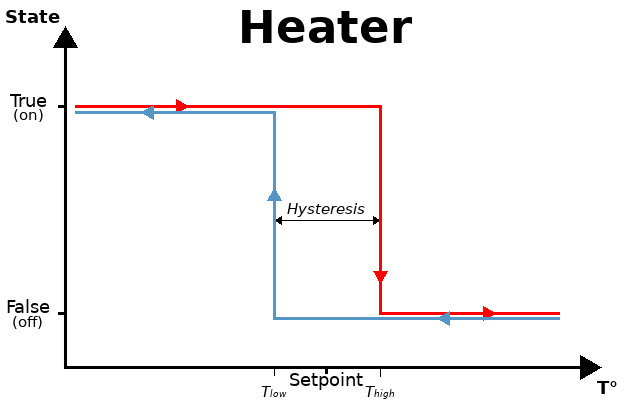
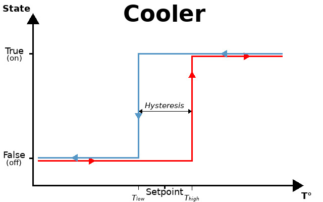

[This file also exists in ENGLISH](hyst_readme_ENG.md)

# Bibliothèques Hysteresis

La bibliothèque [hyst.py](lib/hyst.py) propose des classes permettant d'implémenter facilement des processus avec cycle d'hystéresis comme le sont les thermostats.

Un cycle d'hystéreris présente un consigne (_setpoint_) et une valeur d'hystéresis (_hysteresis_) autour ce cette consigne. 

Le cycle retourne soit un état __actif__ (On, High, state=True) ou un état __inactif__ (off, Low, state=False) en fonction du parcours sur le cycle.

Les classes proposées sont les suivantes:

* [HeatherTh](lib/hyst.py) - gestion d'un cycle de chauffage.
* [CoolerTh](lib/hyst.py) - gestion d'un cycle de refroidissement/ventilation.

Bien que les deux classes soient simplement l'opposée l'une de l'autre, il est plus commode d'identifier l'état d'un cycle de refroidissement comme "Cooler.state" que "not Heater.state"

# Thermostat de chauffage
La classe __HeaterTh__ suit le cycle d'hystersis suivant:



L'exemple [test-heater.py](examples/hyst/test-heater.py) permet de simuler un cycle de température et vérifier l'état de sortie de la classe __HeatherTh__ .

``` python
from hyst import HeaterTh

# Create a temperature cycle
tcycle = [i for i in range(10,31)] + [i for i in range(31,9,-1)]

# Create a Thermostat set on 22°C with an Hysteresis of 2.5°C (-1.25°C to +1.25°C)
thermostat = HeaterTh( 22, 2.5 ) 

print( "--- SetPoint %f -------------------------------" % thermostat.setpoint )
for temp in tcycle:
	state = thermostat.update( temp )
	print( "[%s] at %i°C heater is %s" % (thermostat.setpoint, temp, "ON" if state else 'off') )


thermostat.setpoint = 25.6
print( "--- SetPoint %f -------------------------------" % thermostat.setpoint )
for temp in tcycle:
	state = thermostat.update( temp )
	print( "[%s] at %i°C heater is %s" % (thermostat.setpoint, temp, "ON" if state else 'off') )
```

ce qui produit le résultat suivant:

``` 
--- SetPoint 22.000000 -------------------------------
[22] at 10°C heater is ON
[22] at 11°C heater is ON
[22] at 12°C heater is ON
[22] at 13°C heater is ON
[22] at 14°C heater is ON
[22] at 15°C heater is ON
[22] at 16°C heater is ON
[22] at 17°C heater is ON
[22] at 18°C heater is ON
[22] at 19°C heater is ON
[22] at 20°C heater is ON
[22] at 21°C heater is ON
[22] at 22°C heater is ON
[22] at 23°C heater is ON
[22] at 24°C heater is off
[22] at 25°C heater is off
[22] at 26°C heater is off
[22] at 27°C heater is off
[22] at 28°C heater is off
[22] at 29°C heater is off
[22] at 30°C heater is off
[22] at 31°C heater is off
[22] at 30°C heater is off
[22] at 29°C heater is off
[22] at 28°C heater is off
[22] at 27°C heater is off
[22] at 26°C heater is off
[22] at 25°C heater is off
[22] at 24°C heater is off
[22] at 23°C heater is off
[22] at 22°C heater is off
[22] at 21°C heater is off
[22] at 20°C heater is ON
[22] at 19°C heater is ON
[22] at 18°C heater is ON
[22] at 17°C heater is ON
[22] at 16°C heater is ON
[22] at 15°C heater is ON
[22] at 14°C heater is ON
[22] at 13°C heater is ON
[22] at 12°C heater is ON
[22] at 11°C heater is ON
[22] at 10°C heater is ON
--- SetPoint 25.600000 -------------------------------
[25.6] at 10°C heater is ON
[25.6] at 11°C heater is ON
[25.6] at 12°C heater is ON
[25.6] at 13°C heater is ON
[25.6] at 14°C heater is ON
[25.6] at 15°C heater is ON
[25.6] at 16°C heater is ON
[25.6] at 17°C heater is ON
[25.6] at 18°C heater is ON
[25.6] at 19°C heater is ON
[25.6] at 20°C heater is ON
[25.6] at 21°C heater is ON
[25.6] at 22°C heater is ON
[25.6] at 23°C heater is ON
[25.6] at 24°C heater is ON
[25.6] at 25°C heater is ON
[25.6] at 26°C heater is ON
[25.6] at 27°C heater is off
[25.6] at 28°C heater is off
[25.6] at 29°C heater is off
[25.6] at 30°C heater is off
[25.6] at 31°C heater is off
[25.6] at 30°C heater is off
[25.6] at 29°C heater is off
[25.6] at 28°C heater is off
[25.6] at 27°C heater is off
[25.6] at 26°C heater is off
[25.6] at 25°C heater is off
[25.6] at 24°C heater is ON
[25.6] at 23°C heater is ON
[25.6] at 22°C heater is ON
[25.6] at 21°C heater is ON
[25.6] at 20°C heater is ON
[25.6] at 19°C heater is ON
[25.6] at 18°C heater is ON
[25.6] at 17°C heater is ON
[25.6] at 16°C heater is ON
[25.6] at 15°C heater is ON
[25.6] at 14°C heater is ON
[25.6] at 13°C heater is ON
[25.6] at 12°C heater is ON
[25.6] at 11°C heater is ON
[25.6] at 10°C heater is ON
```

# Thermostat de ventilation/refroidissement
La classe __CoolerTh__ suit le cycle d'hystersis suivant:



L'exemple [test-cooler.py](examples/hyst/test-cooler.py) permet de simuler un cycle de température et vérifier l'état de sortie de la classe __CoolerTh__ .
