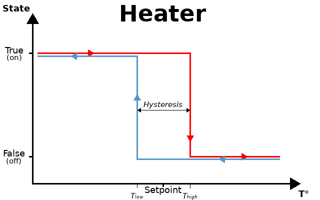
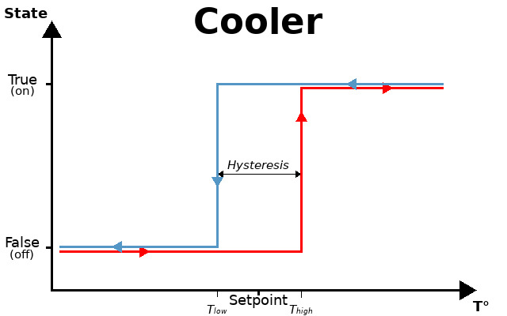

[Ce fichier existe aussi en FRANCAIS](hyst_readme.md)

# Hysteresis library

The [hyst.py](lib/hyst.py) library offers the possibility to write an hysteresis based process (eg: heater thermostat).

An hysteresis cycle do have a _setpoint_ and an _hysteresis_ value (around the setpoint). 

The hysteresis cycle do returns an __active__ state (On, High, state=True) or an __inactive__ state (off, Low, state=False) depending on the position on the hysteresis cycle.

The availables classes are the following:

* [HeatherTh](lib/hyst.py) - handle a heating cycle.
* [CoolerTh](lib/hyst.py) - handle a cooling/ventilation cycle.

Note: the both class are the opposite of the each-other. However, it is more easy to read "Cooler.state" (for a cooling cycle) instead of "not Heater.state"

# Heater Thermostat
The __HeaterTh__ class follows the following cycle:



The [test-heater.py](examples/hyst/test-heater.py) example do simulate a temperature cycling while checking the class __HeatherTh__ output.

``` python
from hyst import HeaterTh

# Create a temperature cycle
tcycle = [i for i in range(10,31)] + [i for i in range(31,9,-1)]

# Create a Thermostat set on 22°C with an Hysteresis of 2.5°C (-1.25°C to +1.25°C)
thermostat = HeaterTh( 22, 2.5 ) 

print( "--- SetPoint %f -------------------------------" % thermostat.setpoint )
for temp in tcycle:
	state = thermostat.update( temp )
	print( "[%s] at %i°C heater is %s" % (thermostat.setpoint, temp, "ON" if state else 'off') )


thermostat.setpoint = 25.6
print( "--- SetPoint %f -------------------------------" % thermostat.setpoint )
for temp in tcycle:
	state = thermostat.update( temp )
	print( "[%s] at %i°C heater is %s" % (thermostat.setpoint, temp, "ON" if state else 'off') )
```

Which produce the result here below:

``` 
--- SetPoint 22.000000 -------------------------------
[22] at 10°C heater is ON
[22] at 11°C heater is ON
[22] at 12°C heater is ON
[22] at 13°C heater is ON
[22] at 14°C heater is ON
[22] at 15°C heater is ON
[22] at 16°C heater is ON
[22] at 17°C heater is ON
[22] at 18°C heater is ON
[22] at 19°C heater is ON
[22] at 20°C heater is ON
[22] at 21°C heater is ON
[22] at 22°C heater is ON
[22] at 23°C heater is ON
[22] at 24°C heater is off
[22] at 25°C heater is off
[22] at 26°C heater is off
[22] at 27°C heater is off
[22] at 28°C heater is off
[22] at 29°C heater is off
[22] at 30°C heater is off
[22] at 31°C heater is off
[22] at 30°C heater is off
[22] at 29°C heater is off
[22] at 28°C heater is off
[22] at 27°C heater is off
[22] at 26°C heater is off
[22] at 25°C heater is off
[22] at 24°C heater is off
[22] at 23°C heater is off
[22] at 22°C heater is off
[22] at 21°C heater is off
[22] at 20°C heater is ON
[22] at 19°C heater is ON
[22] at 18°C heater is ON
[22] at 17°C heater is ON
[22] at 16°C heater is ON
[22] at 15°C heater is ON
[22] at 14°C heater is ON
[22] at 13°C heater is ON
[22] at 12°C heater is ON
[22] at 11°C heater is ON
[22] at 10°C heater is ON
--- SetPoint 25.600000 -------------------------------
[25.6] at 10°C heater is ON
[25.6] at 11°C heater is ON
[25.6] at 12°C heater is ON
[25.6] at 13°C heater is ON
[25.6] at 14°C heater is ON
[25.6] at 15°C heater is ON
[25.6] at 16°C heater is ON
[25.6] at 17°C heater is ON
[25.6] at 18°C heater is ON
[25.6] at 19°C heater is ON
[25.6] at 20°C heater is ON
[25.6] at 21°C heater is ON
[25.6] at 22°C heater is ON
[25.6] at 23°C heater is ON
[25.6] at 24°C heater is ON
[25.6] at 25°C heater is ON
[25.6] at 26°C heater is ON
[25.6] at 27°C heater is off
[25.6] at 28°C heater is off
[25.6] at 29°C heater is off
[25.6] at 30°C heater is off
[25.6] at 31°C heater is off
[25.6] at 30°C heater is off
[25.6] at 29°C heater is off
[25.6] at 28°C heater is off
[25.6] at 27°C heater is off
[25.6] at 26°C heater is off
[25.6] at 25°C heater is off
[25.6] at 24°C heater is ON
[25.6] at 23°C heater is ON
[25.6] at 22°C heater is ON
[25.6] at 21°C heater is ON
[25.6] at 20°C heater is ON
[25.6] at 19°C heater is ON
[25.6] at 18°C heater is ON
[25.6] at 17°C heater is ON
[25.6] at 16°C heater is ON
[25.6] at 15°C heater is ON
[25.6] at 14°C heater is ON
[25.6] at 13°C heater is ON
[25.6] at 12°C heater is ON
[25.6] at 11°C heater is ON
[25.6] at 10°C heater is ON
```

# Cooling/ventilation thermostat
The __CoolerTh__ class follows the hysteresis cycle here below:



The [test-cooler.py](examples/hyst/test-cooler.py) example do simulate a temperature cycle while checking the class __CoolerTh__ output.