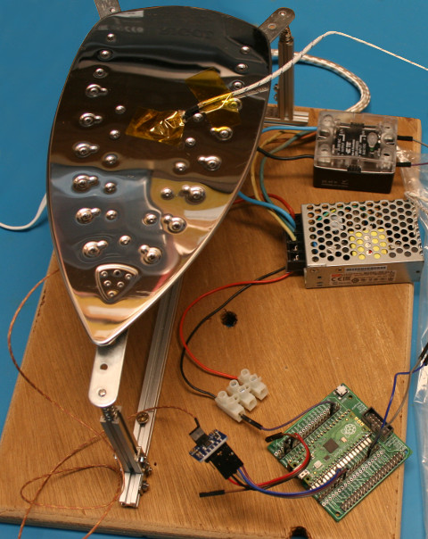
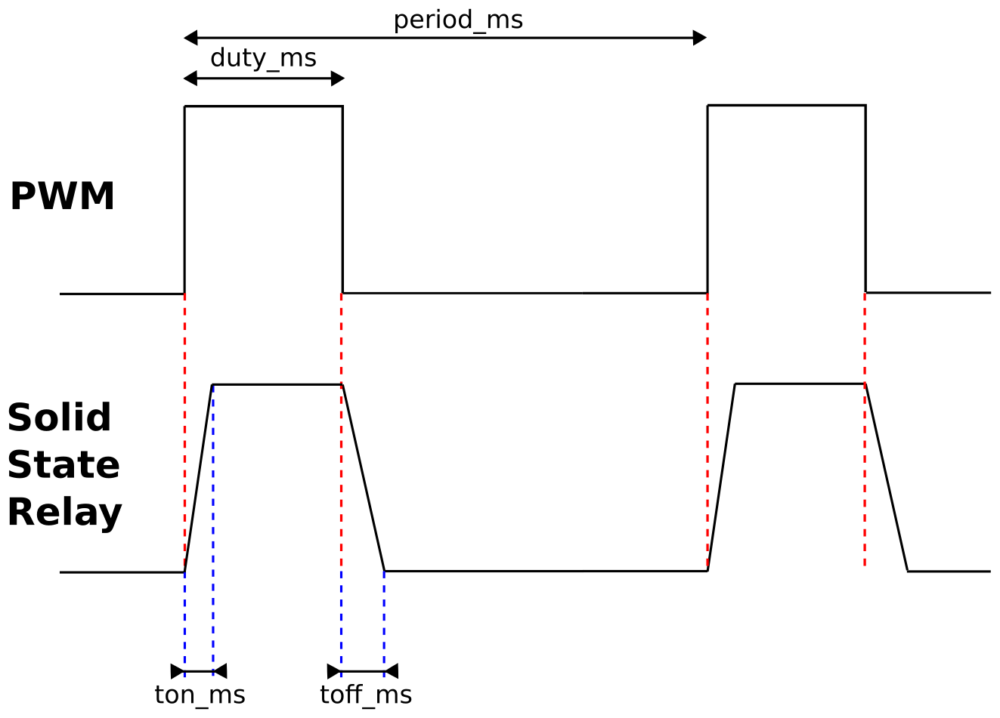

[This file also exists in ENGLISH](readme_ENG.md)

# Low Frequency PWM - simuler un signal PWM sur un signal très basse fréquence (ou grande période)

Lorque l'on pilote un périphérique avec forte inertie comme un Fer à repasser, un chauffage, une plaque chauffante alors il est assez usuel d'utiliser un relais/contacteur/SSR (Solid State Relay).

De telles interfaces ne peuvent pas être pilotés avec un signal PWM habituels parce que cela détruirait le relais/SSR à cause de la haute fréquence du signal (500 Hz).

N'importe quel fréquence de signal supérieur à 1 Hertz n'est pas recommandé dans un tel cas.

Grâce à la grande inertie du périphérique contrôlé, utiliser une très basse fréquence PWM (< 1 Hertz, donc période > 1 sec) n'a pas d'effet négatif sur le la stabilisation de la température et reste compatible avec l'usage de relais statique (Solid State Relay).

Malheureusement, les routines de contrôle PWM n'acceptent aps de basse frequence (ex: inférieur à 7 Hertz pour le RaspberryPi Pico). Nous allons donc devoir faire preuve d'imagination!

# Cas pratique

Pour le [projet plancha-cms](https://arduino103.blogspot.com/search?q=plancha) (plaque de soudure par refusion), un fer à repasser est utilisé comme élément chauffant.



Prévoir une période de 2 secondes pour le contrôle du fer a repasser est un choix raisonnable.

Ce choix semble raisonnable pour les raisons suivantes:
* L'inertie thermique: la base en alliage/métal a besoin d'un certain temps pour propager la chaleur.
* Le relais statique: ayant une activation/désativation toutes les deux secondes est acceptable (en fonction des specs SSR).
* Il est possible de fixer librement un cycle utile de 0 à 100% durant une période de 2 secondes... ce qui devrait permettre un bon contrôle sur de la chaleur du fer)

# Comment fonctionne le PWM basse fréquence?

La bibliothèque [lfpwm.py](lib/lfpwm.py) et la classe `LowFreqPWM` utilisent un Timer à 100 Hertz pour générer le PWM basse fréquence avec une routine de gestion de compteur en python, routine appelées à intervalle régulier.

La classe `LowFreqPWM` peut gérer un PWM ayant une période de plusieurs secondes (donc <1 Hz) avec un cycle utile de 0 à 100% (voir `duty_u16()` ).

Le paramètre de configuration est la __période__ en secondes (converti en millisecondes) en lieu et place de la __fréquence__ . La période offre une valeur plus facile à lire qu'une petite valeur de fréquence.



Dans le monde réel, les transistions ne sont pas instantanées. Un SSR (_Solid State Relay_ = Relais Statique) à besoin de 8.3ms pour s'activer (`ton_ms=9` ms) et de 10 ms pour s'éteindre (`toff_ms=10` ms). Nous devons garder cela en compte pour éviter un stress excessif de l'élément commutateur. Les périphériques à forte inertie consomme généralement beaucoup de puissance, ce qui représente un stress non négligeable pour le relais statique (le relais SSR). Il est donc recommandé d'en tenir compte.

Ce qui amène à la considération de deux conditions complémentaires:

__Case 1:__ Garder le signal à HAUT si le PWM doit passer au niveau bas trop près de la fin de période
* IF `duty_ms` >= `period_ms - toff_ms` THEN `duty_ms = period_ms` # Garder actif (ON)

__Case 2:__ Garder le signal à BAS si le PWM s'active + désactive trop vite en début de période
* IF `duty_ms` < `ton_ms + toff_ms` THEN `duty_ms = 0` # Garder éteint (Keeps )OFF)

# Brancher
Pas besoin de réaliser des branchement, c'est la LED utilisateur interne de la plateforme qui sera utilisée comme broche de sortie de `LowFreqPWM`.

* Sur Raspberry-Pi Pico la LED utilisateur est raccordée sur la broche 25.

# Test

Avant d'exploiter les scripts de test, il est nécessaire de copier la bibliothèque [lfpwm.py](lib/lfpwm.py) sur votre carte MicroPython.

L'exemple [test.py](examples/lfpwm/test.py), visible ci-dessous, définit un signal PWM avec une période de 2.5 secondes (soit 0.4 Hertz) et un cycle utile de 50%.

Comme le cycle utile est fixé avec la méthode `duty_u16(valeur)`, la valeur est comprise entre 0..65535. La valeur 65535/2 = 32767 (arrondi à l'entier) correspond au cycle utile de 50%.

``` python
from lfpwm import LowFreqPWM
from machine import Pin
from os import uname

# LED utilisateur sur le Pico
led = Pin( 25 )

# Activer le PWM
pwm = LowFreqPWM( pin=led, period=2.5 ) # 2.5s

pwm.duty_u16( 65535 / 2 ) # 50% de cycle utile
# pwm.duty_u16( 0 )     # désactiver la broche
# pwm.duty_u16( 65535 ) # activer la broche
# pwm.deinit()          # désactive le Timer
```

Prenez le temps de vérifier les exemples suivants:
* [test_ton.py](examples/lfpwm/test_ton.py) - gère le temps d'activation et désactivation du périphérique
* [test_ratio.py](examples/lfpwm/test_ratio.py) - contrôle du cycle utile avec une valeur entre 0 et 100
