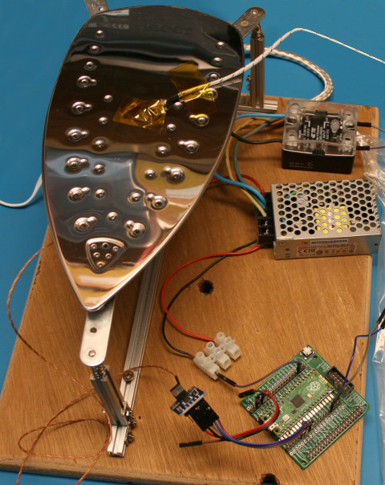

[Ce fichier existe également en FRANCAIS](lfpwm_readme.md)

# Low Frequency PWM - simulate PWM over a long period of time

When driving devices with high inertia like Iron, Heater, Boiler Plate you are using relay/contactor/SSR (Solid State Relay).

Such interface cannot be driven with Usual PWM signal because it will destroy the relay/SSR due the high switching frequency (500 Hz).

Anything with a frequency higher than 1 Hertz freq is not recommanded in such case.

Because of the High inertia of the controled device, using very low PWM frequency (< 1 Hertz, so a period > 1 sec) doesn't matter and is compatible with Solid State Relay usage.

However, microcontoler PWM routine doesn't accept low frequencies (eg: lower than 7 Hertz for RaspberryPi Pico) so we will have to hack!

# UseCase

For the [plancha-cms project](https://arduino103.blogspot.com/search?q=plancha) (Hot Plate for reflow soldering), we did use an Iron as heater.



Planning a 2 seconds period time as base to control the Iron heater is a raisonnable choice.

This looks appropriate for the following reasons:
* the thermal inertia: the iron metal base takes time to propagate the heat.
* the Solid State Relay: having a switch on/off every 2 seconds is acceptable according the SSR specs.
* We can have a duty cycle from 0 to 100% during that period of 2 seconds... which should offer a great control over the Iron heater)

# How Low Frequency PWM works

The [lfpwm.py](lib/lfpwm.py) library and `LowFreqPWM` do use a timer @ 100 Hertz to generate a low frequency PWM with an extra counter managed in python by the callback routine of the time.

The `LowFreqPWM` class can handle PWM periods of several seconds (<1 Hz) with a duty cycle from 0 to 100% (see `duty_u16()` ).

The period of severals seconds (converted in milliseconds) is used to instead of frequency because it will offer more readable value (than extra small frequency values).


In real world conditions, the transitions are not instantaneous. The SSR (Solid State Relay) do need 8.3ms to switch on (`ton_ms=9` ms) and 10 ms to switch off (`toff_ms=10` ms). We have to keep this in account to avoids excessive switching stress. High inertia devices often consume lot of power, which will stress the the high power swicher (the SSR relay in this case). It is recommended to take it into account.

This bring on two additionnals running conditions:

__Case 1:__ Keeps ON if PWM switching off too close from the end of period
* IF `duty_ms` >= `period_ms - toff_ms` THEN `duty_ms = period_ms` # Keeps ON

__Case 2:__ Keeps OFF if PWM switch on + off too close from the begin of the period
* IF `duty_ms` < `ton_ms + toff_ms` then `duty_ms = 0` # Keeps OFF

# Wiring
We will not use any wiring here, just using the internal user LED of the plateform as output pin for the `LowFreqPWM`.

* On Raspberry-Pi Pico the user LED is wired to pin 25.

# Test

Before using the testing script, we must copy the [lfpwm.py](lib/lfpwm.py) to your micropython board.

The example [test.py](examples/lfpwm/test.py), visible here below, just defined a PWM signal with a period of 2.5 seconds (so 0.4 Hertz) and a duty cycle of 50%.

As the duty cycle is set with the method `duty_u16(value)` with value in the range 0..65535, 50% of duty cycle match 65535/2 = 32767 (value must be rounded to integer).

``` python
from lfpwm import LowFreqPWM
from machine import Pin
from os import uname

# User LED on Pico
led = Pin( 25 )

# Setup pwm
pwm = LowFreqPWM( pin=led, period=2.5 ) # 2.5s

pwm.duty_u16( 65535 / 2 ) # 50% duty cycle
# pwm.duty_u16( 0 ) # always Off
# pwm.duty_u16( 65535 ) # always On
# pwm.deinit() # stop everything
```

Take some time to check the other examples:
* [test_ton.py](examples/lfpwm/test_ton.py) - keeps activation time & deactivation time into account
* [test_ratio.py](examples/lfpwm/test_ratio.py) - control the duty cycle with a value between 0 and 100
