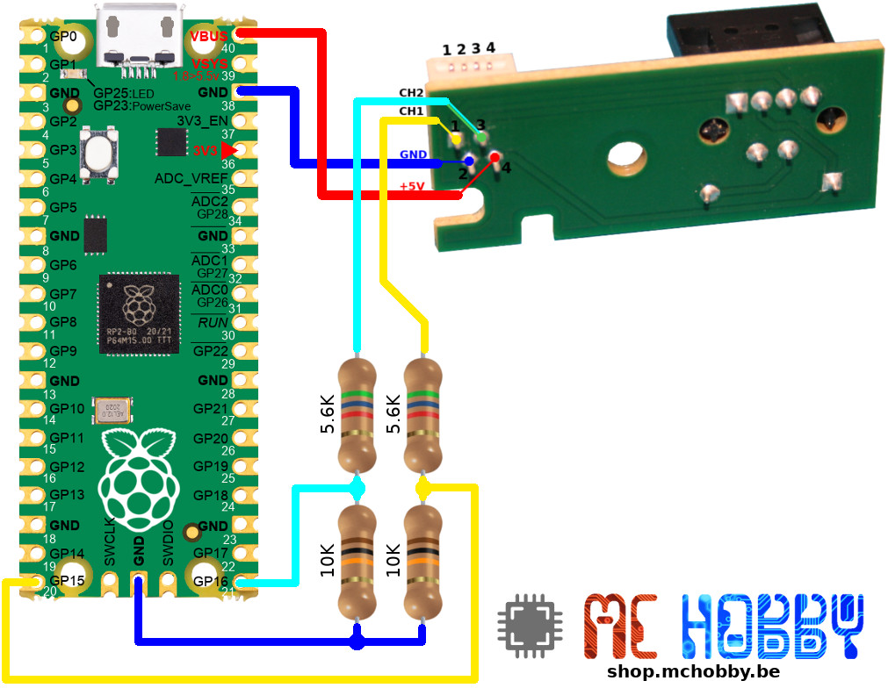
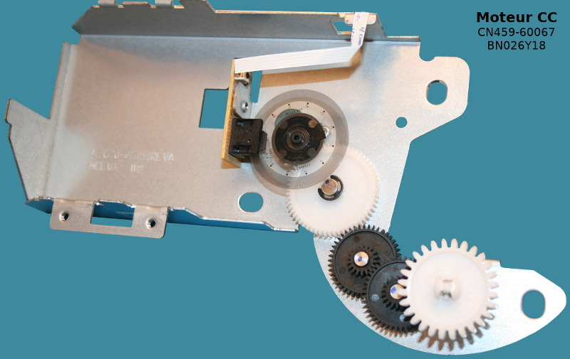
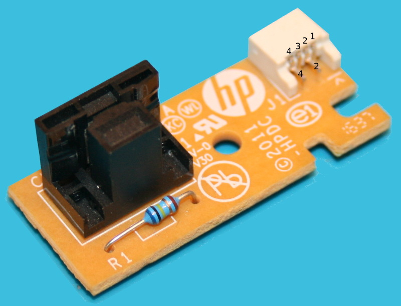
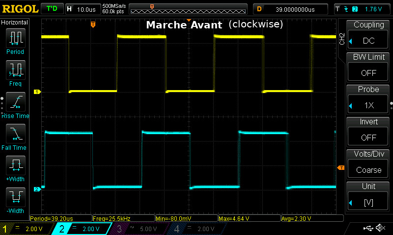
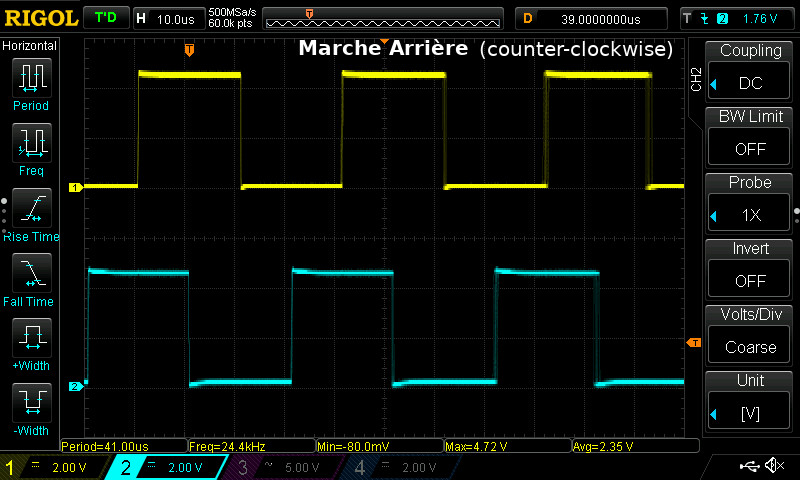

[This file also exists in ENGLISH](rp2lib_readme_ENG.md)

# Bibliothèques pour RP2 - bibliothèques spécifiques pour les microcontrôleurs RP2040, RP2350, etc

Les bibliothèques proposées dans cette section propose des fonctionnalités basées sur PIO (Programmable Input Output) pour les microcontroleurs RP2.

* [rp2cnt.py](rp2lib/rp2cnt.py) - conmptage du nombre d'impulsion (flan montant) d'un signal sur une broche.
* [rp2qenc.py](rp2lib/rp2qenc.py) - compteur pour encodeur a quadrature (compte positivement / compte négativement suivant le sens de rotation).

# rp2cnt - compteur d'impulsion
Cette bibliothèque permet de relever le nombre d'impulsions (flan montant) réceptionnée sur une broche.

## Crédit
Cette bibliothèque est le résultat de ce [fil de discussion suivant paru sur MicroPython.org](https://forum.micropython.org/viewtopic.php?t=9828).

## Brancher
cet exemple utilise le même raccordement que pour l'encodeur a quadrature (voir rp2qenc ci-dessous) mais __se limite au seul GP16__ .



## Tester
Voici le code de l'exemple [test_rp2cnt_motor.py](examples/rp2lib/test_rp2cnt_motor.py) qui compte le nombre d'impulsion réceptionné sur la broche GP16. Cet exemple affiche également l'écoulement du temps en ms.

``` python
from machine import Pin
from rp2cnt import PulseCounter
import time

pin16 = Pin(16, Pin.IN, Pin.PULL_UP)
pc = PulseCounter(0, pin16)

start = time.ticks_ms()
while True:
	ms = time.ticks_diff( time.ticks_ms(), start )
	print( "%8i ms ==> Pulses: %5i" % (ms,pc. get_pulse_count())  )
	time.sleep_ms( 100 )
```

# rp2qenc - compteur pour encodeur à quadrature

L'image ci-dessous présente un moteur continu équipé d'un disque optique et d'un encoodeur à quadrature (encodeur optique, comme dans les souris).


L'encodeur à quadrature se présente comme suit:
* Une LED émettrice
* Deux sorties présentant les impulsions (avec un décalage=déphasage permettant de détecter le sens de rotation du disque).



Ce qui produit les signaux suivants selon le sens de rotation:





## Crédit
Basé sur ce [fil de discussion MicroPython suivant](https://forum.micropython.org/viewtopic.php?t=12277).

## Brancher sur un Pico


## Tester
Voici le code de l'exemple [test_rp2qenc_motor.py](examples/rp2lib/test_rp2qenc_motor.py). Simple et efficace. 

__A noter que le code PIO utilise presque la totalité de la mémoire disponible. Il n'est donc pas possible d'avoir deux encodeur à quadrature sur un seul Pico RP2040.__

``` python
from machine import Pin
from time import sleep_ms
from rp2qenc import PIO_QENC

pinA = Pin(15, Pin.IN, Pin.PULL_UP)
pinB = Pin(16, Pin.IN, Pin.PULL_UP)

qenc = PIO_QENC(0, (pinA, pinB))
print('starting....')
for i in range(120):
    print('iter %3i : Quadrature value = %i' % (i,qenc.read()) )
    sleep_ms(500)
qenc.sm_qenc.active(0)
print('stop')
```