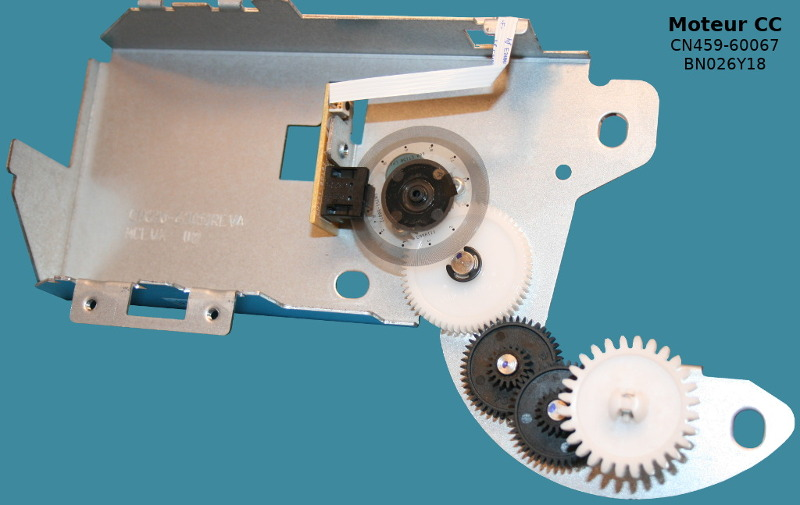

[Ce fichier existe également en FRANCAIS](rp2lib_readme.md)

# RP2 libraries - specific libraries for Raspberry-Pi MCU like RP2040, RP2350, etc

The libraries in this section offers features based on PIO (Programmable Input Output) for the RP2 microcontroler.

* [rp2cnt.py](rp2lib/rp2cnt.py) - pulse counter (rising edge) for a signal sent an input pin.
* [rp2qenc.py](rp2lib/rp2qenc.py) - quadrature encoder counter (add / substract counter value depending on the rotation direction).

# rp2cnt - pulse counter
That library is used to count the pulses sent to an input pin (rising edge only).

## Credit
This library results of the following [discussion thread on MicroPython.org](https://forum.micropython.org/viewtopic.php?t=9828).

## Wiring
This example uses the same wiring than quadrature encoder decoding (see rp2qenc here below) but __only uses GP17 pin__ .


## Test
See below the [test_rp2cnt_motor.py](examples/rp2lib/test_rp2cnt_motor.py) example code who's count the number of pulse received on the GP16 pin. This example also displays the elapsed time (in ms).

``` python
from machine import Pin
from rp2cnt import PulseCounter
import time

pin16 = Pin(16, Pin.IN, Pin.PULL_UP)
pc = PulseCounter(0, pin16)

start = time.ticks_ms()
while True:
	ms = time.ticks_diff( time.ticks_ms(), start )
	print( "%8i ms ==> Pulses: %5i" % (ms,pc. get_pulse_count())  )
	time.sleep_ms( 100 )
```

# rp2qenc - quadrature encoder

The image here below show a DC motor fitted with optical disk and LED based quadrature encoder (same principle as computer mouse).


The quadrature encoder is composed as follows:
* A ligh emitting diode (LED).
* Two output for output pulses (with phase shifting depending on the direction of rotation).


Which produce the following signals when the disk is rotating (600 pulses per rotation):


## Credit
Based on the [following discussion thread on MicroPython.org](https://forum.micropython.org/viewtopic.php?t=12277).

## Wire to Pico RP2040


## Test
Here below the content of the example code [test_rp2qenc_motor.py](examples/rp2lib/test_rp2qenc_motor.py). Efficient and simple. 

__Please note that PIO code is using almost all the memory instruction available. You cannot have two quadrature encoder onto a single Pico RP2040.__

``` python
from machine import Pin
from time import sleep_ms
from rp2qenc import PIO_QENC

pinA = Pin(15, Pin.IN, Pin.PULL_UP)
pinB = Pin(16, Pin.IN, Pin.PULL_UP)

qenc = PIO_QENC(0, (pinA, pinB))
print('starting....')
for i in range(120):
    print('iter %3i : Quadrature value = %i' % (i,qenc.read()) )
    sleep_ms(500)
qenc.sm_qenc.active(0)
print('stop')
```