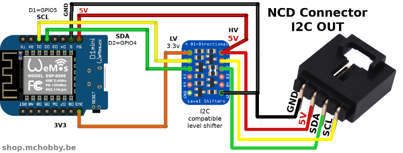
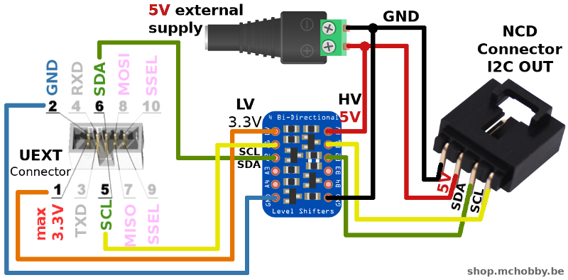

[This file also exists in ENGLISH here](readme_eng.md)

# Qu'est ce que l'écosystème NCD  / National Control Device ?

([National Control Device](https://store.ncd.io)) a créé de nombreuses cartes capteurs I2C (nommée "_I2C Mini Board_" ou mini carte I2C) exploitant un connecteur standardisé à 4 broches et utilisant une __alimentation 5V__ et __logique 5V__.


Utiliser une interface standardisée sur une __grande variété de carte__ (comme Arduino, Raspberry, Feather, WiPy, LoPy, etc) et carte capteur est absolument génial! Ce facilite la prototypage et le développement de solutions personnalisées sans la difficulté d'avoir à disposer de connaissances en électronique ou en soudure (NCD maintien également un GitHub communautaire avec du code pour Arduino, C, Python, ...).


# Connecteur NCD
Pour connecter une mini carte I2C de NCD, vous aurez besoin d'un connecteur NCD (connecteur de sortie I2C) et fils de raccordement.


NCD dispose déjà de nombreuses cartes adaptateur [disponibles ici](https://store.ncd.io/shop/?fwp_product_type=adapters) mais nous pouvons également créer nos propres branchement vers d'autres cartes de développement (comme suggéré ci-dessous).

# Connecteur NCD pour Feather ESP8266

La plateforme Feather ESP8266 utilise une logique en 3V et ne dispose pas de régulateur de tension 5V. Il fonctionne uniquement avec des sorties 3.3V, ce qui est ennuyant puisque NCD requière une logique 5 Volts.

NCD propose un adaptateur pour Feather ([voir ici](https://store.ncd.io/product/feather-i2c-shield-for-particle-and-feather-modules/)) mais nous pouvons également créer notre raccordement.

La broche 5V du Feather n'offre une alimentation 5V uniquement lorsque la plateforme est branchées sur une source USB. Un [régulateur DC/DC step-up/down](https://shop.mchobby.be/fr/regulateurs/463-regul-5v-500ma-step-updown-s7v7f5-3232100004634-pololu.html) peut également être utilisé pour fournir la tension 5V sur le connecteur NCD (depuis la broche BAT du Feather).


## Créer le bus I2C

L'instance du bus I2C peut être créé avec le code suivant

```
from machine import Pin, I2C
i2c = I2C( sda=Pin(4), scl=Pin(5) )
```

# Connecteur NCD sur un Wemos D1
Le Wemos D1 est l'une des plateformes ESP8266 les plus populaires. Sauf erreur, il n'y a pas encode de carte adaptateur pour le Wemos D1.



## Créer le bus I2C

L'instance du bus I2C peut être créé à l'aide du code suivant

```
from machine import Pin, I2C
i2c = I2C( sda=Pin(4), scl=Pin(5) )
```

# Connecteur NCD pour ESP8266-EVB

Sur un ESP8266 d'Olimex [ESP8266-EVB](https://wiki.mchobby.be/index.php?title=ESP8266-DEV), le bus I2C est en 3.3v et déjà connecté sur le connecteur UEXT.

De nombreux produits Olimex (incluant l' ESP8266-EVB) expose le connecteur standard UEXT (une autre solution de connexion intéressante).


Ce connecteur UEXT en logique 3.3V doit être adapté vers un niveau logique 5V à l'aide d'un _level shifter_. Le connecteur NCD doit également être alimenté avec une source de tension 5V externe.



## Créer le bus I2C

L'instance de bus I2C peut être créé à l'aide du code suivant:

```
from machine import Pin, I2C

i2c = I2C( sda=Pin(6), scl=Pin(5) )
```

# Connecteur NCD pour carte MicroPython Pyboard

Voir l'interface de sur le GitHub [pyboard-driver/NCD](https://github.com/mchobby/pyboard-driver/tree/master/NCD) pour brancher des cartes NCD sur la Pyboard Pyboard.

Les codes d'exemple des capteurs NCD disponibles sur le présent dépôt fonctionneront également sur une Pyboard.
