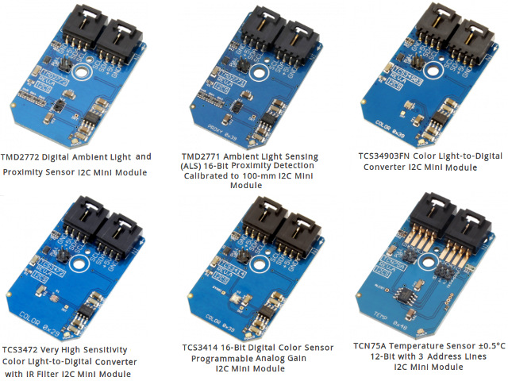
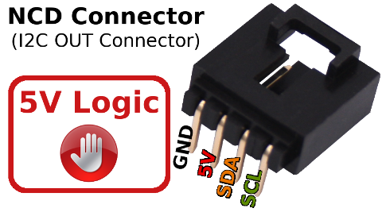
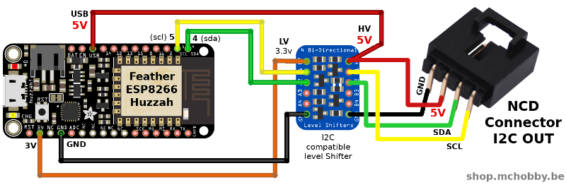

[Ce fichier existe également en FRANCAIS ici](readme.md)

# What is NCD  / National Control Device ecosystem ?

([National Control Device](https://store.ncd.io)) created a lot of I2C sensor boards (namely "I2C Mini Board") featuring a standardized 4 pins connectors and using 5V logic for signal an Power.



Using such standarized interface on a __wide variety of board__ (Arduino, Raspberry, Feather, WiPy, LoPy, etc) and sensor boards are really great! It helps prototyping and development of custom solution without the hardness of being skilled in electronics and soldering (NCD also maintain a community GitHub with code for Arduino, C, Python, ...).


# NCD connector

So, to connect NCD I2C mini boards, you will needs an NCD Connector (I2C output connector) and the wires.



NCD already have of lot of adapter boards [available here](https://store.ncd.io/shop/?fwp_product_type=adapters) but we can also design wiring for other development plateforms (as suggested here under).

# NCD Connector for Feather ESP8266

The ESP8266 Feather plateform uses 3V logic and doesn't have 5V regulator. It only works with 3.3V output which is ennoying since the NCD requires 5 Volt logic.

NCD already propose a Feather adapter board ([see here](https://store.ncd.io/product/feather-i2c-shield-for-particle-and-feather-modules/)) but you can also make your own wiring.

5V pin only supplies 5V output when the plateform is plugged on USB source. A [step-up/down DC/DC regulator](https://shop.mchobby.be/fr/regulateurs/463-regul-5v-500ma-step-updown-s7v7f5-3232100004634-pololu.html) can also be used to supply the NCD 5V from the feather BAT pin.



## Create the I2C bus

The I2C bus instance can be created with the following code

```
from machine import Pin, I2C
i2c = I2C( sda=Pin(4), scl=Pin(5) )
```

# NCD Connector for Wemos D1

The Wemos D1 is one of the most popular ESP8266 plateform. As far we know, NCD doesn't have adapter board for that plateform.


## Create the I2C bus

The I2C bus instance can be created with the following code

```
from machine import Pin, I2C
i2c = I2C( sda=Pin(4), scl=Pin(5) )
```

# NCD Connector for ESP8266-EVB

On the Olimex's [ESP8266-EVB](https://wiki.mchobby.be/index.php?title=ESP8266-DEV) the 3.3V I2C bus is already wired on the UEXT connector.

The lot of Olimex's products (including the ESP8266-EVB) exposes the standard UEXT connector (another great solution).


This 3.3V logic level connector must be adapted with a level shifter to 5V logic level. The NCD must also been feed with an external 5V power source.


## Create the I2C bus

The I2C bus instance can be created with the following code

```
from machine import Pin, I2C

i2c = I2C( sda=Pin(6), scl=Pin(5) )
```

# NCD Connector for MicroPython Pyboard

See our [pyboard-driver/NCD](https://github.com/mchobby/pyboard-driver/tree/master/NCD) friend GitHub for NCD wiring to the Pyboard.

The code of NCD sensors available in this repository will also perfectly works with the MicroPython Pyboard.
