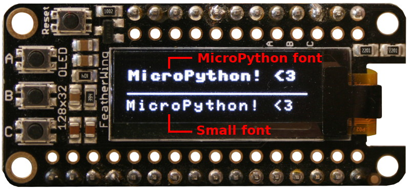

[This file also exists in ENGLISH](readme_ENG.md)

# Une font plus légère pour le FramBuffer MicroPython



MicroPython dispose d'une classe `FrameBuffer` utilisée avec les pilotes d'écran (OLED, TFT, etc).

La classe `FrameBuffer` permet de dessiner des formes géométriques et du texte.

Cependant la font par défaut de MicroPython est un peu "grasse", ce qui n'est pas toujours très esthétique pour dessiner du texte.

Il y a deux options pour utiliser une autre font:
* __SMALL-FONT__ : __le présent projet__ permet d'écrire du texte en utilisant une font nettement plus compacte (projet issu du [portage du pilote st7687s](https://github.com/mchobby/esp8266-upy/tree/master/st7687s) ).
* __FreeType-Generator__ : [un projet alternatif](https://github.com/mchobby/freetype-generator) permettant de créer un fichier binaire pour charger une font sous MicroPython. Fichier exploité avec la classe FontDrawer pour dessiner le texte dans un FrameBuffer.

# Bibliothèque

Cette bibliothèque doit être copiée sur la carte MicroPython avant d'utiliser les exemples.

Sur une plateforme connectée:

```
>>> import mip
>>> mip.install("github:mchobby/esp8266-upy/SMALL-FONT")
```

Ou via l'utilitaire mpremote :

```
mpremote mip install github:mchobby/esp8266-upy/SMALL-FONT
```

# Utiliser

Le projet SMALL-FONT est principalement constitué de la classe `FontDrawer` dans le fichier [lib/sfont.py](lib/sfont.py) .

La classe `FontDrawer` prend un `FrameBuffer` en paramètre, il est donc compatible avec tous les pilotes graphiques exploitant un FrameBuffer sans pour autant limiter les possibilités du pilote d'origine.

En guise d'exemple, c'est un [écran OLED exploitant le pilote SSD1306 officiel de MicroPython.org tel que décrit ici](https://github.com/mchobby/esp8266-upy/tree/master/oled-ssd1306).

L'exemple [test_oled_i2c.py](examples/test_oled_i2c.py), repris ci-dessous, indique comment exploiter SMALL-FONT sur un afficheur héritant de `FrameBuffer` .

1. Il faut créer une instance de FontDrawer en passant le FrameBuffer de l'afficheur en paramètre.
2. Ensuite, les appels sur la méthode __text() du FontDrawer__ dessine le text souhaité dans le FrameBuffer de l'afficheur.  

``` python
from machine import Pin, I2C
import time
import ssd1306
from sfont import FontDrawer

i2c = I2C( sda=Pin(23), scl=Pin(22) ) # ESP32
# i2c = I2C( sda=Pin(4), scl=Pin(5) ) # ESP8266

lcd = ssd1306.SSD1306_I2C( 128, 32, i2c )
fd = FontDrawer( lcd, font_color=1, bgcolor=0 )

# Drawing with MicroPython font
lcd.text( "MicroPython! <3", 0, 0 )

# Standard FrameBuffer Drawing (horizontal line)
lcd.hline( 0, 16, 128, 1 ) #x,y, width, color

# Print with small font (use the font drawer)
fd.text( "MicroPython! <3", 0, 20 )

lcd.show()  # display / Afficher!
```
Ce qui produit le résultat suivant:


