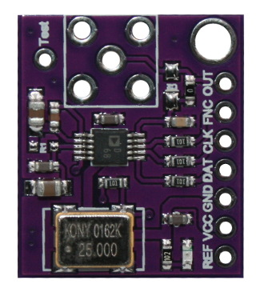
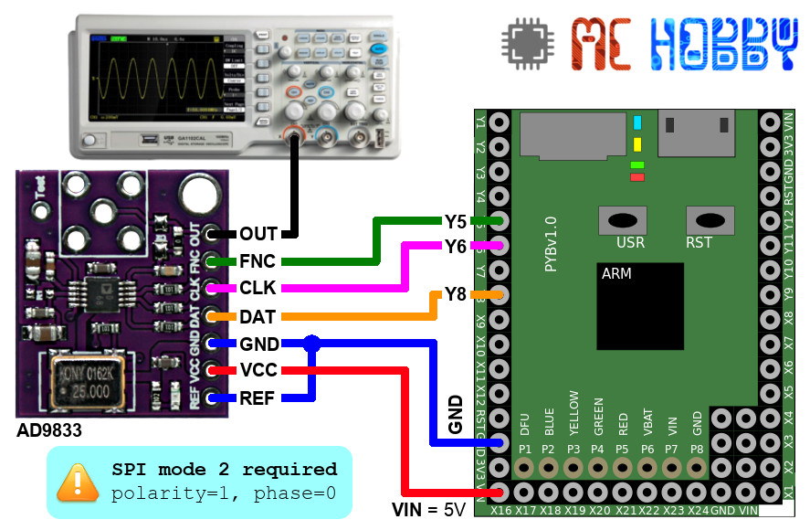
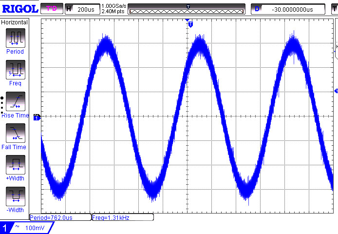

[Ce fichier existe également en FRANCAIS ici](readme.md)

# Using a AD9833 to generate sinusoide and triangle signal with your MicroPython board

The AD9833 is a signal generator used to create a sinusoide, clock, triangle waveform up to 12.5 Mhz (with a 25 MHz cristal) with a 28 bits values.

The AD9833 also support phase shifting from 0 to 2*Pi (with value between 0 and 4096).



The frequency resolution for 28 bits is 12.500.000 / 268.435.455 = 0.06556 Hertz

The AD9833 generates a signal with a voltage of 0.6 Vpp (peak to peak).

For more information, please check this [product sheet](http://shop.mchobby.be/product.php?id_product=1689) .

# Wiring



__ATTENTION__ : bad quality connections (breadboard, bad quality wire) will drive you crazy! 

# Test it

The `ad9833.py` library is available in the /lib subfolder. That file must be made available on your MicroPython board prior to use the example code.

The `test.py` script test the main feature.

``` python
from machine import Pin, SPI

from ad9833 import *

# SPI must be initialized on mode 2 -> Polarity=1, Phase=0
spi = SPI(2, polarity=1, phase=0)
ssel = Pin( "Y5", Pin.OUT, value=1) # use /ss

# Default mclk=25000000 (25 MHz source clock) on most AD9833 board
gen = AD9833( spi, ssel)

# Initialise the AD9833 with 1.3KHz sine output, no phase shift
frequency0 = 1300 #  1.3 Khz
frequency1 = 50 #  50 Hz
phase      = 0 # No phase shift (0..4096)

# Suspend Output
gen.reset = True

# Configure Freq0
gen.select_register(0)
gen.mode = MODE_SINE
gen.freq = frequency0
gen.phase = phase

# Configure Freq1
gen.select_register(1)
gen.freq = frequency1
gen.phase = phase

# Activate output on Freq0
gen.select_register(0)
# Release signal to the output
gen.reset = False
```
Which produce the following result:



# Shopping list
* [AD9833 breakout - signal generator @ MC Hobby](http://shop.mchobby.be/product.php?id_product=1689)
