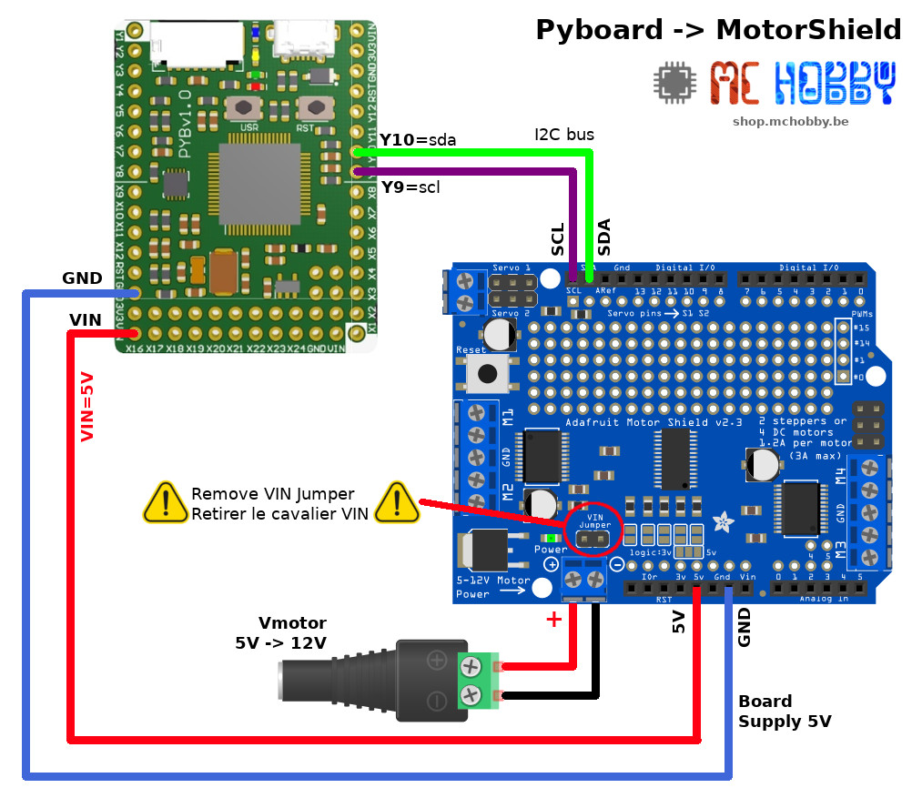
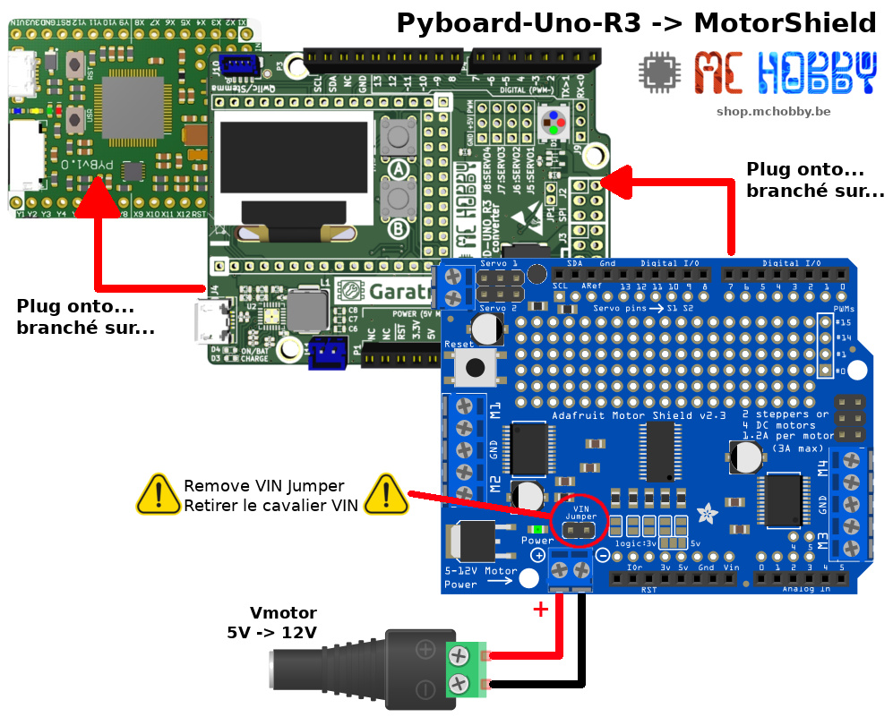
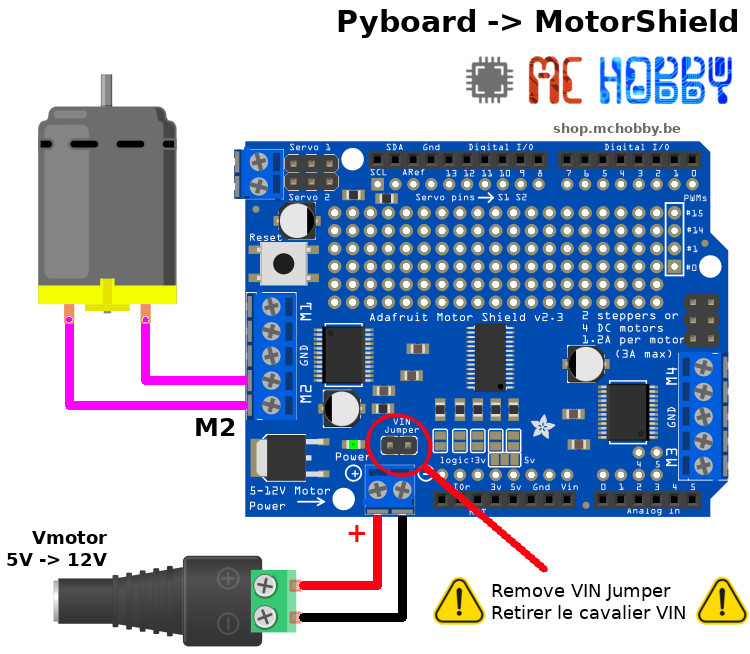
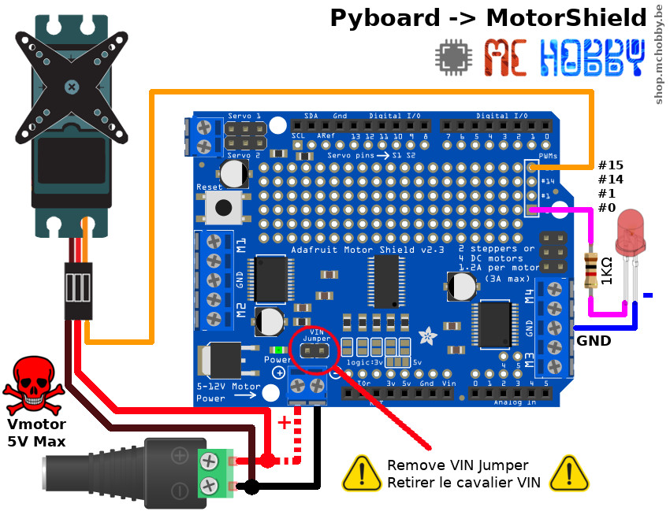

# Adafruit Motor Shield / Motor Wing support
Cette bibliothèque prend en charge le Motor Shield / Motor Wing d'Adafruit avec plusieurs plateformes MicroPython.

__STILL UNDER WRITING__

# Raccordement
La carte Motor Shield (ou Motor Wing) peut être utilisée avec plusieurs cartes microcontrôleur.

Ci-dessous les différents schémas de raccordement de la carte MotorShield sur différentes cartes MicroPython.

Les raccordements des différents moteurs sont repris dans la section test.

## Pyboard
Avec la Pyboard, il faut alimenter la logique du MotorShield et utiliser le bus I2C pour permettre les échanges d'information avec le shield Moteur.



## Pyboard-Uno-R3
Le motor shield peut être branché directement sur l'[adaptateur Pyboard-Uno-R3](https://shop.mchobby.be/fr/micropython/1745-adaptateur-pyboard-vers-uno-r3-extra-3232100017450.html) et utilisé en conjonction avec les [bibliothèques Pyboard-UNO-R3](https://github.com/mchobby/pyboard-driver/tree/master/UNO-R3).



# Tester
Pour pouvoir utiliser cette carte Breakout, il est nécessaire d'installer la bibliothèque sur la carte MicroPython en copiant les fichiers suivants:
* `xxxx.py`

## Moteur continu
Il est possible de brancher jusque 4 moteurs continu sur les ports M1, M2, M3, M4.



Voici comment prendre le contrôle du moteur M2.

```
from machine import I2C
from motorshield import MotorShield
from motorbase import FORWARD, BACKWARD, BRAKE, RELEASE
from time import sleep

# Pyboard& Pyboard-UNO-R3 - SDA=Y10, SCL=Y9
i2c = I2C(2)
sh = MotorShield( i2c )

motor = sh.get_motor(2) # Motor M2
try:
	motor.speed( 128 ) # Half speed
	motor.run( FORWARD )
	sleep( 2 )
	motor.speed( 255 ) # Full speed
	motor.run( BACKWARD )

	# Wait the user to stop the script
	# by Pressing Ctrl+C
	while True:
		sleep( 1 )
except KeyboardInterrupt:
	motor.run( RELEASE )
```

Voir aussi l'exemple `examples/motorshield/test_dcmotors.py` qui teste toutes les fonctionnalités sur tous les ports.

## Moteur pas-à-pas
Le contrôle d'un moteur pas-à-pas est relativement simple. Voici un exemple de base, d'autres sont décris plus bas.


```
from machine import I2C
from motorshield import MotorShield
from motorbase import SINGLE, DOUBLE, INTERLEAVE, MICROSTEP

# Pyboard & Pyboard-UNO-R3 - SDA=Y10, SCL=Y9
i2c = I2C(2)
sh = MotorShield( i2c )

# Stepper S1 (M1+M2)
stepper = sh.get_stepper( 200, 1 )
stepper.speed = 3
stepper.step( 200, dir=FORWARD, style=DOUBLE )
sleep( 2 )
stepper.step( 200, dir=BACKWARD, style=DOUBLE )
```

## test_steppers.py
L'exemple `examples/motorshield/test_steppers.py` teste les différents styles de contrôle du moteur pas-à-pas sur les sorties S1 (M1+M2) + S2 (M3+M4).

Les style de contrôle sont les suivants:
* SINGLE : une seule bobine activée (économie d'énergie)
* DOUBLE : double bobine activée (couple maximal)
* INTERLEAVE : 1/2 pas (meilleure précision)
* MICROSTEP : 1/16 de pas

La [vidéo Youtube suivante](https://youtu.be/mRv0d036vCg) permet de voir les 4 modes de fonctionnements.

Ce qui produit le résultat suivant dans la sortie REPL:

```
MicroPython v1.11-473-g86090de on 2019-11-15; PYBv1.1 with STM32F405RG
Type "help()" for more information.
>>> import test_steppers
Stepper S1
 +-> SINGLE coil activation for full turn (energy saving)
 +-> DOUBLE coil activation for full turn (stronger torque)
 +-> INTERLEAVE for half turn (more precise)
 +-> MICROSTEP 1/16 for half turn
 +-> RELEASE motor
Stepper S2
 +-> SINGLE coil activation for full turn (energy saving)
 +-> DOUBLE coil activation for full turn (stronger torque)
 +-> INTERLEAVE for half turn (more precise)
 +-> MICROSTEP 1/16 for half turn
 +-> RELEASE motor
>>>
```

## test_stepper_speed.py
L'exemple `examples/motorshield/test_stepper_speed.py` permet de modifier la vitesse de rotation du moteur en utilisant un potentiomètre comme consigne.

La vitesse de rotation est limitée par le débit maximum du bus I2C puisque l'avance de chaque pas fait suite à une communication I2C pour modifier l'état des broches.

Ce temps de communication n'est pas tenu en compte dans le calcul du RPM et que plus le rapport pas/sec augmente et plus le temps de communication I2C à de l'importance.

```
from machine import I2C
from motorshield import MotorShield
from motorbase import FORWARD, BACKWARD, SINGLE, DOUBLE
from pyb import ADC

# Pyboard & Pyboard-UNO-R3 - SDA=Y10, SCL=Y9
i2c = I2C(2)
sh = MotorShield( i2c )

def arduino_map(x, in_min, in_max, out_min, out_max):
    return int((x-in_min) * (out_max-out_min) / (in_max-in_min) + out_min)

adc = ADC('X19')

# Test the various speed for a stepper on the MotorShield
stepper = sh.get_stepper( 200, 1 )
while True:
	val = adc.read() # Value between 0 et 4095
	rpm = arduino_map( val, 0, 4095, 1, 100 )
	print( "%s RPM" % rpm )
	stepper.speed = rpm
	stepper.step( 40, dir=FORWARD, style=DOUBLE )
```

La [vidéo YouTube suivante](https://youtu.be/9pRrGbrzA4g) permet de voir le script en fonctionnement.

## Servo-Moteur et PWM

Le carte MotorShield expose 4 sorties PWM portant les libellés #15, #14, #1 et #0.
Ces sorties du PCA9685 peuvent être utilisées pour générer des signaux PWM et contrôler des servo moteurs.

Le graphique ci-dessous présente les deux cas d'utilisations (PWM et servo).

__ATTENTION:__ il ne fait jamais alimenter un servo-moteur avec une tension supérieure à 5 Volts (bien que normalement, 6V soit le maximum absolu).



Le script suivant permet de prendre le contrôle du servo-moteur branché sur la sortie #15

```
from machine import I2C
from motorshield import MotorShield
from time import sleep

# Pyboard & Pyboard-UNO-R3 - SDA=Y10, SCL=Y9
i2c = I2C(2)
sh = MotorShield( i2c, freq=50 )

servo = sh.get_servo( 15 )

servo.angle( 90 )
sleep( 2 )
servo.angle( 0 )
sleep( 2 )
servo.angle( 180 )
sleep( 2 )
servo.angle( 90 )
sleep( 2 )

servo.release() # libérer le servo
```

La [vidéo YouTube](https://youtu.be/jKfkatqdVW8) suivante présente le résultat obtenu.

__Note importante__: La fréquence PWM idéale pour la commande de servo moteur est de 50 Hertz (d'où le paramètre `freq=50` lors de la création de l'instance `MotorShield`). __La fréquence PWM par défaut du MotorShield  (500 Hz) est beaucoup trop elevée__ pour le contrôle de servo-moteur (peu de servos fonctionnerons correctement). Suivant la qualité de vos servo-moteurs, vous pourrez opter pour une fréquence PWM entre 100 et 300 Hz, ce qui est un bon compromis lorsque vous utilisez aussi des moteurs continu et moteurs pas-à-pas.

L'exemple ci-dessous montre comment prendre le contrôle des sorties PWMs.

```
from machine import I2C
from motorshield import MotorShield
from time import sleep

# Pyboard & Pyboard-UNO-R3 - SDA=Y10, SCL=Y9
i2c = I2C(2)
sh = MotorShield( i2c )

# PWM on output #0
pwm = sh.get_pwm( 0 )

# Signal HIGH
pwm.duty_percent( 100 )
sleep( 2 )
# Signal LOW
pwm.duty_percent( 0 )
sleep( 2 )
# Duty cycle @ 50%
pwm.duty_percent( 50 )
sleep( 2 )

# Duty cycle can be finely tuned with a value between 0 (LOW) and 4095 (HIGH)
# Duty cycle at 2866 (so 70%)
pwm.duty( 2866 )
sleep( 2 )

# Release PWM
pwm.duty( 0 ) # or duty_percent( 0 )
```

A noter que tous les appels des methodes `PWM` sont renvoyées vers la classe `PCA9685` en mentionnant la broche a utiliser.

# Crédit
Ce code est basé sur le travail de [Mr Boulanger de CentralSupélec](https://wdi.supelec.fr/boulanger/MicroPython/AdafruitMotorShield).

La bibliothèque a été adaptée pour se rapprocher de l'interface de programmation du MotorShield Arduino.

# Ressource
* [Description de la classes Adafruit_MotorShield](http://adafruit.github.io/Adafruit_Motor_Shield_V2_Library/html/class_adafruit___motor_shield.html)
* [Code original de Frédéric Boulanger - CentralSupélec](https://wdi.supelec.fr/boulanger/MicroPython/AdafruitMotorShield)
