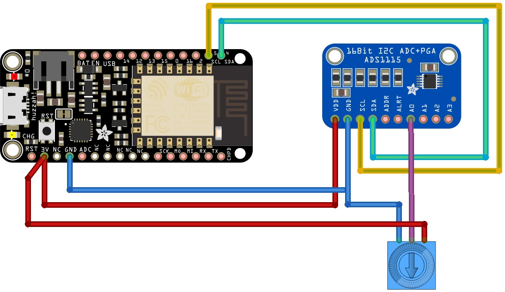

# Pilote pour le convertisseur ADS1015/ADS1115 (analogique vers digital)

Ce pilote est réalisé par [robert-hh](https://github.com/robert-hh) à partir du travail de Radomir Dopieralski (@deshipu).
[robert-hh](https://github.com/robert-hh) a ajouté quelques fonctions et modifié quelques autres pour qu'il correspondent mieux aux besoins de son projet (plus spécialement pour fonctions de timing et pour les rendres IRQ-proof). 

Testé avec ESP8266 sous Micropython

## Traduction 

Le contenu de ce fichier résulte de la traduction du fichier `readme.md` disponible sur [le projet GitHub ads1x15 de robert-hh](https://github.com/robert-hh/ads1x15) .

Le documentation est également augmentée, annoté et inclus des schémas de raccordement.

## L'ADS1115

La bibliothèque ads1x15 permet de contrôler le fonctionnement de l'ADC du ADS1x15 et de réceptionner les données.


L'ADS1115 est un convertisseur analogique vers digital disposant de 4 canaux. Il permet de lire des tension analogiques avec une résolution de 16 bits (valeur de 0 à 65535).

Pour résumer les fonctionnalités:
* Convertisseur ADC 16 bits
* 4 canaux (ou 2 canaux différentiels)
* Amplification à Gain Programmable (jusqu'à 16x)
* Bus I2C
* Echantillonnage en continu (jusqu'à 860 échantillons/seconde)

## Brancher

Le ADS1x15 utilise une interface I2C. Les lignes SCL et SDA doivent donc être connectées (en plus de VDD et GND).



Note: si le CPU doit être déclenché en mode continu, la broche ALERT/RDY doit également être connecté.

### Adresse I2C
* L'adresse par défaut est 72 (0x48) lorsque la broche d'adresse ADDR est placées sur GND. 
* Placer ADDR au niveau haut modifie l'adresse à 73 (0x49).
* Placer ADDR sur SDA modifie l'adresse à 74 (0x4a). 
* Placer ADDR sur SCL modifie l'adresse à 75 (0x4B). 

Vous trouverez plus d'information:
* [https://shop.mchobby.be/breakout/362-ads1115-convertisseur-adc-16bits-i2c-3232100003620-adafruit.html Fiche produit de l'ADS1115] sur MC Hobby.
* [http://mchobby.be/data-files/datasheet/ads1115.pdf Fiche technique de l'ADS1115]

## Utiliser

Le pilote contient la classe ADS1115 et la classe dérivée ADS1015. Etant donné que les deux modèles ne diffèrent que par la taille de la conversion, les mêmes méthodes peuvent s'appliquer avec un interprétation différente des paramètres.

```
from machine import I2C, Pin
from ads1x15 import *
i2c = I2C( sda = Pin(4), scl=Pin(5) )
adc = ADS1115(i2c = i2c, address = 72, gain = 0)

# Mettre le potentiomètre a fond pour appliquer
# 3.3v sur l'entrée analogique A0

# Lire la valeur sur le convertisseur 
# Channel1 = 0 => entrée analogique A0
value = adc.read( rate=0, channel1=0 )

# Affichera la valeur (ex: 17549) 
print( value )

# Calculer la valeur en Volts (voir les notes plus loin)
# Affichera 3.29025
print( value * 0.1875 / 1000 ) 
```

pour un ADS1015, vous pouvez utiliser la ligne suivante :

```
adc = ADS1015(i2c = i2c, address = 72, gain = 0)
```

L'adresse par défaut est 72 et le gain par défaut est 0. 

La valeur de `gain` correspond à un index dans la table `Programmable Gain Amplifier` (PGA). Le PGA définit une gamme de tension utilisé pour la conversion __ET NON__ la tension maximale adminisble par le convertisseur. La tension maximale sur une entrée analogique est fixée à VDD + 0.3v  

Les valeurs acceptables pour `gain` sont:
```
0 : 6.144V # 2/3x
1 : 4.096V # 1x
2 : 2.048V # 2x
3 : 1.024V # 4x
4 : 0.512V # 8x
5 : 0.256V # 16x
```
## Est-ce 15 ou 16 bits?
La sortie d'un ADS1115 est connue pour fournir un entier signé. Cela signifie que l'un des bits de la valeurs 16 bits est utilisé nous indiquer le signe de la valeur rapportée (valeur positive ou négative). Ce qui est important de saisir c'est que seulement 15 des 16 bits sont utilisés pour communiquer la valeur de la mesure.

Sur 15 bits, il est possible d'encoder 32768 valeurs différentes dont zéro est la première valeur et 32767 la dernière valeur.

En fin de compte, c'est bien un périphérique 16 bits mais seuls 15 d'entre-eux sont utilisés pour communiquer la magniture de la mesure.

## ADS1115: La valeur du Bit et conversion en volts

La valeur du bit est déterminé par le PGA (_Programmable Gain Amplifier_, Amplificateur à gain programmable), celui-ci determinant la valeur maximale _théorique_ de la tension sur un ADS1115. Cela est fort différent d'un Arduino ou la valeur maximale du convertisseur ADC est déterminé par par la tension de référence (AREF).

Dans le mode par défaut (`gain = 0`) la valeur est de +/-6.144 volts.

Par conséquent, la valeur numérique 32767 (valeur max sur 15 bits) correspond à 6.144 volts.

Nous obtenons le facteur d'échelle en appliquant la division 6.144 / 32767 = 0.00001875 v par bit = 0.1875 mV par bit. 

C'est une nette amélioration par rapport au convertisseur ADC d'Arduino. En effet, le facteur d'échelle atteint 5/1024 = 0.0048 v par bit = 5mV par bit. Le convertisseur ADC du ADS1115 est 25x plus précis que celui d'un Arduino Uno.


Le cas présenté jusqu'ici était le moins favorable! En utilisant une autre configuration PGA comme `gain = 3` nous avons une tension d'entrée maximale de 1.024 volts, ce qui correspond à un facteur d'échelle de 1.024/32768 = 0.00003125 Volts par bit = 0.03125 mV par bit!

## Methodes disponibles

### adc.read()
Débute la conversion sur un canal à la vitesse `rate` mentionnée et retourne la valeur.

```
value = adc.read(rate, channel1[, channel2])
```

`Channel1` est un canal d'entrée simple (de 0 à 3 pour A0-A3).
Si `channel2` est mentionné, c'est la différence entre `channel1` et `channel2` qui sera échantilloné (_mesure différentielle_). 

`Rate` permet de mentionner une vitesse de conversion. Voici les valeurs souhaitable pour un ADS1015 / ADS1115 :

```
  ADS1015 / ADS1115
  -----------------
0 :  128  / 8      échantillons par seconde
1 :  250  / 16     échantillons par seconde
2 :  490  / 32     échantillons par seconde
3 :  920  / 64     échantillons par seconde
4 :  1600 / 128    échantillons par seconde (défaut)
5 :  2400 / 250    échantillons par seconde
6 :  3300 / 475    échantillons par seconde
7 :  -    / 860    échantillons par seconde
```

La première valeur concerne le convertisseur ADS1015, la seconde s'applique au convertisseur ADS1115. 

Le temps nécessaire pour réaliser un simple conversion est de `1/échantillons\_par\_seconde` plus le temps de communication avec ADC (environ 1 ms sur un ESP8266 à 80 MHz). 

La valeur est retournée comme un entier signé.

__Note__: une conversion plus lente diminue également la proportion du bruit dans le signal. Voir les graphiques de la fiche technique ads1x15 pour vous faire une idée à propos de l'échantillonnage le plus lent. 

###  adc.set_conv et adc.read_rev()
Paire de méthode utilisées pour la lecture séquentielle de valeurs, lecture déclenchée à interval régulier à l'aide d'un timer.
Pour utiliser ces méthodes, il faut d'abord initialiser les paramètres de coonversion à l'aide de `set_conv()` et faire une extraction des valeurs à l'aide de `read_rev()` dans la fonction callback d'un Timer.

```
adc.set_conv(rate, channel1[, channel2])
value = adc.read_rev()
```

Voir la définition de la méthode `adc.read()` concernant les paramètres `channel1`, `channel2` et `rate`. La méthode `read_rev()` lit d'abord la dernière conversion et démare une nouvelle conversion.

Faites attention à ce que le temps nécessaire pour l'échantillonage + tranfert de donnée I2C soit inférieur à la période du Timer + le temps de traitement des données.

Dans l'exemple de code ci-dessous, le jitter observé sur un ESP8266 était d'environ 1ms mais la période de temps est défine par par le timer Timer (qui à ses propres problèmes).

La valeur retournée par `read_rev` est un entier signé.

###  adc.alert_start() et adc.alert_read()

Une paire de méthode pour l'échantillonage continu sur un canal et le déclenchement d'une alerte lors d'un seuil est atteind.
```
adc.alert_start(rate, channel1[, channel2][, threshold])
value = adc.alert_read()
```

Les valeurs de `channel1`, `channel2` et `rate` sont abordé dans `adc.read()` .

`Threshold` (_seuil_) indique la valeur supérieure du registre "threshold" et devrait se situer dans l'intervalle du convertisseur ADC. Soit 0 à 32767 pour l'ADS1115 et 0 à 2047 pour l'ADS1015. 

La vitesse d'échantillonnage `rate` devrait être choisi en adéquation avec la vitesse de changement du signal d'entrée et la précision souhaitée. Le mode est fixé pour "comparateur traditionnel" (_traditional comparator mode_), avec le seuil inférieur fixé à 0.

La valeur retournée par `alert_read` est la valeur brute du registre (_raw register bitmap_) non corrigée pour inclure le signe.
Cette correction doit être effectuée par script. Dans l'exemple ci-dessous cela est réalisé implicitement en stoquant les valeurs dans un tableau signé de bytes ('signed halfword array').

Sinon la correction peut être effectuée à l'aide de:
```
value = adc.alread_read()
if value > 32768:
    value -= 65536
```

###  adc.conversion_start() et adc.alert_read()
Cette paire de méthode est utilisée pour réaliser une échantillonnage continu sur un simple canal et déclencher une alerte à chaque échantillon. Cette paire de fonction utilisé pour une pour une configuration à base d'interruption.

```
adc.conversion_start(rate, channel1 [, channel2])
value = adc.alert_read()
```
Les valeurs de `channel1`, `channel2` et `rate` sont abordé dans `adc.read()` .

Le jitter temporel semble être d'environ 200 ns. Le timer du convertisseur ADC n'étant pas d'une très grande précision. 

Si ce jitter temporel est un problème pour votre application alors il est recommandé d'effectuer quelques contrôles et calibrations pour modeliser les temps de réponses (et leur variation).

La valeur retournée par `alert_read` est la valeur brute du registre (_raw register bitmap_) non corrigée pour inclure le signe.
Cette correction doit être effectuée par script. Dans l'exemple ci-dessous cela est réalisé implicitement en stoquant les valeurs dans un tableau signé de bytes ('signed halfword array').

Sinon la correction peut être effectuée à l'aide de:
```
value = adc.alread_read()
if value > 32768:
    value -= 65536
```

###  adc.\_write_register()

Ecrire une valeur dans le registre du convertisseur ADC.

```
adc._write_register(register, value)
```

`Register` doit contenir le numéro du registre (tel que décrit dans la fiche tehcnique) et `value` une valeur 16 bit (encodée de façon adéquate). 

Numéros de registre.
```
0: Registre de Conversion; Contient la valeur convertie
1: Registre de configuration
2: Seuil inférieur / Low Threshold
3: Seuil supérieur / High Threshold
```
###  adc.\_read_register()

Lire la valeur d'un registre du convertisseur ADC.

```
value = adc._read_register(register)
```

`Register` doit contenir le numéro du registre (tel que décrit dans la fiche tehcnique). Retourne une valeur 16 bit. 

Lire le registre de conversion retour la valeur de l'échantillonnage le plus récent. 

Le bit 15 du registre de configuration est placé à 1 lorsque la configuration est terminée.

# Codes d'exemple

## Echantillonage continu déclenché par un Timer
```
from machine import I2C, Pin, Timer
import ads1x15
from time import sleep_ms, ticks_ms, ticks_us
from array import array

addr = 72
gain = 1
_BUFFERSIZE = const(512)

data = array("h", 0 for _ in range(_BUFFERSIZE))
timestamp = array("L", 0 for _ in range(_BUFFERSIZE))
i2c = I2C(scl=Pin(5), sda=Pin(4), freq=400000)
ads = ads1x15.ADS1115(i2c, addr, gain)

#
# Routine d'interruption pour l'acquisition de donnée
# Appelé par l'interruption du Timer
#
def sample(x, adc = ads.alert_read, data=data, timestamp = timestamp):
    global index_put, irq_busy
    if irq_busy:
        return
    irq_busy = True
    if index_put < _BUFFERSIZE:
        timestamp[index_put] = ticks_us()
        data[index_put] = adc()
        index_put += 1
    irq_busy = False

irq_busy = False

index_put = 0
ADC_RATE = 5 # 5 ms

# Fixer le taux de conversion à 860 SPS (Sample Per Second, _échantillon par seconde_)
# 860 SPS = 1.16 ms; ce qui laisse 3ms pour le traitement des
# données si nous utilisons un Timer de 5ms
#
ads.set_conv(7, 0) # Démarrer la permière conversion
ads.read_rev()
sleep_ms(ADC_RATE)
tim = Timer(-1)
tim.init(period=ADC_RATE, mode=Timer.PERIODIC, callback=sample)

while index_put < _BUFFERSIZE:
    pass

tim.deinit() 

# Arrivé ici, nous avons les valeurs échantillonnée et le timestamp (tick en µs) 
# correspondant à chacune d'entre elle.
#
```

Dans le cas présentl le jitter temporel constaté était de +/- 500 µs, avec 90% jusqu'à 50 µs et 5% oscillant entre 450 et 550 µs. Les interférences temporelles se produisent toutes les secondes.

Avec une horloge à 160MHz, le jitter temporel est réduit à +/- 50 µs

## Echantillonnage continu déclenché par le convertisseur ADC

```
from machine import I2C, Pin, Timer
import ads1x15
from array import array

addr = 72
gain = 1
_BUFFERSIZE = const(512)

data = array("h", 0 for _ in range(_BUFFERSIZE))
i2c = I2C(scl=Pin(5), sda=Pin(4), freq=400000)
ads = ads1x15.ADS1115(i2c, addr, gain)

#
# Routine d'interruption pour l'acquisition des 
# données. Elle est activée par la broche d'interruption
#
def sample_auto(x, adc = ads.alert_read, data = data):
    global index_put
    if index_put < _BUFFERSIZE:
        data[index_put] = adc()
        index_put += 1

data = array("h", [0] * _BUFFERSIZE)
index_put = 0

irq_pin = Pin(13, Pin.IN, Pin.PULL_UP)
# Vitesse d'échantillonnage 5 = 250 échantillons par seconde
ads.conversion_start(5, 0)

irq_pin.irq(trigger=Pin.IRQ_FALLING, handler=sample_auto)

while index_put < _BUFFERSIZE:
    pass

irq_pin.irq(handler=None)
#
# Ici, nous avons 512 échantillons dont l'acquisition est effectuée à un débit donné
#
```
La vitesse d'échantillonage atteinte durant le test est de 251.9 échantillon par seconde (SPS) ou 3.97 ms/échantillon.
Information qui est d'une relative précision étant donné la précision d'horloge de l'ESP8266.

## Où acheter
* [https://shop.mchobby.be/breakout/362-ads1115-convertisseur-adc-16bits-i2c-3232100003620-adafruit.html Adafruit ADS115] disponible chez MCHobby

