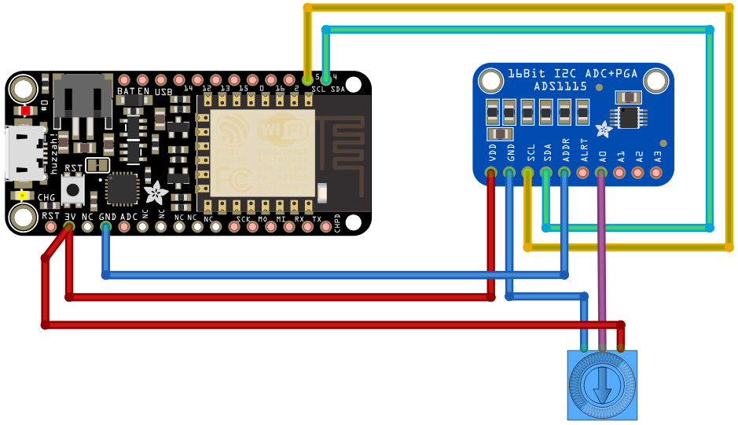

[Ce fichier existe en version détaillée en FRANCAIS](readme.md)

# Introduction
This is a driver for the ADS1015 / ADS1115 analog to Digital (ADC) converter

This pilote have been made by [robert-hh](https://github.com/robert-hh) from a former work of Radomir Dopieralski (@deshipu).
[robert-hh](https://github.com/robert-hh) did add some function and rework other methods to fit its own needs.

Tested with ESP8266 under Micropython and the NADHAT PYB405 (so also the Pyboard)


To read the details of this driver in english, please go the `readme.md` file in the [robert-hh's ads1x15 project](https://github.com/robert-hh/ads1x15) .

# The ADS1115

The ads1x15 library can be used to control the ADS1x15 ADC and receives the data through the I2C bus.

The ADS1115 is an analog to digital converted with 4 channels. It can read the analog voltage with a 16 bit resolutions (value in the range 0 to 65535).

Feature summary:
* 16 bits ADC converted
* 4 channels (or 2 differential channels)
* Programmable gain amplifier (in the chip, up to 16x)
* I2C bus
* Continuous sampling up to 860 samples/second

# Wiring

The ADS1x15 uses an I2C interface. The SCL & SDA must be wired (VDD and GND as well).



Note: If the MCU must be triggered in continuous mode then the ALERT/RDY poins must also been wired.

## I2C Address
* The default address is 72 (0x48) when the ADDR pin is set to the ground (GND).
* Set ADDR to high level will set the address to 73 (0x49).
* Set ADDR to SDA will set the address to 74 (0x4a).
* Set ADDR to SCL will set the address to 75 (0x4B).

You will find more information on this in
* the [ADS1115 product sheet](https://shop.mchobby.be/breakout/362-ads1115-convertisseur-adc-16bits-i2c-3232100003620-adafruit.html)
* [ADS1115 datasheet](http://mchobby.be/data-files/datasheet/ads1115.pdf)

# Usage

The driver does contains the ADS1115 class (inherit from ADS1015). As the both models are similar (only the smapling resolution is different) then all the methods are commons and work the same.

```
from machine import I2C, Pin
from ads1x15 import *
i2c = I2C( sda = Pin(4), scl=Pin(5) )
adc = ADS1115(i2c = i2c, address = 72, gain = 0)

# Set the pot. to 3.3V on A0

# Read the value on the converter
# Channel1 = 0 => analog input A0
value = adc.read( rate=0, channel1=0 )

# Display the value (ex: 17549)
print( value )

# Calculate the value in volts (see note further)
# will displays 3.29025
print( value * 0.1875 / 1000 )
```

For an ADS1015, you can use the following sentence :

```
adc = ADS1015(i2c = i2c, address = 72, gain = 0)
```

The default address is 72 and default gain is 0.

The value for `gain` would correspond to the index entry of the `Programmable Gain Amplifier` (PGA) table. The PGA set the voltage range for the converter __WARNING!__ it isn't the maximum voltage that the converter can receives. The absolute maximum voltage on an ADC input is VDD + 0.3v  

What are the possible `gain` values:
```
0 : 6.144V # 2/3x
1 : 4.096V # 1x
2 : 2.048V # 2x
3 : 1.024V # 4x
4 : 0.512V # 8x
5 : 0.256V # 16x
```

# Where to buy
* [ADS115 of Adafruit Industries](https://shop.mchobby.be/breakout/362-ads1115-convertisseur-adc-16bits-i2c-3232100003620-adafruit.html) is available @ MCHobby
