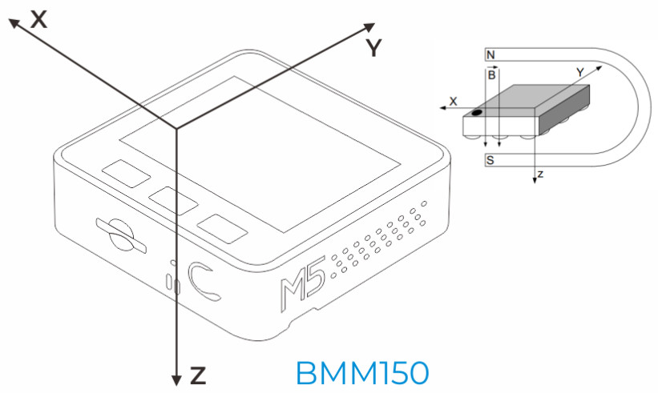

# Detection du champ magnétique avec le BMM150 sous MicroPython

Ceci est un premier effort de portage de pilote BMM115 pour MicroPython.

A l'instant, seul l'exemple test_bmm150.py est rédigé mais les résultats ne sont pas convaincants.

Le capteur BMM150 oriente ses axes comme ceci:

