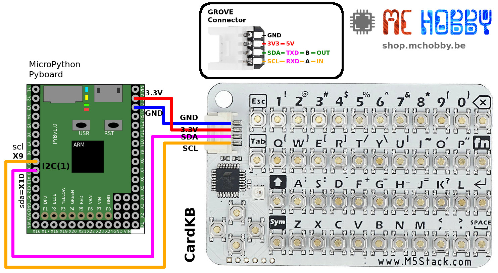
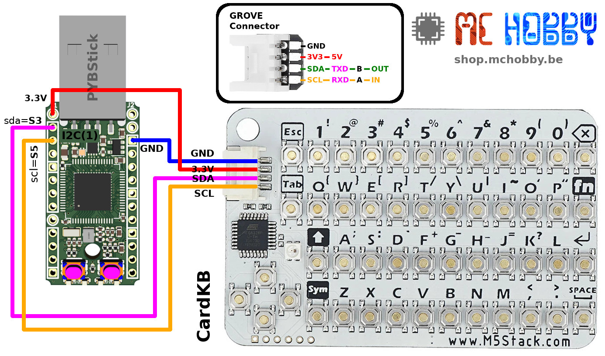

[This file also exists in ENGLISH](readme_ENG.md)

# Mini clavier I2C CardKB Qwerty de M5Stack sous MicroPython

CardKB est un mini-clavier très complet qui se connecte en I2C sur votre MicroControleur.


Initialement développé par [M5Stack pour son M5-Core](https://shop.mchobby.be/fr/153-m5stack-esp) et expose un [connecteur Groove](https://shop.mchobby.be/fr/154-grove) pour faciliter les raccordements.

# Brancher

## Brancher sur M5Stack

Pour utiliser ce produit sur un [M5Stack](https://shop.mchobby.be/fr/153-m5stack-esp), il suffit de le brancher sur le port Grove rouge (I2C).

Il est également possible d'utiliser ce clavier avec d'autres carte MicroPython en opérant les raccordements décrits ci-dessous.

L'utilisation d'un [connecteur Grove vers broches](https://shop.mchobby.be/fr/m5stack-esp/1929-connecteur-grove-vers-broches-5pcs-3232100019294-m5stack.html) pourrait vous aider dans la réalisation des connexions.

## Brancher sur Pyboard

Voici comment brancher le clavier sur votre carte [MicroPython Pyboard](https://shop.mchobby.be/fr/56-micropython).



## Brancher sur PYBStick

Voici comment brancher le clavier sur votre carte [PYBStick](https://shop.mchobby.be/fr/recherche?controller=search&orderby=position&orderway=desc&search_query=PYBStick&submit_search=).



# Tester

Avant de pouvoir utiliser les exemples ci-dessous, il est nécessaire de copier la bibliothèque [`lib/cardkb.py`](lib/cardkb.py) sur votre carte MicroPython.

## read_char

L'exemple [`test_char.py`](examples/test_char.py) exploite la méthode `CardKB.read_char()` pour capturer le dernier caractère pressé (ainsi que quelques caractères de contrôle).

Cette __méthode rudimentaire__ filtre tous les données ne correspondant à un caractère ASCII pour se concentrer sur la saisie de texte. Pour un contrôle plus fin des saisies, il est recommandé de passer à l'exemple suivant.

```
from machine import I2C
from cardkb import *

# Pyboard : X10=sda, X9=scl
# PYBStick: S3=sda, S5=scl
i2c = I2C(1)
# M5Stack : Connecteur Grove - réduire la vitesse est nécessaire
# i2c = I2C(freq=100000, sda=21, scl=22)

keyb = CardKB( i2c )

s = ''
while True:
	ch = keyb.read_char( wait=True ) # Attendre qu'une touche soit pressée
	if ord(ch) == RETURN:
		print( 'Return pressed! Blank string')
		s = ''
	elif ord(ch) == BACKSPACE:
		s = s[:-1] # retirer le dernier caractère
	else:
		s = s + ch # ajouter le caractère à la chaine
	print( s )
```

Ce qui produit le résultat suivant dans la session REPL lorsqu'on encode des données

```
>>> import test_char
e
en
enc
enco
encod
encode
encode
encode u
encode un
encode u
encode
encode a
encode a
encode a s
encode a st
encode a str
encode a stri
encode a strin
encode a string
Return pressed! Blank string

h
he
hel
hell
hello
```

## read_key

L'exemple [`test_readkey.py`](examples/test_readkey.py) exploite la méthode `CardKB.read_key()` retourne un tuple `(keycode, ascii/None, modifier)` où:
* __keycode__ : le code de la touche pressée. La méthode `CardKB.is_ctrl()` permet de savoir s'il s'agit d'un caractère de contrôle comme le retour clavier, un backspace, touche esc, etc.
* __ascii__ : caractère ASCII (si possible) correspondant à la touche pressée. Attention, une retour clavier retourne un vrai passage à la ligne. A noter que `test_readkey.py` substitue le caractère de contrôle avec une chaîne informative.
* __modifier__ : indique si la touche SYM (Symbole) ou FN (Function) est pressée.

```
from machine import I2C
from cardkb import *

# Pyboard : X10=sda, X9=scl
# PYBStick: S3=sda, S5=scl
i2c = I2C(1)
# M5Stack : Connecteur Grove - réduire la vitesse est nécessaire
# i2c = I2C(freq=100000, sda=21, scl=22)

keyb = CardKB( i2c )

MOD_TEXT = { MOD_NONE : 'none', MOD_SYM : 'SYMBOL', MOD_FN : 'FUNCTION'}
CTRL_NAME = {0xB5:'UP',0xB4:'LEFT',0xB6:'DOWN',0xB7:'RIGHT',0x1B:'ESC',0x09:'TAB',0x08:'BS',0x7F:'DEL'}

print( 'Keycode | Ascii | Modifier' )
print( '---------------------------')
while True:
	keycode,ascii,modifier = keyb.read_key()

	# Pas de touche pressée = rien a afficher
	if keycode == None:
		continue

	# Les touche de controle ne peuvent etre affichée normalement
	# Donc remplacer les touches de contrôle par leur libellé (plus facile à lire)
	if keyb.is_ctrl( keycode ):
		if keycode in CTRL_NAME:
			ascii = CTRL_NAME[keycode]
		else: # On the connait pas le nom pour le KeyCode
			ascii = 'ctrl' # Donc on remplace avec la chaîne "ctrl"

	# Afficher code de la touche, le caractère et la touche modifiante (si utilisée)
	print( "  %5s | %5s | %s" %(hex(keycode), ascii, MOD_TEXT[modifier]) )

```

Ce qui produit le résultat suivant:

```
>>> import test_readkey
Keycode | Ascii | Modifier
---------------------------
   0xb5 |    UP | none
   0xb6 |  DOWN | none
   0xb4 |  LEFT | none
   0xb7 | RIGHT | none
   0xb7 | RIGHT | none
   0xb7 | RIGHT | FUNCTION
   0xb7 | RIGHT | none
   0x71 |     q | none
   0x77 |     w | none
   0x65 |     e | none
   0x85 |  None | FUNCTION
   0x35 |     5 | none
   0x50 |     P | none
   0x22 |     " | SYMBOL
   0x1b |   ESC | none
   0x1b |   ESC | none
   0x1b |   ESC | none
   0x80 |  None | FUNCTION
    0x8 |    BS | none
   0x7f |   DEL | none
   0x20 |       | none
   0xaf |  None | FUNCTION
```
