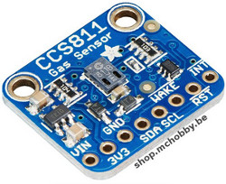
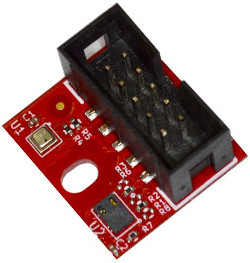
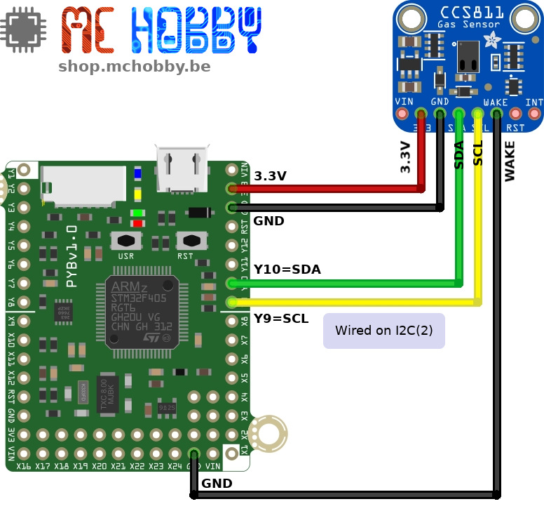

[This file also exists in ENGLISH](readme_ENG.md)

# Measure the eCO2 and VOC (Volatile Organic Compunds) with the CCS811 used with MicroPython



Add air quality monitoring to your project with the [Adafruit CCS811 Air Quality Sensor Breakout](https://shop.mchobby.be/fr/breakout/1274-ccs811-senseur-qualite-d-air-cov-et-eco2-3232100012745-adafruit.html).

This sensor from AMS is a gas sensor capable to detect a wide range of Volatile Organic Compounds (VOCs). It can be used to measure indoor air quality. When connected to your microcontroller this sensor can returns a Total Volatile Organic Compound (TVOC) reading and an equivalent carbon dioxide reading (eCO2) over I2C.



The CCS811 sensor is also available on the [MOD-ENV (Environmental sensor)](https://shop.mchobby.be/fr/uext/1780-capteur-environnementale-tout-en-un-bme280-ccs811-3232100017801.html) from Olimex. The library is also suited for this sensor, __check the detail in the `modenv` subfolder of this GitHub__.

# Wire



# Use it

The [`ccs811.py`](lib/css811.py) library is available into the `/lib` folder. This file mise be copied to the MicroPython board before using the example.

The [`test.py`](examples/test.py) example shows how to use the sensor.

``` python
import time
import ccs811

from machine import I2C

i2c = I2C( 2 ) # Use Y9 and Y10
ccs811 = ccs811.CCS811( i2c )

# Check if the sensor returns an error
if ccs811.check_error:
	print( "An error occured!")
	print( "ERROR_ID = %s" % ccs811.error_id.as_text )
	while True:
		time.sleep( 0.100 )

# Wait for the sensor to be ready
while not ccs811.data_ready:
	time.sleep( 0.100 )

while True:
    print("CO2: {} PPM, TVOC: {} PPB"
          .format(ccs811.eco2, ccs811.tvoc))
    time.sleep(0.5)
```

Which produce the following results into the REPL session.

```
CO2: 423 PPM, TVOC: 3 PPB
CO2: 423 PPM, TVOC: 3 PPB
CO2: 423 PPM, TVOC: 3 PPB
CO2: 423 PPM, TVOC: 3 PPB
... breathing toward the senseor
... souffler en direction du capteur
CO2: 423 PPM, TVOC: 3 PPB
CO2: 423 PPM, TVOC: 3 PPB
CO2: 439 PPM, TVOC: 5 PPB
CO2: 439 PPM, TVOC: 5 PPB
CO2: 454 PPM, TVOC: 8 PPB
CO2: 454 PPM, TVOC: 8 PPB
CO2: 454 PPM, TVOC: 8 PPB
CO2: 454 PPM, TVOC: 8 PPB
CO2: 439 PPM, TVOC: 5 PPB
CO2: 439 PPM, TVOC: 5 PPB
CO2: 439 PPM, TVOC: 5 PPB
CO2: 439 PPM, TVOC: 5 PPB
CO2: 423 PPM, TVOC: 3 PPB
CO2: 423 PPM, TVOC: 3 PPB
CO2: 439 PPM, TVOC: 5 PPB
```

# Shopping list
* [Adafruit CCS811 Air Quality Sensor Breakout](https://shop.mchobby.be/fr/breakout/1274-ccs811-senseur-qualite-d-air-cov-et-eco2-3232100012745-adafruit.html) @ MCHobby
* [Adafruit CCS811 Air Quality Sensor Breakout](https://www.adafruit.com/product/3566) @ Adafruit
* [MOD-ENV : Environmental sensor](https://shop.mchobby.be/fr/uext/1780-capteur-environnementale-tout-en-un-bme280-ccs811-3232100017801.html) @ MCHobby
* [MOD-ENV : Environmental sensor](https://www.olimex.com/Products/Modules/Sensors/MOD-ENV/open-source-hardware) @ Olimex
