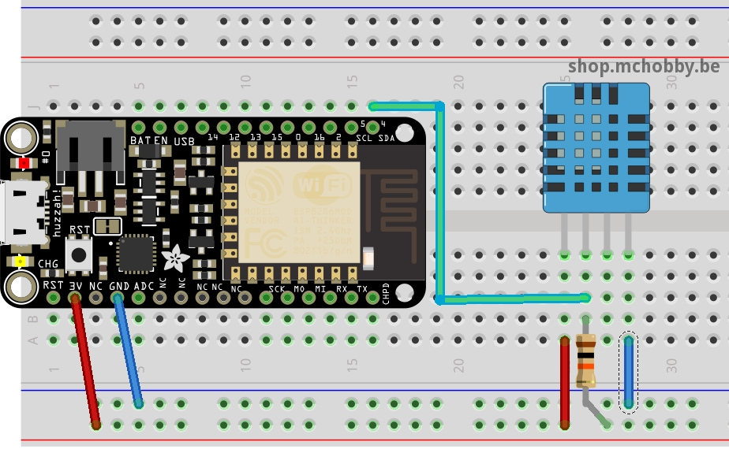

# Mesure Humidité et température avec DHT11 et ESP8266 sous MicroPython

Attention, le DHT11 est un senseur d'entrée de gamme avec une précision limitée.
Ce senseur n'utilise que la broche SDA du bus I2C.

* Shop: [DHT11](http://shop.mchobby.be/product.php?id_product=708)
* Wiki: https://wiki.mchobby.be/index.php?title=MicroPython-Accueil#ESP8266_en_MicroPython

# Raccordement



# Code de test

```
# Utiliser un senseur DHT11 avec ESP8266 sous MicroPython
#
# Shop: http://shop.mchobby.be/product.php?id_product=708
# Wiki: https://wiki.mchobby.be/index.php?title=MicroPython-Accueil#ESP8266_en_MicroPython

import machine

# Le DHT 11 est déjà supporté par le Firmware MicroPython
# Il n'est pas possible de brancher d'autre Breakout I2C sur le même bus I2C.
import dht
d = dht.DHT11( machine.Pin(4) )

d.measure()
d.temperature()
d.humidity()
```

ce qui donne les résultats suivants


    
# Source et ressources
* _aucune_
