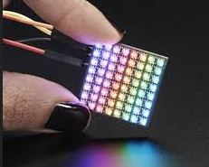
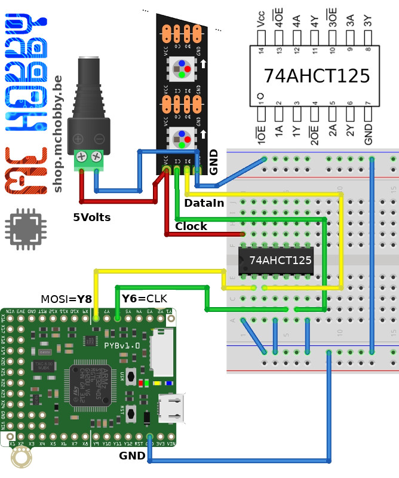
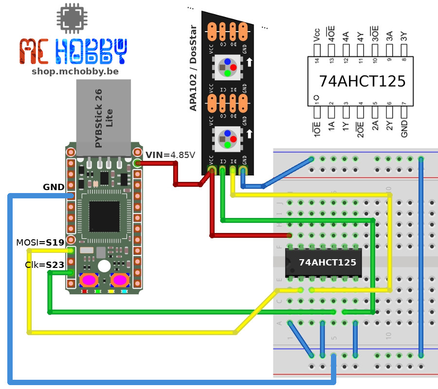

[Ce fichier existe aussi en FRANCAIS](readme.md)

# DotStar / APA102 library for MicroPython

The APA102 LEDs (or DotStar) are chainable LEDs using a protocol based on a data signal and a clock signal which offers a better control over the data flow.
Such LEDs are driven from a SPI bus (MOSI & CLK signals), so 4 wires are needed to drive such LEDs (including power).

__Attention:__ APA102 LEDs looks alike NeoPixels LEDs (WS2812b) but are quite différent in the way of working.



The `micropython_dotstar.py` library have been modified to create the `dotstar.py` library 'designed' to run over low power MicroPython board (having less RAM).

The original `micropython_dotstar.py` library is available on [mattytrentini's micropython-dotstar GitHub repository](https://github.com/mattytrentini/micropython-dotstar) can't be
parsed on a [Pyboard Lite](https://shop.mchobby.be/fr/micropython/765-micro-python-pyboard-lite-3232100007659.html) or on a
[PYBStick Lite](https://shop.mchobby.be/fr/micropython/1830-pybstick-lite-26-micropython-et-arduino-3232100018303-garatronic.html) because of the fewer RAM available on such plateforme.

# Which modifications were made?
The `dotstar.py` library have beed created by:
1. Removing all the comment to ease the parsing on Pyboard Lite (there is still few comment)
2. The library header (author, license, etc) is stored into the `dotstar.header` file (not parsed by MicroPython).
3. By removing the dynamic brightness control for the DotStar ribbon (which allocate a second fully sized buffer). The individual LED brightness can still be controled.

# Documentation

The original library [`micropython_dotstar` de mattytrentini](https://github.com/mattytrentini/micropython-dotstar) (GitGub) documentation and examples are still applicable.

Please, note that the library is running in mode `auto_write = True`, the ribbon is automatically updated when any LED color is changed.

# Wiring

The `DataIn` and `Clock` signals of the DotStar/APA102 LEDs must be at the same logical level than the LED power supply.

__Notes:__
* Signal with logical level of 3.3V and a power supply of 5V may work but this cannot be certified (we tested it).
* Even if the APA102 LEDs can work under 3.3V, the most common voltage used is 5V.

The following wiring show the APA102 LEDs wired to a Pyboard and using an external 5V power. A [74AHCT125](https://shop.mchobby.be/fr/ci/1041-74ahct125-4x-level-shifter-3v-a-5v-3232100010413.html) level shifter is used to convert the signals from 3.3 to 5V.



The following wiring use the PYBStick supply available on VIn. As the board is wired on the computer, the VIn voltage is 4.85V. As the [74AHCT125](https://shop.mchobby.be/fr/ci/1041-74ahct125-4x-level-shifter-3v-a-5v-3232100010413.html) is also used, this assembly also works perfectly.



# Example

Le following Pyboard example control 3 APA102 LEDs.

Notice that miso pin must be defined when creating the SPI bus (whatever it is used or not used).

```
>>> from dotstar import DotStar
>>> from machine import SPI, Pin
>>> spi = SPI( sck=Pin("Y6",Pin.OUT), miso=Pin("Y7",Pin.OUT), mosi=Pin("Y8",Pin.OUT) )
>>> leds = DotStar( spi, 3 )
>>> leds.fill( (255,0,0) )
>>> leds.fill( (0,255,0) )
>>> leds.fill( (0,0,255) )
>>> leds[0]=(255,0,0)
>>> leds[1]=(0,255,0)
```

This second example for the PYBStick demonstrate the usage of the same 3 LEDs.

```
MicroPython v1.11-473-g86090de on 2019-11-15; PYBv1.1 with STM32F405RG
Type "help()" for more information.
>>>
>>> from dotstar import DotStar
>>> from machine import SPI, Pin
>>> spi = SPI( sck=Pin("S23",Pin.OUT), miso=Pin("S21",Pin.OUT), mosi=Pin("S19",Pin.OUT) )
>>> leds = DotStar( spi, 3 )
>>> leds.fill( (255,0,0) )
>>> leds.fill( (0,255,0) )
>>> leds.fill( (0,0,255) )
>>> leds[0]=(255,0,0)
>>> leds[1]=(0,255,0)
```

# Shopping list
* [LED DotStar (APA102)](https://shop.mchobby.be/fr/55-neopixels-et-dotstar) are available in the MACHobby's LEDs product line
* [PYBStick 26 Lite - MicroPython & Arduino board](https://shop.mchobby.be/fr/micropython/1830-pybstick-lite-26-micropython-et-arduino-3232100018303-garatronic.html)
* [MicroPython boards](https://shop.mchobby.be/fr/56-micropython) available at MCHobby
