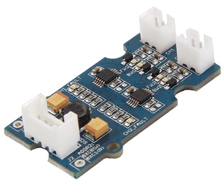
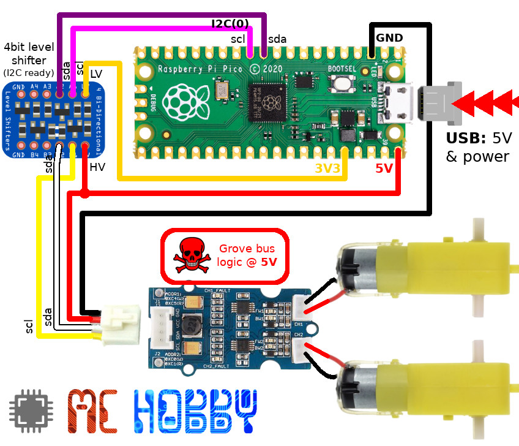

[This file also exists in ENGLISH](readme_ENG.md)

# Utiliser la carte Mini I2C Motor Driver (DRV8830) sous MicroPython

Cette carte est produite par SparkFun et SeeedStudio. La version SeeedStudio dispose d'un connecteur Grove.



Dans la version SeeedStudio, la tension d'alimentation est utilisée pour l'alimentation moteur et celle des signaux du I2C.

Il __faudra impérativement__ un _Level Shifter_ sur les signaux SDA et SCL si le microcontrôleur n'est pas tolérant 5V (ex: le Pico)

# Bibliothèque

 Cette bibliothèque doit être copiée sur la carte MicroPython avant d'utiliser les exemples.

 Sur une plateforme connectée:

 ```
 >>> import mip
 >>> mip.install("github:mchobby/esp8266-upy/drv8830")
 ```

 Ou via l'utilitaire mpremote :

 ```
 mpremote mip install github:mchobby/esp8266-upy/drv8830
 ```

# Brancher

## Raspberry-Pi Pico

Un _level shifter_ est utilisé pour convertir les signaux SDA et SCL du bus I2C de 3.3V 3.3V (Pico) vers 5V (Grove) et vice-versa.



# Test

Pour pouvoir utiliser ce contrôleur moteur, il est nécessaire d'installer la bibliothèque [`lib/drv8830mot.py`](lib/drv8830mot.py) sur la carte MicroPython.

Le code de test suivant démontre les fonctionnalités de base en contrôlant les deux moteurs équipant une plateforme robotique.

``` python
from machine import I2C
from drv8830mot import DRV8830
import time

# Pico - I2C(0), sda=IO8, scl=IO9
i2c = I2C(0, freq=100000)

# Activer les deux controleurs moteurs
mot1 = DRV8830( i2c, address=0x65 ) # Chanel 1
mot2 = DRV8830( i2c, address=0x60 ) # Chanel 2
print( 'Marche avant plein vitesse' )
mot1.drive( 63 )
mot2.drive( 63 )
time.sleep( 2 )
print( 'Stop' )
mot1.stop()
mot2.stop()
time.sleep( 1 )
print( 'Marche Arrière mi-vitesse' )
mot1.drive( -32 )
mot2.drive( -32 )
time.sleep( 2 )
print( 'Freiner les moteurs' )
mot1.brake()
mot2.brake()
time.sleep( 1 )
print( 'Stop moteurs' )
mot1.stop()
mot2.stop()
print( 'Thats all folks' )
```

# Liste d'achat
* [Raspberry-Pi Pico](https://shop.mchobby.be/product.php?id_product=2025
) @ MCHobby
* [4bits level-shifter (I2C compatible)](https://shop.mchobby.be/product.php?id_product=131)
