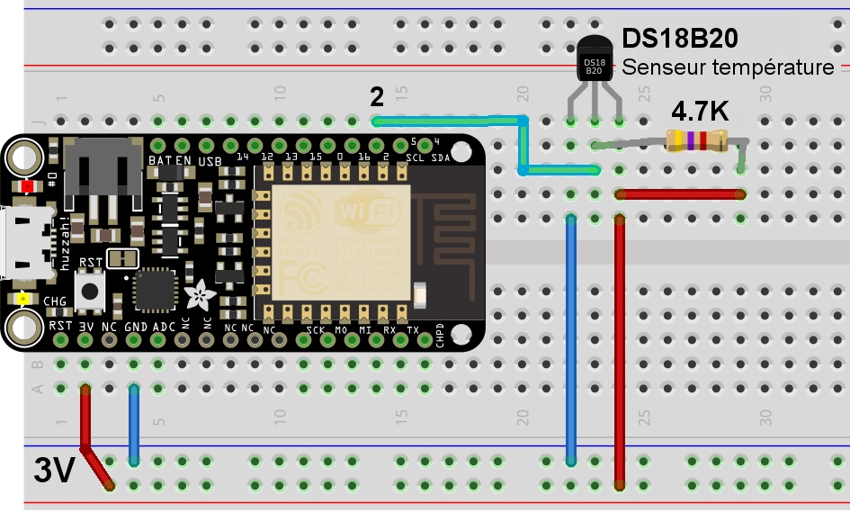

# Utilisation senseur température DS18B20 et ESP8266 MicroPython

* Shop: [DS18B20](https://shop.mchobby.be/senseur-divers/259-senseur-temperature-ds12b20-extra-3232100002593.html)
* Shop: [DS18B20 WaterProof](https://shop.mchobby.be/senseur-divers/151-senseur-temperature-ds18b20-etanche-extra-3232100001510.html)
* Wiki: https://wiki.mchobby.be/index.php?title=MicroPython-Accueil#ESP8266_en_MicroPython

# Bibliothèque
La bibliothèque ds18x20 et onewire incluse dans le firmware microPython permettent de prendre en charge les senseur DS18B20, senseurs que vous pouvez raccorder en étoile.

# Raccordement



| Broche ESP8266 | Broche DS18B20 | Note                                                                                                       |
|----------------|----------------|------------------------------------------------------------------------------------------------------------|
| GND            | 1	          | Masse                                                                                                      |
| 3V             | 3              | Alimentation. Le DS18B20 fonctionne avec une tension d'alimentation de 3 à 5V    							 |
| 2              | 2 	          | OneWire Signal. Cette broche __doit également raccordée à +3V par l'intermédiaire d'une résistance de 4.7 KOhms.__ |

## Broches compatibles

Nous avons testé la bibliothèque sur les broches suivantes de l'ESP8266:

| Broche | Compatibilité |
|---|---|
| __14__ | OneWire compatible. |
| __12__ | OneWire compatible. |
| __13__ | OneWire compatible. |
| __15__ | __NON FONCTIONNEL__. Non compatible OneWire |
| __0__  | __NE PAS UTILISER__. Broche de boot. |
| __16__ | __NON FONCTIONNEL__. Non compatible OneWire |
| __2__  | OneWire compatible. |
| __5__  | _non testé._ Bus I2C (SCL) |
| __4__  | _non testé._ Bus I2C (SDA) |

# Code de test

```
# Utilisation senseur température DS18B20 et ESP8266 MicroPython
#
# Shop: https://shop.mchobby.be/senseur-divers/259-senseur-temperature-ds12b20-extra-3232100002593.html
# Shop: https://shop.mchobby.be/senseur-divers/151-senseur-temperature-ds18b20-etanche-extra-3232100001510.html
#
# Wiki: https://wiki.mchobby.be/index.php?title=MicroPython-Accueil#ESP8266_en_MicroPython
#
from machine import Pin
from onewire import OneWire
from ds18x20 import DS18X20
from time import sleep_ms

bus = OneWire( Pin(2) )
ds = DS18X20( bus )

# Scanner tous les périphériques sur le bus
# Chaque périphérique à une adresse spécifique
roms = ds.scan()
for rom in roms:
	print( rom )

# Interrogation des senseurs
ds.convert_temp()
# attendre OBLIGATOIREMENT 750ms 
sleep_ms( 750 )

# Lecture des température pour chaque périphérique
for rom in roms:
	temp_celsius = ds.read_temp(rom)
	print( "Temp: %s" % temp_celsius )
```

# Adresse des périphériques
Les adresses des périphériques (`rom` dans le code) sont constitués de 5 octets.

L'affichage des adresses rom se présente donc sous la forme d'une liste de bytearray. C'est une information binaire.

```
bytearray(b'(\xff\xd3\xe2p\x16\x03]')
```

# Source et ressources
* Référence officielle DS18x20 sous ESP8266: http://docs.micropython.org/en/v1.9.3/esp8266/esp8266/tutorial/onewire.html
