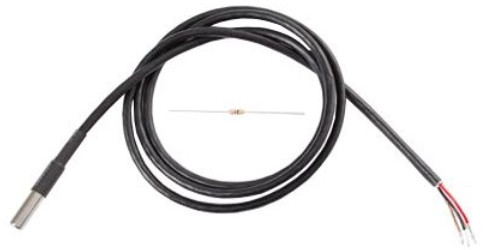
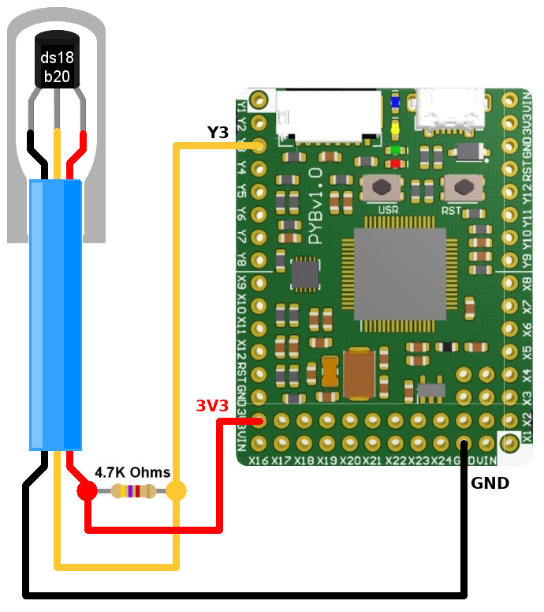
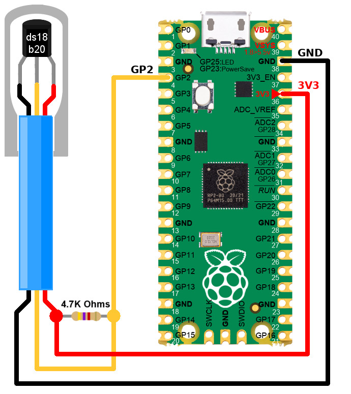

[Ce fichier existe également en Français](readme.md)

# DS18B20 (OneWire) temperature sensor under MicroPython

The DS18B20 is a temperature sensor using the 1-Wire bus (_One Wire_) to transmit the data in the both way (emitting and receiving on a single wire).

The 1-Wire bus do allow to connect several sensors with at a certain distance (~10m).

This is the reason for the DS18B20 popularity, it is quite easy to create a star topology with several sensors.

   

There is a drawback to 1-Wire, the bus do have an important latency which limits the acquisition rate (about once every two secondes).

If this is good to control the room temperature, the latency is an issue when contrôling the temperature of an hot plate.

Some behaviors:
* Temperature range: -55 to 125°C (-67°F to +257°F)
* Resolution: from 9 to 12 bits (selectable)
* Interface: 1-Wire - requires only one digital pin to communicates.
* Unique 64 bit identifier (burned into the sensor during manufacturing)
* Several sensors can be wired into one digital pin.
* Accuracy: +/-0.5°C from -10°C to +85°C
* Alarme temperature "limit temp"
* Request donne in less than 750ms
* Can be used with a voltage 3.0V to 5.5V (power/data)

See wiki: https://wiki.mchobby.be/index.php?title=MicroPython-Accueil#ESP8266_en_MicroPython

# Library
The following libraries are required to use this sensor:
* `ds18x20` :
 * usually available in the MicroPython firmware for ESP.
 * Available in `micropython-lib` @ [https://github.com/micropython/micropython-lib/tree/master/micropython/drivers/sensor/ds18x20](https://github.com/micropython/micropython-lib/tree/master/micropython/drivers/sensor/ds18x20)
* `onewire` : already included in the MicroPython firmware.

# Wire

## DS18B20 to Pyboard



## DS18B20 to Raspberry-Pi Pico



## DS18B20 to ESP8266


| ESP8266 pin | DS18B20 pin | Note                                                                                                       |
|----------------|----------------|------------------------------------------------------------------------------------------------------------|
| GND            | 1	          | Ground                                                                                                      |
| 3V             | 3              | Power. The DS18B20 can be powered with 3.3 to 5V.    							 |
| 2              | 2 	          | OneWire Signal. This pin __must be pull-up to the logic voltage with a 4.7 KOhms pull-up resistor.__ |

__ESP compatible pins:__

The library have been tested on the following ESP8266 pins:

| Pin | Compatibility |
|---|---|
| __14__ | OneWire compatible. |
| __12__ | OneWire compatible. |
| __13__ | OneWire compatible. |
| __15__ | __NOT COMPATIBLE__. |
| __0__  | __Do not use__. Boot pin. |
| __16__ | __NOT COMPATIBLE__. |
| __2__  | OneWire compatible. |
| __5__  | _not tested._ I2C bus (SCL) |
| __4__  | _not tested._ I2C bus (SDA) |

# Test

```
# Using the DS18B20 temperature sensor with Pyboard, Pico & ESP8266 under MicroPython
from machine import Pin
from onewire import OneWire
from ds18x20 import DS18X20
from time import sleep_ms

# PyBoard
bus = OneWire( Pin("Y3") )
# ESP8266
# bus = OneWire( Pin(2) )
# Pico
# bus = OneWire( Pin(2) )

ds = DS18X20( bus )

# Scan all the DS12B20 on the bus (for each of the ROM address).
# Each of the device do have a specific address
roms = ds.scan()
for rom in roms:
	print( rom )

# Request temps from sensors
ds.convert_temp()
# Waits for 750ms (required)
sleep_ms( 750 )

# Display the temp for each device
for rom in roms:
	temp_celsius = ds.read_temp(rom)
	print( "Temp: %s Celcius" % temp_celsius )
```

# Device address (ROM address) of sensors
The device address (namely `rom` variable in the code) is made of 5 binary bytes.

The display of ROM addresses is made from a list of `bytearray`. Indeed, we do not know how many devices are available on the bus until we do scan it.

```
bytearray(b'(\xff\xd3\xe2p\x16\x03]')
```

# Source and ressources
* Offical reference for the DS18x20 with ESP8266: http://docs.micropython.org/en/v1.9.3/esp8266/esp8266/tutorial/onewire.html

# Shopping list
* Shop: [DS18B20](https://shop.mchobby.be/senseur-divers/259-senseur-temperature-ds12b20-extra-3232100002593.html) @ MCHobby
* Shop: [DS18B20 WaterProof](https://shop.mchobby.be/senseur-divers/151-senseur-temperature-ds18b20-etanche-extra-3232100001510.html) @ MCHobby
