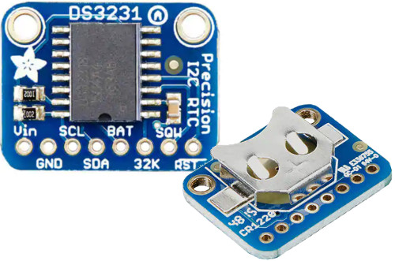
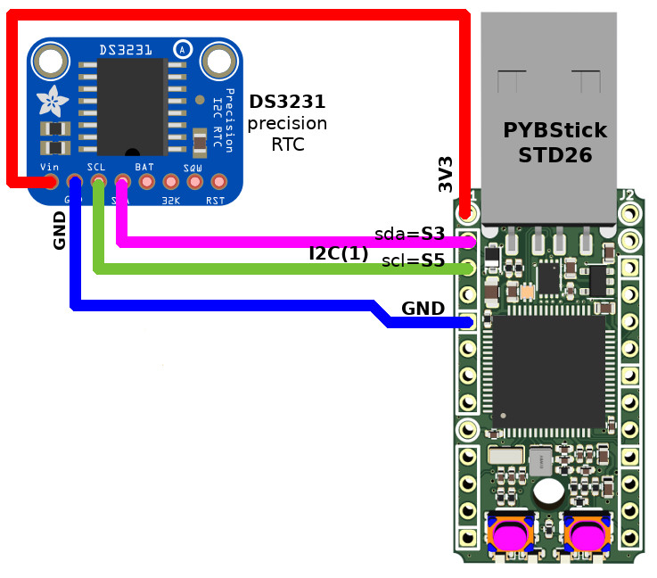
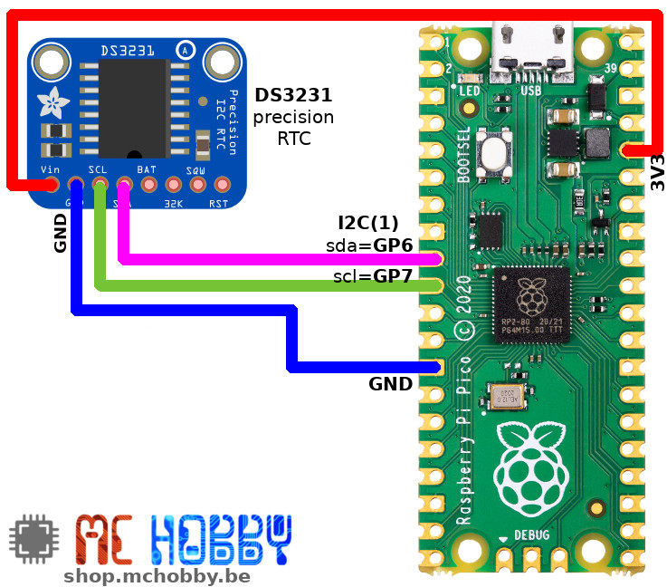

[Ce fichier existe également en FRANCAIS](readme.md)

# Using a real time clock (RTC) DS3231 with MicroPython

The PYBStick does have an internal clock (also named **RTC** for **R**eal **T**ime **C**lock) which could be quite useful for many temporal usage.
Unfortunately, when the PYBStick is powered off, the internal RTC is **reset to zero**. The date / time and not stored somewhere, as the PYBStick doesn't have **batterie** to keep track of time while power down.

On the other side, the Raspberry-Pi Pico doesn't have anykind of RTC... so giving him a RTC could be quite useful.



When an project needs an internal clock with a exact time/date then we would needs to add external component having an bettery cell backup.

It exists various models of clocks, the **RTC DS-3231** module is pretty well suited because:
1. it is accurate
2. it works with **3,3 Volts** !

# Library

The library must be copied on the MicroPython board before using the examples.

On a WiFi capable plateform:

```
>>> import mip
>>> mip.install("github:mchobby/esp8266-upy/ds3231")
```

Or via the mpremote utility :

```
mpremote mip install github:mchobby/esp8266-upy/ds3231
```

# Wiring

**Note** : to avoids damage on the PYBStick, do not power-up (or plug PYBStick USB) until the wiring is done and double-check !

Place the coin battery on the DS3231 RTC. That will allow the RTC to keep the time counting while the project is powered off. Using a RTC without the coin battery can lead to unpredictable results with the RTC.

## PYBStick wiring
On a PYBStick, the I2C(1) bus will be used to communicates with the RTC.

|PYBStick 26|DS-3231|
|:-:|:-:|
|3.3V|VCC|
|GND|GND|
|S3 (SDA)|SDA|
|S5 (SCL)|SCL|



Once wired, plug the PYBStick on your computer then start your favorite IDE.

## Pico wiring
On a Pico, the I2C(1) bus will be used to communicates with the RTC.

|Raspberry Pico|DS-3231|
|:-:|:-:|
|3.3V|VCC|
|GND|GND|
|GP6 (SDA)|SDA|
|GP7 (SCL)|SCL|



# Testing
## Initialize date and time

When the RTC module is first powered up or after replacing the battery, it will be necessary to initialize the RTC to memorize the date and time.

We will start by checking the connection with the module and reading the current value stored for date and time.

In the **REPL** console:

```python
>>> from machine import I2C
>>> from ds3231 import DS3231
>>> ds = DS3231(I2C(1) )
>>> ds.datetime()

(2000, 1, 1, 1, 0, 2, 18, 0)

>>>
```

The `ds.datetime()` returns a **datetime tuple**.

Here are the following values, in the right order :

|Position|value|Description|
|-:|-:|-|
|0|2000|Année|
|1|1|Mois|
|2|1|Jour|
|3|1|Jour de la semaine|
|4|0|Heures|
|5|2|Minutes|
|6|18|Secondes|
|7|0|Sous-secondes (0-255)|

The date time currently stored in the DS3231 is therefore : **01/01/2000 00:02:18**

Since these values are not correct, we will initialize/store the right date and time in the DS-3231.

If the **Thonny** editor is used then, **l'horloge interne (RTC)** will certainly be initialized with the computer date / time.

To check if this is indeed properly updated, on a PYBStick and on a Pyboard, it is possible to query the internal RTC clock of the MicroController:

```python
>>> from pyb import RTC
>>> rtc = RTC()
>>> rtc.datetime()

(2021, 1, 29, 5, 19, 7, 43, 140)

>>>
```

If the date time is correct, we can initialize the internal clock of the DS-3231 and then check the stored value.

```python
>>> from pyb import RTC
>>> from machine import I2C
>>> from ds3231 import DS3231
>>> rtc = RTC()
>>> ds = DS3231( I2C(1) )
>>> ds.datetime()

(2000, 1, 1, 1, 0, 11, 57, 0)

>>> ds.datetime( rtc.datetime() )
>>> ds.datetime()

(2021, 1, 29, 5, 19, 15, 9, 0)

>>>
```

**Remark** :  If the RTC is missing (or if the internal clock is not right), you can set the time of the DS3231 RTC with a tuple.

```python
>>> from machine import I2C
>>> from ds3231 import DS3231
>>> ds = DS3231( I2C(1) )
>>> ds.datetime( (2021, 1, 29, 5, 19, 15, 9, 0) )
>>>
```
Once the RTC DS3231 initialized, it will stays at right time... the date/time of the clock can be read at any moment (and be used to initialize -again- the internal MCU RTC if there are any).

```python
>>> from machine import I2C
>>> from ds3231 import DS3231
>>> ds = DS3231( I2C(1) )
>>> ds.datetime( )

(2021, 1, 29, 5, 19, 16, 13)

>>> # Reinitialize the microcontroller internal RTC from the DS3231 RTC
>>> from pyb import RTC
>>> rtc = RTC()
>>> rtc.datetime( ds.datetime() )
>>> rtc.datetime()

(2021, 1, 29, 5, 20, 20, 8, 255)

```

## Link

[https://docs.micropython.org/en/latest/library/pyb.RTC.html](https://docs.micropython.org/en/latest/library/pyb.RTC.html)
