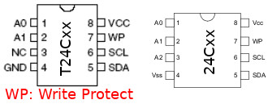
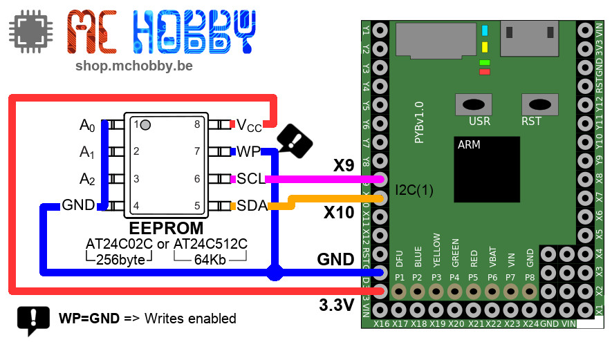

[Ce fichier existe également en FRANCAIS](readme.md)

# Use a T24Cxxx or 24Cxx EEPROM with MicroPython

The T24Cxxx is an I2C EEPROM from Peas semiconductor (default address=0x50).

The 24Cxxx is an I2C EEPROM from MicroChip semiconductor (default address=0x50).



Such I2C module can be used to store some bytes up to several KiloBytes depending on the IC used.

The AT24C0C EEPROM have 2 Kbit (2x1024 bits=2048 bits, so 2048/8= 256 bytes) is used on the [UNIPI](https://shop.mchobby.be/fr/pi-extensions/1171-extension-unipi-pour-raspberry-pi-3232100011717-unipi-technology.html) board, the reason for using this library.

The _Write Protect_ signal (WP) can be used to to protect the EEPROM against writing (when set to HIGH level). The writing operation are allowed when the WP pin is set to LOW.

## Credit

This library is based on the [EEPROM.py source code available on the MicroPython GitHub](https://raw.githubusercontent.com/dda/MicroPython/master/EEPROM.py) .

# Wiring

## to a Pyboard

Wire the EEPROM to a [MicroPython Pyboard](https://shop.mchobby.be/fr/56-micropython) board.



Wire the EEPROM on a [PYBStick](https://shop.mchobby.be/fr/recherche?controller=search&orderby=position&orderway=desc&search_query=pybstick&submit_search=) board.


# Test

You will have to copy the the needed library to the MicroPython board before using the various scripts.

* [`eeprom24cxx.py`](lib/eeprom24cxx.py) for the 24Cxxx EEPROM.

The script here under reads the 256 bytes stored in the 24C02C EEPROM (256 bytes).

```
from machine import I2C
from mcp24cxx import MCP24Cxx, CHIP_MCP24C02C

i2c = I2C( 2 )

eeprom = MCP24Cxx( i2c, addr=0x50, chip=CHIP_MCP24C02C ) # 256 octets

# Address from 0 to 255
for mem_addr in range( 256 ):
	data = eeprom.read( mem_addr ) # read one byte
	print( "0x%2s = %s" % ( hex(mem_addr), data[0]) )
```

Which produces:

```
0x0x0 = 255
0x0x1 = 255
0x0x2 = 255
...
0x0xf5 = 178
0x0xf6 = 64
0x0xf7 = 213
0x0xf8 = 0
0x0xf9 = 0
0x0xfa = 0
0x0xfb = 0
0x0xfc = 0
0x0xfd = 0
0x0xfe = 0
0x0xff = 0
```

The [`test_24c02c_read.py`](examples/test_24c02c_read.py) example produce a more appealing example.

```
0x0 : 4D 43 48 4F 42 42 59 23 : MCHOBBY#
0x8 : 24 25 0F EE AD FE 63 00 : $%....c.
0x10 : 0F 43 1E 40 49 0F D8 14 : .C.@I...
0x18 : 42 65 6C 67 69 75 6D 00 : Belgium.
0x20 : 00 00 00 00 00 00 00 00 : ........
0x28 : 00 00 00 00 01 FF FF FF : ........
0x30 : FF FF FF FF FF FF FF FF : ........
0x38 : FF FF FF FF FF FF FF FF : ........
```

The most exciting examples code are:
* [`test_24c02c_datawrite.py`](examples/test_24c02c_datawrite.py) : showing how to store datas like bytes, small integer, large integer, float, strings, ect inside the EEPROM.
* [`test_24c02c_dataread.py`](examples/test_24c02c_dataread.py) : indicates how to read back the data stored into the EEPROM: bytes, small integer, large integer, float, strings, etc.

# Shopping list
* [MicroPython Pyboard](https://shop.mchobby.be/fr/56-micropython) @ MCHobby
* [PYBStick 26](https://shop.mchobby.be/fr/recherche?controller=search&orderby=position&orderway=desc&search_query=pybstick&submit_search=) @ MCHobby
