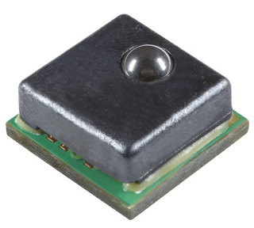
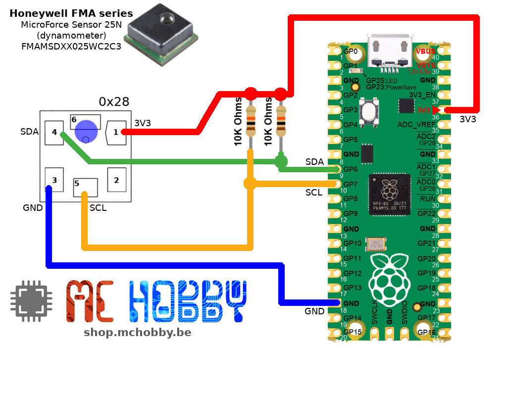

[This file also exist in ENGLISH](readme_ENG.md)

# Utiliser un capteur de Microforce Honeywell de 25 Newtons (serie FMA, dynamomètre) avec MicropYthon



De tels capteurs sont disponibles pour bus I2C et bus SPI, La référence FMAMSDXX025WC2C3 est un capteur I2C disposant d'une résolution typoque à 12 bits. C'est un capteur aussi plus couteux (30~40 Eur).

Capteur de la série FMA, compensé et amplifié, avec couplage magnétique, sphère comme élément de contact, gamme de force: 25 N pour force de compression, sortie numérique sur bus I2C (adresse 0x28), __fonction de transfert de 20% à 80%__, tension d'alimentation 3.3 V +/-10%.

Notes:

* Document Honeywell "DIGITAL OUTPUT FORCE SENSORS I2C COMMUNICATIONS" (voir [sps-siot-force-i2c-comms-tech-note-008291-ciid-156711.pdf](https://prod-edam.honeywell.com/content/dam/honeywell-edam/sps/siot/pt-br/products/sensors/force-sensors/microforce-fma-series/documents/sps-siot-force-i2c-comms-tech-note-008291-ciid-156711.pdf)  : détail des calcul, devrait être alu avant d'adapter le code pour une autre série de capteurs.
* [Note application pour créer un système de mesure basé sur les capteurs FSR FMA](https://community.element14.com/learn/learning-center/essentials/w/documents/27610/force-sensors) (Element 14).
* note technique de Honeywell: "overforce design consideration" ([sps-siot-overforce-tech-note-008334-ciid-181806.pdf](https://www.google.com/url?sa=t&source=web&rct=j&opi=89978449&url=https://prod-edam.honeywell.com/content/dam/honeywell-edam/sps/siot/ru-ru/products/sensors/force-sensors/microforce-fma-series/documents/sps-siot-overforce-tech-note-008334-ciid-181806.pdf&ved=2ahUKEwiZrYylqs-JAxWbTqQEHYtkOMcQFnoECBUQAQ&usg=AOvVaw2H_5kwqhaEnO9iwYYXRF2P))

# Bibliothèque

La bibliothèque doit être copiée sur la carte MicroPython avant de pouvoir utiliser les exemples.

Sur une plateforme WiFi:

```
>>> import mip
>>> mip.install("github:mchobby/esp8266-upy/fsr-fma-25N")
```

Ou via l'utilitaire mpremote :

```
mpremote mip install github:mchobby/esp8266-upy/fsr-fma-25N
```

# Brancher
## Brancher sur un Pico


# Tester
Avant de pouvoir tester l'élément, la bibliothèque [fsrfma.py](lib/fsrfma.py) doit être copiée sur la carte avant de pouvoir tester du code.

## test

Le script [test.py](examples/test.py), visible ci-dessous, est utilisé pour tester les fonctionnalités de base du capteur FSR FMA d'Honeywell.

``` python
from machine import I2C, Pin
from fsrfma import FsrFma
from time import sleep

i2c = I2C( 1, sda=Pin.board.GP6, scl=Pin.board.GP7 )
fsr = FsrFma( i2c ) # address=0x28, model=FMAMSDXX025WC2C3 (25N max) par défaut


while True:
	f = fsr.force
	print( "force: %5.2f N" % (f) )
	sleep( 1 )
```
Ce simple exemple révèle que le capteur peu présenter une valeur légèrement décallée (ce que l'on appelle un Offset).

## test_zero

Le script [test_zero.py](examples/test_zero.py), visible ci-dessous, capture l'offset du capteur et soustrait cette valeur des futures lectures. Cet exemple converti également la force en poids (pour les applications type "balance").

``` python
from machine import I2C, Pin
from fsrfma import FsrFma
from time import sleep

i2c = I2C( 1, sda=Pin.board.GP6, scl=Pin.board.GP7 )
fsr = FsrFma( i2c ) # address=0x28, model=FMAMSDXX025WC2C3 (25N max) par défaut

# Le capteur peut présenter un décallage de lecture (offset).
# Effectuer quelques lecture et initaliser la valeur pour obtenir 0 N.
fsr.set_offset()

while True:
	f = fsr.force
	w = fsr.weight
	print( "force: %5.2f N, Kg: %5.3f" % (f,w) )
	sleep( 1 )
```
