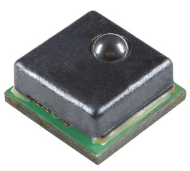

[Ce fichier existe aussi en FRANCAIS](readme.md)

# Using a 25N Honeywell MicroForce sensor (FMA series, dynamometer) with MicroPython



Such sensors exists with I2C and SPI bus, the FMAMSDXX025WC2C3 is an I2C sensor having a typical resolution of 12 bits. It is a  bit expensive (30~40 Eur).

FMA Series Force Sensor, compensated/amplified, mechanically
coupled, sphere contact element, sensor short and open
diagnostics, 25 N force range, compression force type, I2C digital
output, address 0x28, __20% to 80% transfer function__, 3.3 V ±10%
supply voltage

Note:

* Honeywell document "DIGITAL OUTPUT FORCE SENSORS I2C COMMUNICATIONS" (see [sps-siot-force-i2c-comms-tech-note-008291-ciid-156711.pdf](https://prod-edam.honeywell.com/content/dam/honeywell-edam/sps/siot/pt-br/products/sensors/force-sensors/microforce-fma-series/documents/sps-siot-force-i2c-comms-tech-note-008291-ciid-156711.pdf)  : detailed calculation notes that should be read before adapting the code for another sensor range.
* [Element 14 Application notes for building measurement unit using FSR FMA such sensor](https://community.element14.com/learn/learning-center/essentials/w/documents/27610/force-sensors).
* Honeywell offers a technical note on "overforce design consideration" ([sps-siot-overforce-tech-note-008334-ciid-181806.pdf](https://www.google.com/url?sa=t&source=web&rct=j&opi=89978449&url=https://prod-edam.honeywell.com/content/dam/honeywell-edam/sps/siot/ru-ru/products/sensors/force-sensors/microforce-fma-series/documents/sps-siot-overforce-tech-note-008334-ciid-181806.pdf&ved=2ahUKEwiZrYylqs-JAxWbTqQEHYtkOMcQFnoECBUQAQ&usg=AOvVaw2H_5kwqhaEnO9iwYYXRF2P))

# Library

The library must be copied on the MicroPython board before using the examples.

On a WiFi capable plateform:

```
>>> import mip
>>> mip.install("github:mchobby/esp8266-upy/fsr-fma-25N")
```

Or via the mpremote utility :

```
mpremote mip install github:mchobby/esp8266-upy/fsr-fma-25N
```

# Wiring
## Wiring on Pico


# Test
Before testing the unit, the library [fsrfma.py](lib/fsrfma.py) must be copied to the board prior to the execution of any test code.

## test

The [test.py](examples/test.py) script, visible here below, is used to test the basic features of Honeywell FSR FMA sensor.

``` python
from machine import I2C, Pin
from fsrfma import FsrFma
from time import sleep

i2c = I2C( 1, sda=Pin.board.GP6, scl=Pin.board.GP7 )
fsr = FsrFma( i2c ) # default address=0x28, model=FMAMSDXX025WC2C3 (25N max)


while True:
	f = fsr.force
	print( "force: %5.2f N" % (f) )
	sleep( 1 )
```
This simple revealed that the sensor may have a small offset value.

## test_zero

The [test_zero.py](examples/test_zero.py) script, visible here below, capture the sensor offset and substract the value from the future reads. This example also convert force into weight (for balance application).

``` python
from machine import I2C, Pin
from fsrfma import FsrFma
from time import sleep

i2c = I2C( 1, sda=Pin.board.GP6, scl=Pin.board.GP7 )
fsr = FsrFma( i2c ) # default address=0x28, model=FMAMSDXX025WC2C3 (25N max)

# Sensor may report an offset value.
# Make some reading then set the 0 N force.
fsr.set_offset()

while True:
	f = fsr.force
	w = fsr.weight
	print( "force: %5.2f N, Kg: %5.3f" % (f,w) )
	sleep( 1 )
```
