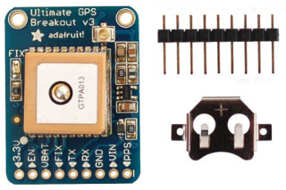
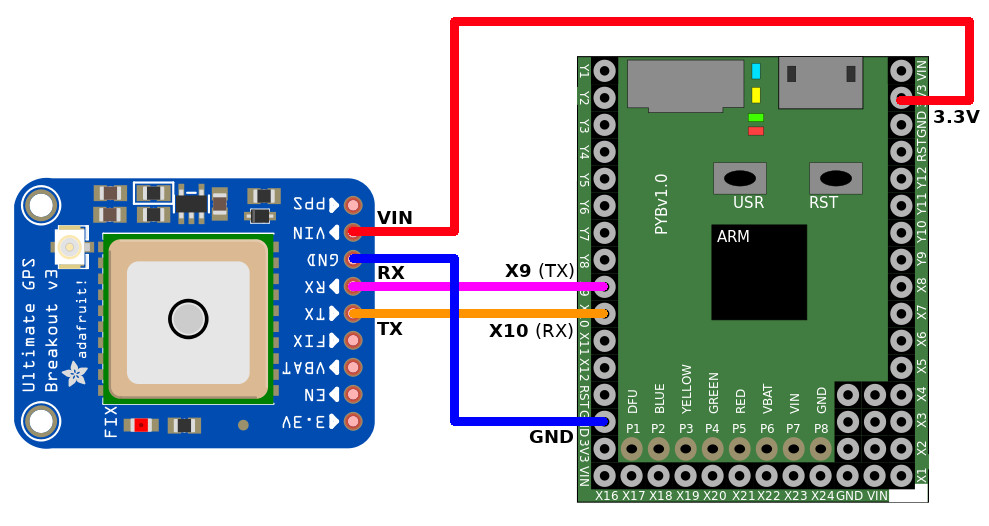

[This file also exists in ENGLISH](readme_ENG.md)

# Utiliser un GPS pour obtenir la latitude et la longitude
Le module GPS est un outil essentiel pour connaître sa position (localisation) sur la terre.

Il peut également être utilisé pour obtenir le temps universel (UTC).



Note:
1. Le GPS envoi des données au format NMEA même s'il n'a pas de FIX GPS. The flux NMEA indique que le FIX n'est pas disponible (et donc que les données de localisation ne sont pas valide).
2. Le signa FIX est aussi disponible en breakout. Ce signal est identique à celui de la LED FIX.
3. La LED FIX:
   * Flash toutes les secondes SI le FIX GPS n'est PAS DISPONIBLE.
   * Flash une fois toutes les 15 secondes lorsque le FIX GPS est DISPONIBLE.

# Credit

Cette bibliothèque est basée sur Adafruit_CircuitPython_GPS disponible sur https://github.com/adafruit/Adafruit_CircuitPython_GPS

Le contenu est également basé sur le travail de "alexmrqt" disponible sur https://github.com/alexmrqt/micropython-gps/commits/master

Distribué sur la licence MIT (comme la bibliothèque originale).

# Brancher



* Les broches X9 et X10 sont celles correspondant à __UART(1)__.

# Test

## Lecture du flux NMEA brute
L'exemple `testraw.py` effectue juste la configuration du GPS puis réceptionne les octets sur la ligne série (pour recomposer une chaîne de caractère).

Lorsqu'un caractère _line feed_ est réceptionné, la fonction `process_buffer()` est appelée (celle-ci ne fait qu'afficher le _buffer_ dans la session REPL.

La méthode `UART.readline()` est ici volontairement ignorée car trop sensible au paramètre `timeout` communiqué lors de la création de l'UART.

```
>>> import testraw
bytearray(b'L\x89\xa2\x82\x92br\xb100424.0478,E,1,07,1.19,94.7,M,47.4,M,,*52\r\n')
bytearray(b'$GPRMC,201225.,A,5041.4402,N,00424.0478,E,0.00,295.03,290719,,,A*6A\r\n')
bytearray(b'$PMTK001,314,3*36\r\n')
bytearray(b'$PMTK001,220,3*30\r\n')
bytearray(b'$GPGGA,201225.200,5041.4402,N,00424.0478,E,1,07,1.19,94.7,M,47.4,M,,*50\r\n')
bytearray(b'$GPRMC,201225.200,A,5041.4402,N,00424.0478,E,0.01,340.31,290719,,,A*61\r\n')
bytearray(b'$GPGGA,201225.400,5041.4402,N,00424.0478,E,1,07,1.19,94.7,M,47.4,M,,*56\r\n')
bytearray(b'$GPRMC,201225.400,A,5041.4402,N,00424.0478,E,0.01,356.93,290719,,,A*68\r\n')
bytearray(b'$GPGGA,201225.600,5041.4402,N,00424.0478,E,1,07,1.19,94.7,M,47.4,M,,*54\r\n')
bytearray(b'$GPRMC,201225.600,A,5041.4402,N,00424.0478,E,0.01,336.34,290719,,,A*61\r\n')
...
bytearray(b'$GPGGA,201227.600,5041.4403,N,00424.0478,E,1,07,1.19,94.7,M,47.4,M,,*57\r\n')
bytearray(b'$GPRMC,201227.600,A,5041.4403,N,00424.0478,E,0.00,359.85,290719,,,A*60\r\n')
```
Notes:
* La première ligne contient souvent des artefacts car la collecte des données commence au milieu du flux.
* les caractères \r\n (carriage return, linefeed) sont également inclus dans le _buffer_.

## Tester la bibliothèque

Voir `examples/minimaltest.py` qui effectue un parsing des trames NMEA à l'aide de la bibliothèque `adafruit_gps` et affiche la localisation GPS (avec un minimum d'information sur la sortie REPL).

Pour un affichage plus complet, voir l'autre example `simpletest.py`. 

Important: l'uart doit être créé à 9600 baud avec un __timeout fixé à 3000ms__. Sans cette configuration approrpriée de `timeout`, la bibliothèque sera incapable de fonctionner correctement.

``` python
from machine import UART
import utime as time

import adafruit_gps

# Pyboard (TX=X9, RX=X10)
uart = UART( 1, baudrate=9600, timeout=3000)

# Crée une instance GPS
gps = adafruit_gps.GPS(uart)

# Active les infos basiques GGA et RMC
gps.send_command('PMTK314,0,1,0,1,0,0,0,0,0,0,0,0,0,0,0,0,0,0,0')

# Mise-à-jour une fois par seconde (1hz)
gps.send_command('PMTK220,1000')

# Boucle principale
last_print = time.ticks_ms()
while True:
    gps.update()
    # Afficher chaque seconde
    current = time.ticks_ms()
    if time.ticks_diff(current, last_print) >= 1000:
        last_print = current

        if not gps.has_fix:
            print('Waiting for fix...')
            continue

        print('=' * 40)  
        print('Fix timestamp: {}/{}/{} {:02}:{:02}:{:02}'.format(
            gps.timestamp_utc[1],  
            gps.timestamp_utc[2],
            gps.timestamp_utc[0],
            gps.timestamp_utc[3],
            gps.timestamp_utc[4],
            gps.timestamp_utc[5]))
        print('Latitude: {} degrees'.format(gps.latitude))
        print('Longitude: {} degrees'.format(gps.longitude))
        if gps.satellites is not None:
            print('# satellites: {}'.format(gps.satellites))
        if gps.track_angle_deg is not None:
            print('Speed: {} km/h'.format(gps.speed_knots*1.8513))
```

La position est obtenue à l'aide de

``` python

    print('Latitude: {0:.6f} degrees'.format(gps.latitude))
    print('Longitude: {0:.6f} degrees'.format(gps.longitude))
```

Note: l'envoi de multiple commandes PMTK314 avec `gps.send_command()` ne fonctionnera pas (voir `gps_config.py`). Il faut en effet attendre un minimum de temps entre chaque appel de de `gps.send_command()`. Un `time.sleep()` de 1 seconde devrait convenir.

# Ressources
## A propos des données NMEA

Ce module GPS utilise le protocole NMEA 0183.

Ces données sont formatées par le GPS de deux façons différentes:
* La première est GGA qui contient à peu près tout ce qui est nécessaire.
* La deuxième est RMC (_Recommended Minimum Navigation_) qui sont les informations recommandées pour la navigation.

Voici quelques explications concernant GGA. La terminologie anglaise est préservé:
```

                                                        11
           1         2       3 4        5 6 7  8   9  10 |  12 13  14   15
           |         |       | |        | | |  |   |   | |   | |   |    |
    $--GGA,hhmmss.ss,llll.ll,a,yyyyy.yy,a,x,xx,x.x,x.x,M,x.x,M,x.x,xxxx*hh
```

1. Time (UTC)
2. Latitude
3. N or S (North or South)
4. Longitude
5. E or W (East or West)
6. GPS Quality Indicator,

   * 0 - fix not available,
   * 1 - GPS fix,
   * 2 - Differential GPS fix

7. Number of satellites in view, 00 - 12
8. Horizontal Dilution of precision
9. Antenna Altitude above/below mean-sea-level (geoid)
10. Units of antenna altitude, meters
11. Geoidal separation, the difference between the WGS-84 earth ellipsoid and mean-sea-level (geoid), "-" means mean-sea-level below ellipsoid
12. Units of geoidal separation, meters
13. Age of differential GPS data, time in seconds since last SC104 type 1 or 9 update, null field when DGPS is not used
14. Differential reference station ID, 0000-1023
15. Checksum

Voici les détails concernant la trame RMC:
```
                                                               12
           1         2 3       4 5        6 7   8   9   10   11|
           |         | |       | |        | |   |   |    |   | |
    $--RMC,hhmmss.ss,A,llll.ll,a,yyyyy.yy,a,x.x,x.x,xxxx,x.x,a*hh
```

1. Time (UTC)
2. Status, V = Navigation receiver warning
3. Latitude
4. N or S
5. Longitude
6. E or W
7. Speed over ground, knots
8. Track made good, degrees true
9. Date, ddmmyy
10. Magnetic Variation, degrees
11. E or W
12. Checksum

Le contenu des lignes peut être comparé et décodé à l'aide de la documentation suivante:
* [NMEA 0183 sur wikipedia](https://fr.wikipedia.org/wiki/NMEA_0183)
* [Adafruit_GPS GitHub](https://github.com/adafruit/Adafruit_GPS)
* [NMEA0183 (pdf) @ tronico](https://www.tronico.fi/OH6NT/docs/NMEA0183.pdf)
* [NMEA sentences @ GpsInformation.org](https://www.gpsinformation.org/dale/nmea.htm)

# Où acheter
* [Adafruit GPS Ultimate (ADA-746)](https://shop.mchobby.be/product.php?id_product=62) @ MCHobby
* [Adafruit GPS Ultimate (ADA-746)](https://www.adafruit.com/product/746) @ Adafruit Industries
