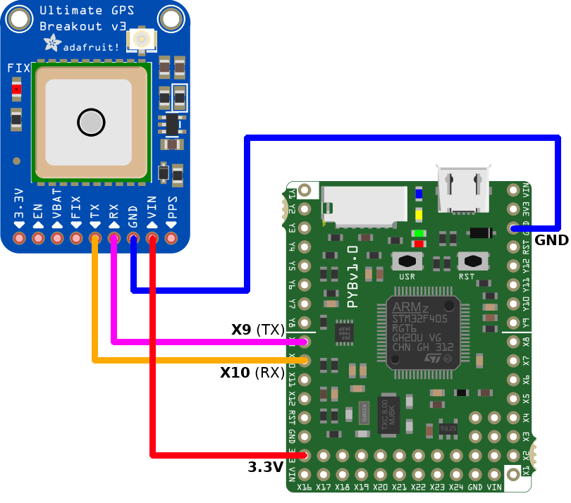

[Ce fichier existe également en FRANCAIS](readme.md)

# Using GPS to get latitude and longitude
*** DESCRIPTION TO COMPLETE ***

Note:
1. The GPS sends NMEA even with NO GPS FIX. The NMEA stream just indicates that the fix is not available.
2. The Fix signal is available as breakout pin. The signal on this pin is the same as the FIX LED.
3. The FIX LED:
   * Flash every second when the GPS FIX is not available.
	 * Flash once every 10 seconds when the GPS has a FIX.

# Wiring



* The X9 & X10 are the pin of __UART(1)__.

# Test

## Raw reading of NMEA streams
The `testraw.py` sample just send configuration string to the GPS module then parse incoming bytes on the serial line.

When the line feed is received, the `process_buffer()` is called. This function only prints the buffer content to the REPL output.

```
>>> import testraw
bytearray(b'L\x89\xa2\x82\x92br\xb100424.0478,E,1,07,1.19,94.7,M,47.4,M,,*52\r\n')
bytearray(b'$GPRMC,201225.,A,5041.4402,N,00424.0478,E,0.00,295.03,290719,,,A*6A\r\n')
bytearray(b'$PMTK001,314,3*36\r\n')
bytearray(b'$PMTK001,220,3*30\r\n')
bytearray(b'$GPGGA,201225.200,5041.4402,N,00424.0478,E,1,07,1.19,94.7,M,47.4,M,,*50\r\n')
bytearray(b'$GPRMC,201225.200,A,5041.4402,N,00424.0478,E,0.01,340.31,290719,,,A*61\r\n')
bytearray(b'$GPGGA,201225.400,5041.4402,N,00424.0478,E,1,07,1.19,94.7,M,47.4,M,,*56\r\n')
bytearray(b'$GPRMC,201225.400,A,5041.4402,N,00424.0478,E,0.01,356.93,290719,,,A*68\r\n')
bytearray(b'$GPGGA,201225.600,5041.4402,N,00424.0478,E,1,07,1.19,94.7,M,47.4,M,,*54\r\n')
bytearray(b'$GPRMC,201225.600,A,5041.4402,N,00424.0478,E,0.01,336.34,290719,,,A*61\r\n')
bytearray(b'$GPGGA,201225.800,5041.4402,N,00424.0478,E,1,07,1.19,94.7,M,47.4,M,,*5A\r\n')
bytearray(b'$GPRMC,201225.800,A,5041.4402,N,00424.0478,E,0.01,333.71,290719,,,A*6B\r\n')
bytearray(b'$GPGGA,201226.000,5041.4402,N,00424.0478,E,1,07,1.19,94.7,M,47.4,M,,*51\r\n')
bytearray(b'$GPRMC,201226.000,A,5041.4402,N,00424.0478,E,0.01,331.63,290719,,,A*61\r\n')
bytearray(b'$GPGGA,201226.200,5041.4402,N,00424.0478,E,1,07,1.19,94.7,M,47.4,M,,*53\r\n')
bytearray(b'$GPRMC,201226.200,A,5041.4402,N,00424.0478,E,0.00,343.31,290719,,,A*60\r\n')
bytearray(b'$GPGGA,201226.400,5041.4402,N,00424.0478,E,1,07,1.19,94.7,M,47.4,M,,*55\r\n')
bytearray(b'$GPRMC,201226.400,A,5041.4402,N,00424.0478,E,0.00,299.06,290719,,,A*64\r\n')
bytearray(b'$GPGGA,201226.600,5041.4402,N,00424.0478,E,1,07,1.19,94.7,M,47.4,M,,*57\r\n')
bytearray(b'$GPRMC,201226.600,A,5041.4402,N,00424.0478,E,0.01,290.00,290719,,,A*68\r\n')
bytearray(b'$GPGGA,201226.800,5041.4402,N,00424.0478,E,1,07,1.20,94.7,M,47.4,M,,*53\r\n')
bytearray(b'$GPRMC,201226.800,A,5041.4402,N,00424.0478,E,0.01,359.98,290719,,,A*63\r\n')
bytearray(b'$GPGGA,201227.000,5041.4402,N,00424.0478,E,1,07,1.20,94.7,M,47.4,M,,*5A\r\n')
bytearray(b'$GPRMC,201227.000,A,5041.4402,N,00424.0478,E,0.01,30.54,290719,,,A*56\r\n')
bytearray(b'$GPGGA,201227.200,5041.4402,N,00424.0478,E,1,07,1.20,94.7,M,47.4,M,,*58\r\n')
bytearray(b'$GPRMC,201227.200,A,5041.4402,N,00424.0478,E,0.01,29.49,290719,,,A*50\r\n')
bytearray(b'$GPGGA,201227.400,5041.4402,N,00424.0478,E,1,07,1.19,94.7,M,47.4,M,,*54\r\n')
bytearray(b'$GPRMC,201227.400,A,5041.4402,N,00424.0478,E,0.00,357.90,290719,,,A*69\r\n')
bytearray(b'$GPGGA,201227.600,5041.4403,N,00424.0478,E,1,07,1.19,94.7,M,47.4,M,,*57\r\n')
bytearray(b'$GPRMC,201227.600,A,5041.4403,N,00424.0478,E,0.00,359.85,290719,,,A*60\r\n')
```
Notes:
* The first line appears wierd because the data has been collected in the middle of the stream
* The \r\n (carriage return, linefeed) in included in the buffer.

The content of lines can be compared decode with the following documentations:
* [NMEA 0183 on wikipedia](https://fr.wikipedia.org/wiki/NMEA_0183)
* [Adafruit_GPS GitHub](https://github.com/adafruit/Adafruit_GPS)
