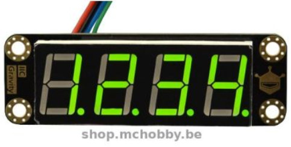
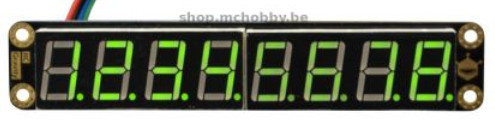
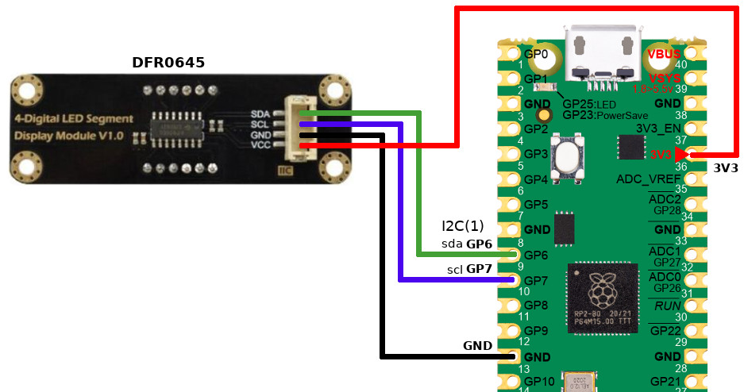
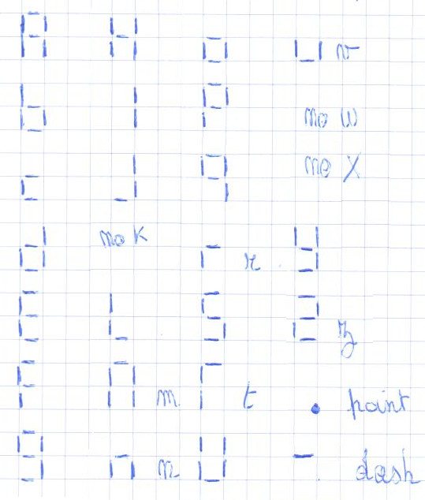

[This file is also available in ENGLISH](readme_ENG.md)

# Afficher des valeurs numériques à l'aide d'un afficheur numérique 4x7 et 8x7 à Segments LED (DFR0645, DFR646) sous MicroPython

Un tel afficheur peut être utilisé pour afficher une valeur numérique compter un score, tension, etc mais aussi un message rudimentaire.

Le DFR0645 propose les caractéristiques suivantes:
* 4 chiffres
* 8 niveaux de luminosités
* Chipset **TM1650**
* Couleur multiple (red, green)
* Expose un connecteur Gravity (pour raccordement rapide)
* DFR645



Le DFR0646 propose les caractéristiques suivantes:
* 8 chiffres
* 16 niveaux de luminosités
* Clignotement (0.5, 1, 2 hertz)
* Chipset **VK16K33**
* Couleur multiple (red, green)
* Expose un connecteur Gravity (pour raccordement rapide)
* DFR646



# Bibliothèque

La bibliothèque doit être copiée sur la carte MicroPython avant de pouvoir exécuter les exemples.

Sur une plateforme de type WiFi:

```
>>> import mip
>>> mip.install("github:mchobby/esp8266-upy/grav-digital-led")
```

Ou à l'aide de l'utilitaire mpremote :

```
mpremote mip install github:mchobby/esp8266-upy/grav-digital-led
```

# Brancher

Notez que le bus I2C doit être limité à la vitesse de 100 KHz pour l'afficheur 4 Digit qu'il fonctionne correctement.

## Raspberry-Pi Pico

Le raccordement est identique pour les afficheurs LED à 4 ou 8 digits.



| Broche Module | Couleur Fils | Broche Pico | Remarque     |
|------------|------------|----------|------------|
| SDA        | vert       | 6        | I2C(1).sda |
| SCL        | bleu       | 7        | I2C(1).scl, 100 Khz max pour DFR0645 |
| GND        | noir       | GND      |            |
| VCC        | rouge      | 3V3      |            |

# Tester

Si vous voulez utiliser ces modules, il sera nécessaire d'installer la bibliothèque adéquate sur votre carte MicroPython.

* DFR0645 : 4 digits display is driven by `ledseg4.py` .
* DFR0646 : 8 digits display is driven by `ledseg8.py` .

## DFR0645 - Afficheur LED 4 Digits

Le code si dessous indique comment afficher différent type de donnée sur l'afficheur 4 chiffres.

Les codes de test [test.py](examples/test.py) et [test_print.py](examples/test_print.py) concerne les "**afficheurs LED à 4 digits**" (DFR0645).

Notez que l'on utilise la classe `LedSegment4` de la bibliothèque `ledseg4`.

```
from machine import I2C
from ledseg4 import LedSegment4

# Raspberry-Pi Pico
i2c = I2C(1, freq=100000 ) # sda=GP6, scl=GP7 , limité a 100 KHz
dis = LedSegment4( i2c )   # DFR0645 afficheur LED 4 digit

# Afficher des entiers
dis.int( 4289 )
dis.int(-43)

# Afficher des float (virgule flottante)
dis.float(0.1)
dis.float(-3.1415)

# Control de luminosité
# (de 0=min a 7=max)
dis.brightness( 4 )

# Eteindre (off) et allumer (on)
dis.off()
dis.on()
```

La bibliothèque est également capable d'afficher un message texte rudimentaire (ASCII, 7bits).

L'image ci-dessous présente les lettres de l'alphabet (en colonnes) et leur représentation sur l'afficheur.



Les caractères inconnus sont remplacés par des blancs (espace).

Lorsque la chaîne est plus longue que l'afficheur le message défile sur celui-ci.


```
from machine import I2C
from ledseg4 import LedSegment4

# Raspberry-Pi Pico
i2c = I2C(1, freq=100000 ) # sda=GP6, scl=GP7 , limited to 100 KHz
dis = LedSegment4( i2c )  # DFR0645 4 digit LED display

# Affichage de messages
dis.print("halo")                  # retour immédiat
dis.print("Micropython is great!") # défilement de texte
```

Le défilement du texte peut être accéléré ou ralenti en utilisant le paramètre `delay_ms` qui modifie le temps d'attente entre deux étapes successive (500ms par défaut).

```
dis.print("Fast scrolling text", delay_ms=200 ) # Défilement rapide
```

## DFR0646 - Afficheur LED 8 digits

Les codes de tests suivants proviennent de [test8.py](examples/test8.py) et [test8_print.py](examples/test8_print.py) et sont spécifiquement conçus pour "**l'afficheur LED 8 digits**" (DFR0646).

Notez que l'on utilise la classe `LedSegment8` de la bibliothèque `ledseg8`.

```
from machine import I2C
from ledseg8 import LedSegment8, VK16K33_BLINK_1HZ, VK16K33_BLINK_2HZ, VK16K33_BLINK_0HZ5
from time import sleep

# Raspberry-Pi Pico
i2c = I2C(1) # sda=GP6, scl=GP7
dis = LedSegment8( i2c ) # DFR0646 : afficheur LED 8 digits

# Affiche des entiers
dis.int( 4289213 )
sleep(2)
dis.int(-4366444)
sleep(2)

# Affiche des nombres décimaux
dis.float(0.101)
sleep(2)
dis.float(7890.101)
sleep(2)
dis.float(-3.14159265) # pi
sleep(2)
dis.float(6.283185307179586) # tau

# Contrôle de luminosité (0..15)
for i in range( 16 ): # 0..15
	dis.brightness( i )
	dis.print( 'br  %s' % i )
	sleep(1)

d = {VK16K33_BLINK_1HZ:"1 Hz", VK16K33_BLINK_2HZ:"2 Hz", VK16K33_BLINK_0HZ5 : "0.5Hz"}
for freq in (VK16K33_BLINK_1HZ, VK16K33_BLINK_2HZ, VK16K33_BLINK_0HZ5):
		dis.print( "Bl %s" % d[freq] )
		dis.blink( freq )
		sleep( 5 )
dis.blink_off()

dis.print( "Fin" )
sleep(2)
# Eteind l ecran
dis.off()
```

La bibliothèque peut également être utilisée pour afficher un texte rudimentaire (ASCII, 7bits).

Si la chaîne est plus longue que l'afficheur alors celle-ci défile sur l'afficheur.

Les caractères inconnus sont remplacés par des espaces.

```
from machine import I2C
from ledseg8 import LedSegment8
from time import sleep

# Raspberry-Pi Pico
i2c = I2C(1) # sda=GP6, scl=GP7
dis = LedSegment8( i2c ) # DFR0646 8 digit LED display

dis.print("halo") # retour immédiat
sleep(2)
dis.print("14FE") # retour immédiat
sleep(2)
dis.print("Micropython is great!") # défillement du texte
sleep(2)
dis.print("amigos") # pas de défilement
```

As previous example, the text scrolling can also be accelerated or reduced by using the `delay_ms` parameter.

```
dis.print("Fast scrolling text", delay_ms=200 )
```

## Manipuler l'afficheur

Sur le principe, une méthode privé (préfixée par `__`) doit être appelée exclusivement par la bibliothèque. Dans les faits, rien n'empêche cet appel depuis vos propre script! Il est donc possible de possible de **créer vos propres animations** en manipulant directement les données envoyées vers l'afficheur.

Ces données sont manipulées en utilisant la méthode `__set_raw_value( pos, data )` où:
* `pos` est la position du digit dans l'afficheur (0..3 ou 0..7 selon le modèle).
* `data` l'octet avec les bits d'activation de l'afficheur 7 segments (voir ci-dessous)


Ensuite, l'afficheur est mis à jour en utilisant la méthode `__send_buf()` .


# Liste d'achat
* [Raspberry-Pi Pico](https://shop.mchobby.be/en/search?controller=search&s=pico) @ MCHobby
* [Green I2C display 4 digit 7 segments - 22 mm (SEN0645)](https://shop.mchobby.be/fr/leds/2092-afficheur-i2c-vert-4-chiffres-de-7-seg-22-mm-3232100020924-dfrobot.html) @ MCHobby
* [Green I2C display 4 digit 7 segments - 22 mm (SEN0645)](https://www.dfrobot.com/product-1966.html) @ DFRobot
* [Green I2C display 8 digit 7 segments - 22 mm (SEN0646)](https://shop.mchobby.be/fr/leds/2584-afficheur-i2c-vert-8-chiffres-de-7-seg-22-mm-3232100025844-dfrobot.html) @ MCHobby
* [Green I2C display 8 digit 7 segments - 22 mm (SEN0646)](https://www.dfrobot.com/product-1979.html) @ DFRobot
