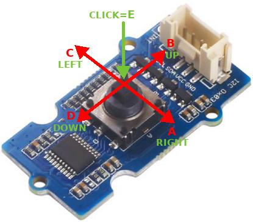
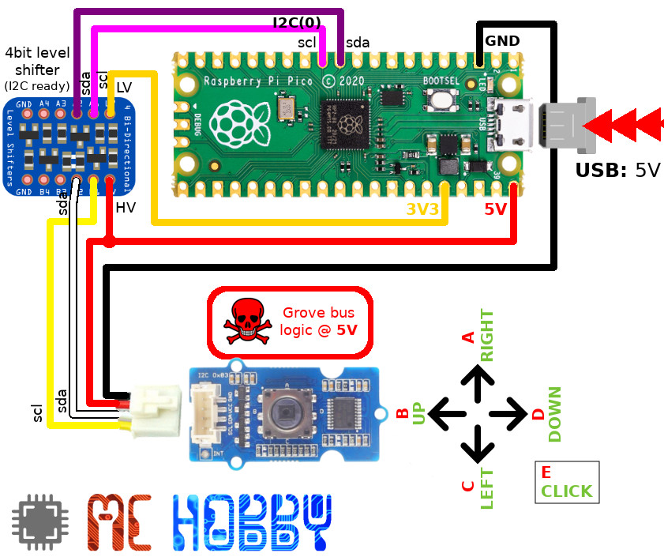

[Ce fichier existe également en FRANCAIS](readme.md)

# Use the Grove "5 Way Switch" I2C board (SeeedStudio) with MicroPython

This Grove module manufactured by SeeedStudio shows a 4 positions joystick + click that can be query over I1C bus.



This module does features event mecanism allowing to detect
* simple/double click,
* long click,
* press/release events.

An interesting feature of this board is its ability to get its I2C address modified by software. You can them combine several identical devices on the same bus (but I2C address must be modified first).

The `Grove5Way` class will help to use the module.

## Also for 6 DIPs module

The library can also be used with the DIP I2C module from SeeedStudio.


That module will use the `Grove6Dip` class as shown in the [testdip.py](examples/testdip.py) example.

## Not 3.3V compatible

The power voltage and I2C logic level are 5V.

You __will absolutely need__ to use a Level Shifter over the SDA and SCL lines if the MCU is not 5V tolerant (eg: like the Pico)

__Note:__ the `I2C.scan()` MicroPython method will not return any result for the module. So will wil have to register (annotate) the I2C address if you do modifies it.


# Wiring

## Raspberry-Pi Pico

The level shifter is used ti convert the 5V SDA and SCL I2C lines (Grove) to 3.3V (Pico) and vice-versa.

__Note:__ this grove module can also be powered with 3.3V, in such case you do not need to use a _level shifter_.



# Test

Before using the module, it will be necessary to copy the [`lib/grove5way.py`](lib/grove5way.py) library on the MicroPython board. The ['lib/grove6dip.py'](lib/grove6dip.py) must also be copied when using the "6 DIP Switch" module.

Please note that __the most complete example__ is not showed in this readme but available in the [examples/testevent2.py](examples/testevent2.py)

## RAW mode

The [examples/test.py](examples/test.py) script, visible here below, demonstrate the basic features related to joystick position. It relies on the default RAW mode to read button states.

The `get_event()` method returns a object of type  `ButtonEvent`. That object expose the `up`, `down`, `left`, `right`, `click` properties (or `a`,`b`,`c`,`d`,`e`)

``` python
from machine import I2C
from grove5way import Grove5Way
import time

# Pico - I2C(0), sda=IO8, scl=IO9
i2c = I2C(0, freq=400000)

sw = Grove5Way( i2c )
print( 'versions    :', sw.device_version() ) # return the 10 bytes of version
print( 'version     :', sw.version )
print( 'Switch Count:', sw.switch_count )
print( 'event mode  :', 'RAW')

# Using lambda expression to associate a test on event object with the
# text to display.
text_n_test = { 'Up'     : lambda ev : ev.up,
				'Down'   : lambda ev : ev.down,
				'Left'   : lambda ev : ev.left,
				'Right'  : lambda ev : ev.right,
				'CLICK!' : lambda ev : ev.click }

while True:
	ev = sw.get_event()
	print( '.' )
	# print( 'has_event', ev.has_event )
	# print( 'a,b,c,d,e', ev.a, ev.b, ev.c, ev.d, ev.e )
	# print( 'up,down,left,right,clicked', ev.up, ev.down, ev.left, ev.right, ev.click )
	if ev.has_event:
		# Smart way to test ev.up(), ev.down, ...
		for text, test in text_n_test.items():
			if test( ev ):
				print( text )
	time.sleep(0.250)
```

Ce qui produit le résultat suivant:

```
MicroPython v1.15 on 2021-04-18; Raspberry Pi Pico with RP2040
Type "help()" for more information.
>>> import test
versions    : 1
version     : 1
Switch Count: 5
event mode  : RAW
.
.
.
.
Up
.
Up
.
Up
.
.
.
Down
.
Down
.
.
Left
.
Left
.
.
.
Right
.
Right
.
.
CLICK!
.
CLICK!
.
.
.
.
CLICK!
.
CLICK!
.
CLICK!
.
```

## EVENT mode

The [examples/testevent.py](examples/testevent.py) script allows to detect the events on UP and CLICK button (reduced to ease script understanding).

A full example is available at [examples/testevent2.py](examples/testevent2.py) .

``` python
from machine import I2C
from grove5way import Grove5Way
import time

# Pico - I2C(0), sda=IO8, scl=IO9
i2c = I2C(0, freq=400000)

sw = Grove5Way( i2c )
sw.set_event_mode( True )
print( 'versions    :', sw.device_version() ) # return the 10 bytes of version
print( 'version     :', sw.version )
print( 'Switch Count:', sw.switch_count )
print( 'event mode  :', 'EVENT')
print( '' )
print( 'ONLY  UP and CLICK buttons')
print( '' )

while True:
	ev = sw.get_event()
	print( '.' )
	if ev.has_event: # Contains an event for any of the buttons ?
		# Testing UP button
		if ev.up_events.has_event:
			print( 'UP' )
			if ev.up_events.single_click :
				print( '  +-> Single click')
			if ev.up_events.double_click :
				print( '  +-> Double click')
			if ev.up_events.long_press :
				print( '  +-> long press')
			if ev.up_events.level_changed :
				print( '  +-> level changed')
		# Testing CLICK button
		if ev.click_events.has_event:
			print( 'CLICK' )
			if ev.click_events.single_click :
				print( '  +-> Single click')
			if ev.click_events.double_click :
				print( '  +-> Double click')
			if ev.click_events.long_press :
				print( '  +-> long press')
			if ev.click_events.level_changed :
				print( '  +-> level changed')

	time.sleep(0.250)
```

Wich produce the following results:

```
>>> import testevent
versions    : 1
version     : 1
Switch Count: 5
event mode  : EVENT

ONLY  UP and CLICK buttons

.
.
UP                    >>> PRESS DOWN the button and keep it pressed
  +-> level changed   >>> Note: read the "up" property to know the state
.
.
.
.
UP
  +-> long press
.
.
.
UP                   >>> RELEASE the button
  +-> level changed
.
.
.
.
UP                   >>> Click & Release the button
  +-> Single click
.
.
.
.
UP
  +-> Single click
  +-> level changed  >>> Starting a double click operation
.
UP
  +-> Double click
  +-> level changed
.
.
.
.
.
CLICK
.
CLICK
.
.
CLICK
.
CLICK
.
.
```

## Change the I2C address

The [examples/testaddr.py](examples/testaddr.py) test script show how to use the `unlock()` & `change_address()` methods to change the I2C address of the module.

__WARNING:__ it is very important to identify and note the new module address.

# Shopping list
* [Raspberry-Pi Pico](https://shop.mchobby.be/product.php?id_product=2025
) @ MCHobby
* [4bits level-shifter (I2C compatible)](https://shop.mchobby.be/product.php?id_product=131)
