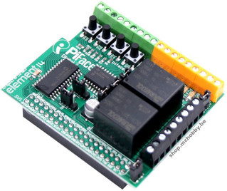
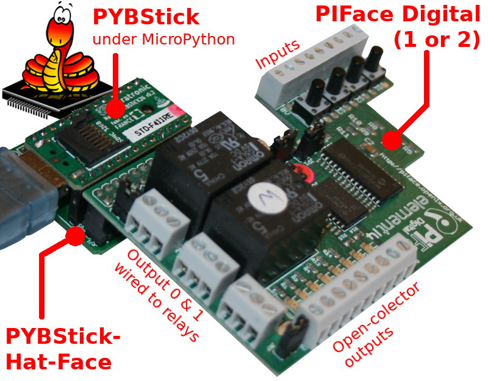
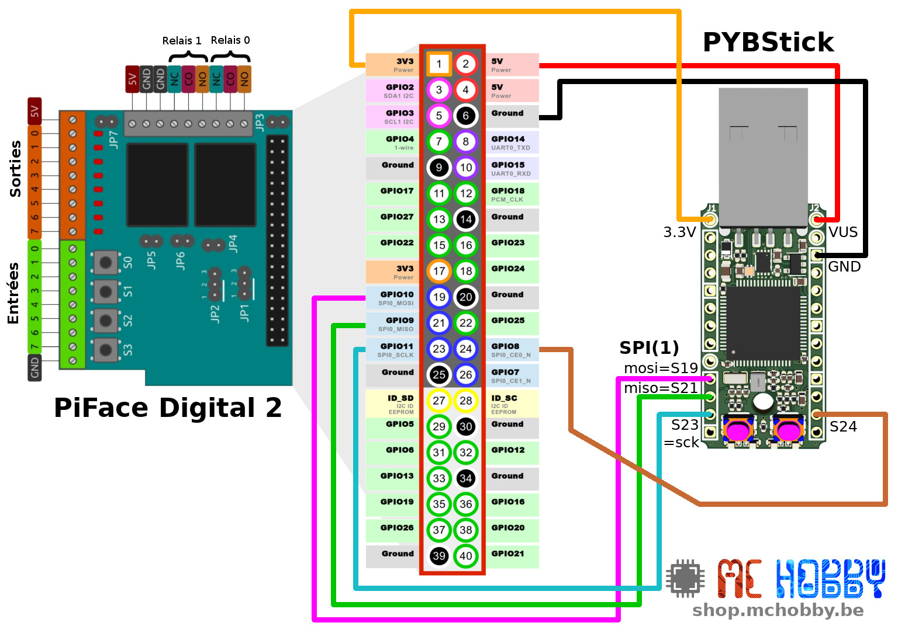
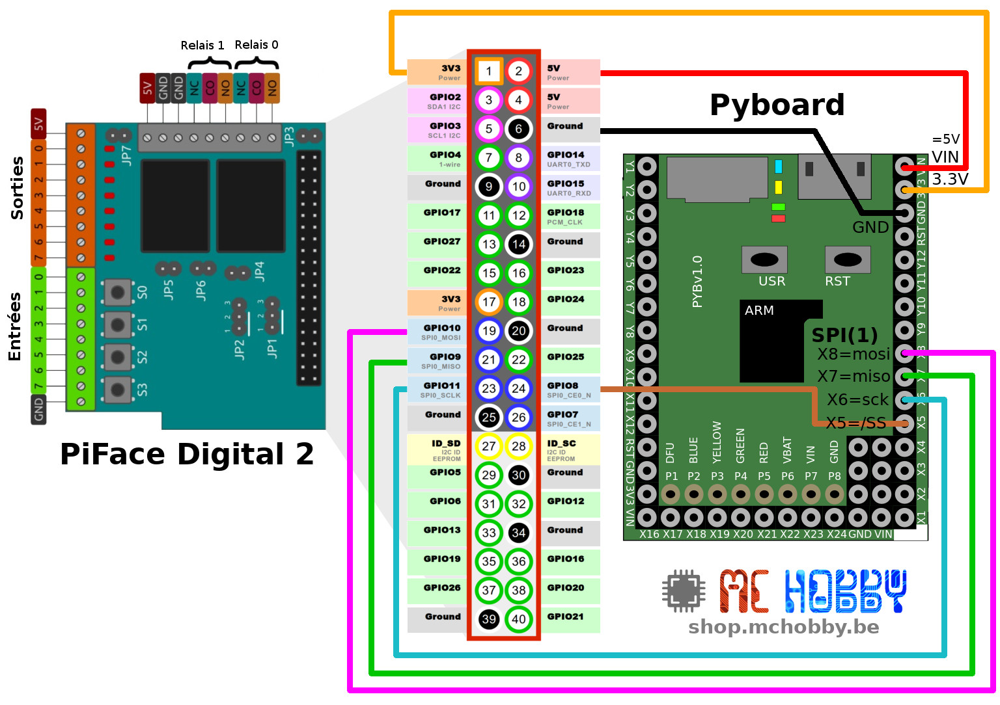

[This file also exists in ENGLISH](readme_ENG.md)
# Utiliser un PiFace-Digital (v1 ou v2) sous MicroPython

Le PiFace Digital 1 et [PiFace Digitial 2](https://shop.mchobby.be/fr/pi-hats/221-piface-digital-2-pour-raspberry-pi-3232100002210.html) sont identiques du point de vue matériel (seul le facteur de forme diffère).



Ce HAT, équipé d'un MCP23S17 (SPI) en guise de contrôleur. Il peut donc être utilisé avec n'importe quel microcontrôleur disposant d'un port SPI.

Le PiFace expose les interfaces suivantes:
* 2 relais (deux directions chacun)
* 4 boutons poussoirs momentanés
* 8 entrées numériques
* 8 sorties à collecteur ouvert
* 8 LEDs (indicatrice)

[L'utilisation du PiFace est documenté en français sur notre Wiki](https://wiki.mchobby.be/index.php?title=PiFace2-Manuel) ou dans la [documentation constructeur (en anglais)](http://df.mchobby.be/RASP-PIFACE-DIGITAL2/Operating-Instruction.pdf)

# Brancher

Si ce HAT est initialement prévu pour Raspberry-Pi, il est tout à fait possible de l'exploiter avec d'autres nano-ordinateurs et/ou microcontrôleur.

## PYBStick + PYBSTICK-HAT-FACE
La capture ci-dessous montre le Hat PiFace Digital (v1) Branché avec une carte [PYBStick](https://shop.mchobby.be/fr/micropython/1844-pybstick-standard-26-micropython-et-arduino-3232100018440-garatronic.html) sous MicroPython à l'aide de l'adaptateur PYBSTICK-HAT-FACE (voir [documentation](https://shop.mchobby.be/fr/micropython/1935-interface-pybstick-vers-raspberry-pi-3232100019355.html))



# PYBStick 26
Si vous n'avez pas d'adaptateur PYBStick-HAT-FACE, vous pouvez effectuer les raccordements suivants:



# Pyboard
Si vous avez un Pyboard alors vous pouvez effectuer les raccordements suivants:



# Tester

Avant de pouvoir tester les différent exemples, il sera nécessaire d'installer les bibliothèques nécessaires:
* [piface.py](lib/piface.py) : bibliothèque de contrôle pour la PyFace
* Dépendances : l'archive ZIP contenu dans le répertoire [lib/](lib) contient les dépendances requises par la bibliothèque `piface`.

Ces fichiers doivent être copiés sur la carte MicroPython.

Les exemples sont prévus pour __PYBSTICK__. Pour une utilisation avec Pyboard, il faudra remplacer la broche __S24__ avec la broche __X5__ dans les scripts de démonstration.

## Lecture d'une entrée

L'exemple ci-dessous, provenant de [test_input.py](examples/test_input.py), lit les entrées... une à la fois.

Pour chaque lecture d'entrée, la bibliothèque entre en communication avec le HAT pour récupérer l'information nécessaire. Cette approche consomme donc plus de bande passante sur le bus I2C.

``` python
from machine import SPI, Pin
from piface import PiFace
import time

# PYBStick / PYBStick-HAT-FACE
spi = SPI( 1, phase=0, polarity=0 ) # SCLK=S23, MISO=S21, MOSI=S19
cs = Pin( 'S24', Pin.OUT, value=True ) # SPI_CE0=S24, utiliser X5 pour Pyboard

piface = PiFace( spi, cs, device_id=0x00 )

# read all inputs (une a la fois)
try:
	print( "Press CTRL+C to halt script" )
	while True:
		for i in range( 0, 8 ): # 0..7
			if piface.inputs[ i ]:
				print( "Input %s is pressed" % i )
		time.sleep_ms( 300 )
except:
	print( "That s all folks" )
```

## Lecture de toutes les entrées
L'exemple suivant issus de [test_input2.py](examples/test_input2.py) montre comment lire toutes les entrées en une seule opération.

``` python
from machine import SPI, Pin
from piface import PiFace
import time

# PYBStick / PYBStick-HAT-FACE
spi = SPI( 1, phase=0, polarity=0 ) # SCLK=S23, MISO=S21, MOSI=S19
cs = Pin( 'S24', Pin.OUT, value=True ) # SPI_CE0=S24, utiliser X5 pour Pyboard

piface = PiFace( spi, cs, device_id=0x00 )

# Lire toutes les entrées en une fois
try:
	# Preparer une liste avec les noms des entrées
	pin_names =  ['IN%i' % pin for pin in range(8) ]
	print( "Press CTRL+C to halt script" )
	while True:
		values = piface.inputs.all # collecter toutes les entrées en une opération
		datas = zip(pin_names,values) # Combiner les deux liste [ (pin_name0,value0), (pin_name1,value1), ... ]
		print( ", ".join( ["%s:%s" % (name_value[0],name_value[1]) for name_value in datas] ))
		time.sleep(0.5)
except:
	print( "That s all folks" )
```

## Modification des sorties

Le script [test_output.py](examples/test_output.py) montre comment modifier les sorties.

``` python
from machine import SPI, Pin
from piface import PiFace
import time

# PYBStick / PYBStick-HAT-FACE
spi = SPI( 1, phase=0, polarity=0, baudrate=400000 ) # SCLK=S23, MISO=S21, MOSI=S19
cs = Pin( 'S24', Pin.OUT, value=True ) # SPI_CE0=S24, utiliser X5 pour Pyboard

piface = PiFace( spi, cs, device_id=0x00 )

# changer l'état de toutes les sorties (chasse)
try:
	print( "Press CTRL+C to halt script" )
	while True:
		for i in range( 8 ): # 0..7
			piface.outputs[i] = True
			time.sleep_ms( 300 )
			piface.outputs[i] = False
except:
	piface.reset() # Reset de toutes les sorties
```

# Ou Acheter
* [Carte PYBStick](https://shop.mchobby.be/fr/micropython/1844-pybstick-standard-26-micropython-et-arduino-3232100018440-garatronic.html) et [PYBStick-Hat-Face](https://shop.mchobby.be/fr/micropython/1935-interface-pybstick-vers-raspberry-pi-3232100019355.html)
* [Carte MicroPython Pyboard](https://shop.mchobby.be/fr/56-micropython)
* [PiFace Digital 2](https://shop.mchobby.be/fr/pi-hats/221-piface-digital-2-pour-raspberry-pi-3232100002210.html) disponible chez MCHobby
