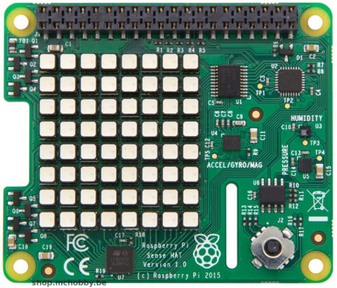
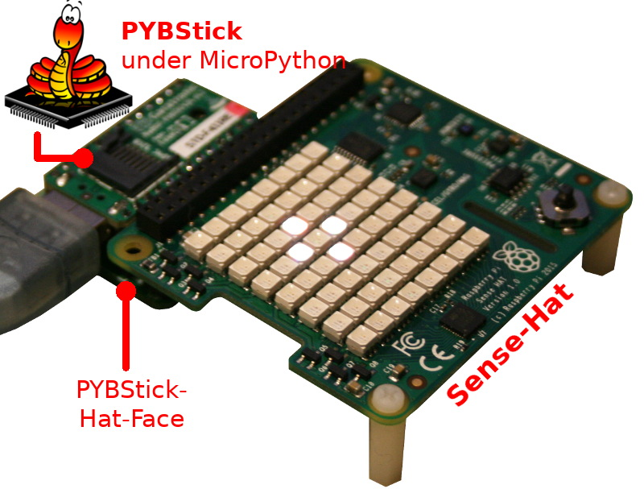
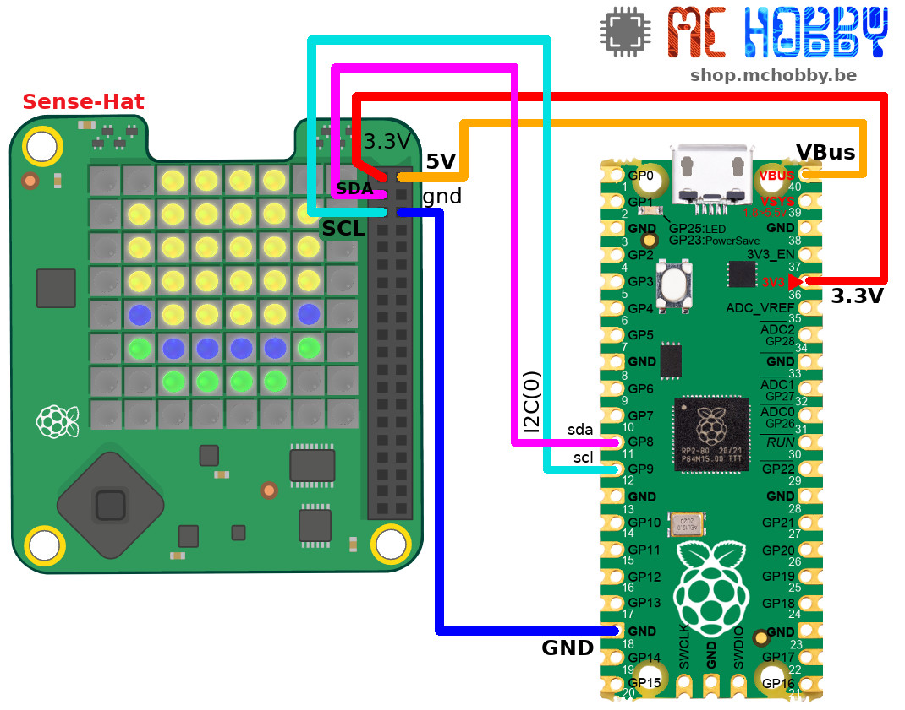
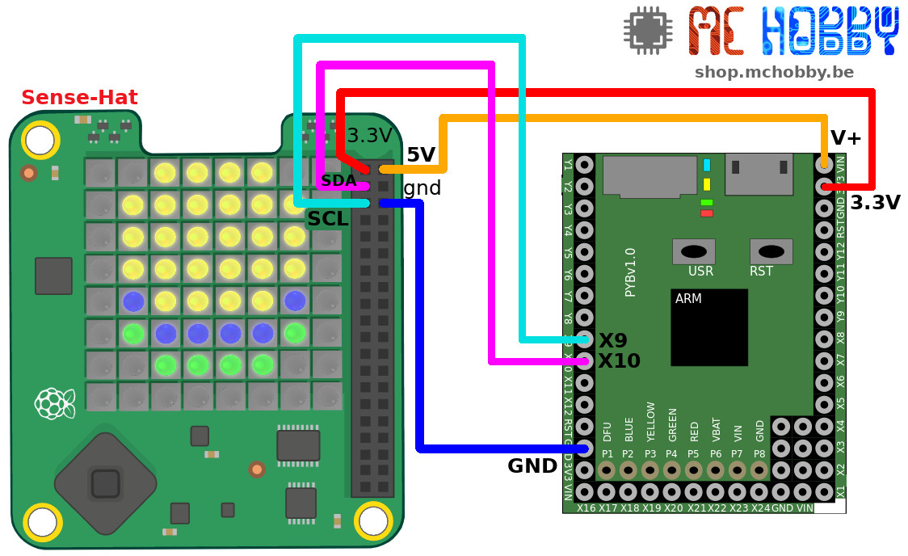
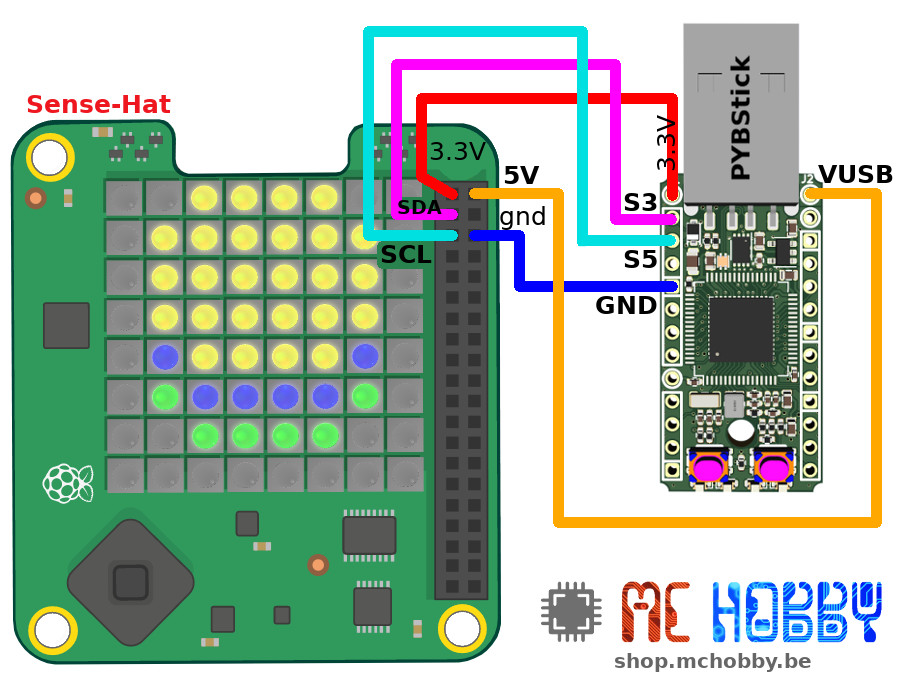
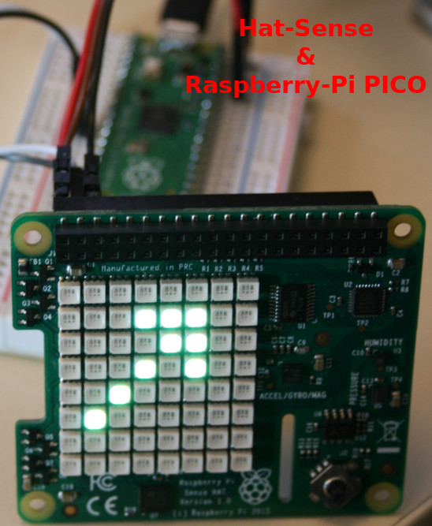
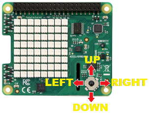
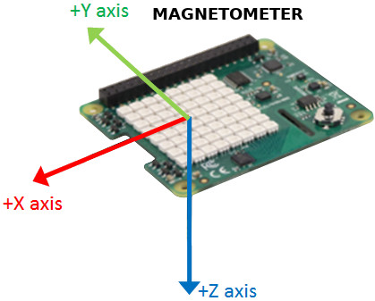
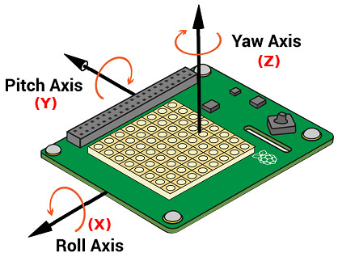
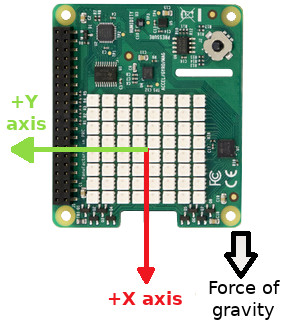

[This file also exists in ENGLISH](readme_ENG.md)

# Utiliser un Hat-Sense sous MicroPython

Le Sense Hat embarque les capteurs d'orientation, magnétique, gyroscope, accéléromètre, pression atmosphérique, humidité, température, joystick ainsi qu'une matrice de 8x8 LEDs RGB permettant de réaliser de nombreuses expérimentation, applications, interfaces homme-machine et même des jeux.



Avec le Sense-Hat vous pourrez connaître sa vitesse de rotation, son orientation par rapport au sol, le taux d'humidité de l'air, la température, etc.

Si ce HAT est initialement prévu pour Raspberry-Pi, il est tout à fait possible de l'exploiter avec d'autres nano-ordinateurs et/ou microcontrôleur.

La capture ci-dessous montre le Sense-Hat utilisé avec une carte PYBStick sous MicroPython.



Le portage de ce projet sous MicroPython est basé sur le GitHub du projet "[Sense Hat Unchained](https://github.com/bitbank2/sense_hat_unchained)" et son code source en C écrit par Larry Bank.

# Vidéo

Il est possible de voir le "[Sense-Hat sous MicroPython](https://youtu.be/PUU4EqAMHds)" sur la vidéo YouTube.

# Bibliothèque

Cette bibliothèque doit être copiée sur la carte MicroPython avant d'utiliser les exemples.

Sur une plateforme connectée:

```
>>> import mip
>>> mip.install("github:mchobby/esp8266-upy/hat-sense")
```

Ou via l'utilitaire mpremote :

```
mpremote mip install github:mchobby/esp8266-upy/hat-sense
```

# Brancher

## Raspberry-Pi PICO
Vous pouvez réaliser le cablage suivant ou utiliser un [adaptateur Pico-Hat](https://shop.mchobby.be/fr/pico-raspberry-pi/2037-interface-hat-pour-raspberry-pi-pico-3232100020375.html)




## MicroPython PYBoard



## MicroPython PYBStick



__---> PYBStick-Hat-Face <---__

Il est également possible d'utiliser la carte d'interface [__PYBStickHAT-FACE__](https://shop.mchobby.be/fr/nouveaute/1935-interface-pybstick-vers-raspberry-pi-3232100019355.html) pour brancher rapidement et facilement le HAT sur la PYBStick (voir image de présentation).

C'est d'ailleurs sur base de cette interface que la bibliothèque MicroPython a été développée.

# Tester

Avant de pouvoir utiliser les différents exemples, il est nécessaire de copier la bibliothèque [sensehat.py](lib/sensehat.py) sur votre carte MicroPython.

Si vous désirez utiliser les icones (identique à celles du Micro:bit), il sera également nécessaire de copier le fichier [icons.py](lib/icons.py) sur votre carte.

## Utilisation de la matrice LEDs

Le script [test_basic.py](examples/test_basic.py) repris ci-dessous effectue toute une série d'opérations graphique sur la matrice LED.
Comme la classe `SenseHat` hérite de `FrameBuffer` et bénéficie donc de toutes [les méthodes graphiques disponibles](https://docs.micropython.org/en/latest/library/framebuf.html)

``` python
from machine import I2C
from sensehat import SenseHat
import time

# PYBStick, Hat-Face: Sda=S3, Scl=S5
# Pyboard, Sda=X10, Scl=X9
i2c = I2C( 1 )
# Raspberry-Pi Pico, Sda=GP8, Scl=GP9
# i2c = I2C( 0 )

hat = SenseHat( i2c )

# See the FrameBuffer doc @ https://docs.micropython.org/en/latest/library/framebuf.html
#
hat.fill( hat.color(255,0,0) ) # Rouge
hat.update() # Afficher sur matrice LED
time.sleep(1)

hat.fill( hat.color(0,255,0) ) # Vert
hat.update()
time.sleep(1)

hat.fill( hat.color(0,0,255) ) # Bleu
hat.update()
time.sleep(1)

# Dessiner des rectangle imbriqués
hat.clear()
hat.rect( 0,0, 8,8, hat.color(255,0,0) ) # exterieur = Rouge
hat.rect( 1,1, 6,6, hat.color(0,255,0) ) # Vert
hat.rect( 2,2, 4,4, hat.color(0,0,255) ) # Bleu
hat.rect( 3,3, 2,2, hat.color(255,255,0) ) # Jaune
hat.update()
time.sleep(2)

# Balayage de haut en bas
for y in range(8):
	hat.clear( update=False ) # uniquement effacer la mémoire interne
	hat.hline(0, y, 8, hat.color(238,130,238) ) # Violet
	hat.update()
	time.sleep(0.200)

# Balayage de gauche à droite
hat.clear()
for x in range(8):
	hat.clear( update=False )
	hat.vline(x, 0, 8, hat.color(91,60,17) ) # brun
	hat.update()
	time.sleep(0.200)

hat.clear()

# Affichage de Pixel au hasard (avec couleur au hasard)
from random import randint
while True:
	hat.pixel( randint(0,7), randint(0,7), hat.color(randint(0,255),randint(0,255),randint(0,255) ) )
	hat.update()
```
L'exemple [test_scroll.py](examples/test_scroll.py), repris ci-dessous, fait défiler un texte sur la matrice.

Note:
* La méthode `scroll()` ne rend la main qu'une fois le texte affiché.
* Le paramètre optionnel `c` permet d'indiquer la couleur (blanc par défaut)
* le paramètre optionnel `delay_ms` permet d'indiquer le temps de pause entre chaque défilement de colonne de pixels (100 ms par défaut).
* Un buffer de `8*(Nbre_Caractères+2)` octets est alloué durant l'affichage d'un texte.

``` python
from machine import I2C
from sensehat import SenseHat
import time

# PYBStick, Hat-Face: Sda=S3, Scl=S5
# Pyboard, Sda=X10, Scl=X9
i2c = I2C( 1 )
# Raspberry-Pi Pico, Sda=GP8, Scl=GP9
# i2c = I2C( 0 )

hat = SenseHat( i2c )

hat.clear()
hat.scroll( "Sense-Hat running under MicroPython!" )
```

L'exemple [test_image.py](examples/test_image.py), repris ci-dessous, indique comment afficher une image sur la matrice en exploitant la méthode `pixels()`

``` python
from machine import I2C
from sensehat import SenseHat
import time

# PYBStick, Hat-Face: Sda=S3, Scl=S5
# Pyboard, Sda=X10, Scl=X9
i2c = I2C( 1 )
# Raspberry-Pi Pico, Sda=GP8, Scl=GP9
# i2c = I2C( 0 )

hat = SenseHat( i2c )

# Definir les code couleurs
w = hat.color(150, 150, 150)
b = hat.color(0, 0, 255)
e = hat.color(0, 0, 0)

# Définir l'image sous forme de liste.
# 8 lignes de 8 pixels, soit 64 pixels
image = [
e,e,e,e,e,e,e,e,
e,e,e,e,e,e,e,e,
w,w,w,e,e,w,w,w,
w,w,b,e,e,w,w,b,
w,w,w,e,e,w,w,w,
e,e,e,e,e,e,e,e,
e,e,e,e,e,e,e,e,
e,e,e,e,e,e,e,e
]

# Envoyer l'image vers la matrice
hat.clear()
hat.pixels(image)
hat.update()

# Miroir Horizontale + re-afficher
while True:
	time.sleep(1)
	hat.flip_h() # ou flip_v
	hat.update()

```

L'exemple [test_icon.py](examples/test_icon.py), partiellement repris ci-dessous, indique comment afficher une des icones prédéfinies sur la matrice. Les icones sont définie dans le fichier `lib/icons.py` qu'il faudra aussi copier sur la carte.

``` python
from machine import I2C
from sensehat import SenseHat
from icons import HEART, HEART_SMALL
import time
from random import randint

# PYBStick, Hat-Face: Sda=S3, Scl=S5
# Pyboard, Sda=X10, Scl=X9
i2c = I2C( 1 )
# Raspberry-Pi Pico, Sda=GP8, Scl=GP9
# i2c = I2C( 0 )

hat = SenseHat( i2c )

# Afficher un coeur qui pulse
red = hat.color(200, 0, 0)
for i in range(10):
	hat.clear()
	hat.icon( HEART, color=red )
	hat.update()
	time.sleep(1)

	hat.clear()
	hat.icon( HEART_SMALL, color=red )
	hat.update()
	time.sleep(1)
```
Note:
* Seuls les pixels actifs de l'icone sont dessinés (les pixels éteint ne sont pas effacés/resettés)
* Le paramètre optionnel `clear` efface le contenu du FrameBuffer avant de dessiner l'icone. La valeur par défaut est `True`. En placant ce paramètre à `False`, il est possible de dessiner une icone par dessus un arrière plan de couleur.
* Le paramètre optionnel `x` indique la position pour dessiner l'icone (fixé à 1 par défaut, la seconde colonne),
* Le paramètre optionnel `y` indique la position pour dessiner l'icone  (fixé à 1 par défaut, la seconde ligne),
* Le paramètre optionnel `color` permet d'indiquer la couleur à utiliser pour dessiner l'icone (0x7BEF par defaut, un blanc moins agressif).



Ce n'est pas un hasard si toutes les icones font 5x5 pixels, il s'agit des icones Micro:bit réencodées par Amélie (ma fille) sur base cette image publiée sur giggletronics.blogspot.com . Ces icones sont disponibles dans le fichier [icons.py](lib/icons.py)


L'exemple [test_text.py](examples/test_text.py),partiellement repris ci-dessous, montre comment afficher un caractère sur la matrice. La méthode `FrameBuffer.text()` permet de dessiner un texte dans un FrameBuffer. Cependant, le FrameBuffer de la matrice est juste assez grande pour contenir une seule lettre (la première lettre du texte).

``` python
from machine import I2C
from sensehat import SenseHat
import time

# PYBStick, Hat-Face: Sda=S3, Scl=S5
# Pyboard, Sda=X10, Scl=X9
i2c = I2C( 1 )
# Raspberry-Pi Pico, Sda=GP8, Scl=GP9
# i2c = I2C( 0 )

hat = SenseHat( i2c )

hat.clear()
hat.text( "A",0,0, hat.color(125,125,125) )
hat.update()
time.sleep(1)
```

## Joystick

La propriété `joystick` retourne l'état du joystick (JOY_UP, JOY_DOWN, JOY_RIGHT, JOY_LEFT, JOY_ENTER) ou None si le joystick n'est pas utilisé.



``` python
from machine import I2C
from sensehat import *
from icons import ARROW_N,ARROW_S,ARROW_E,ARROW_W,TARGET
import time

# PYBStick, Hat-Face: Sda=S3, Scl=S5
# Pyboard, Sda=X10, Scl=X9
i2c = I2C( 1 )
# Raspberry-Pi Pico, Sda=GP8, Scl=GP9
# i2c = I2C( 0 )


hat = SenseHat( i2c )
hat.clear()

while True:
	hat.clear(update=False) # Effacer le contenu du FrameBuffer
	j = hat.joystick
	if j == JOY_UP:
		hat.icon(ARROW_N)
	elif j == JOY_DOWN:
		hat.icon(ARROW_S)
	elif j == JOY_RIGHT:
		hat.icon(ARROW_W)
	elif j == JOY_LEFT:
		hat.icon(ARROW_E)
	elif j == JOY_ENTER:
		hat.icon(TARGET)
	hat.update()
	```

## Pression et température

La propriété `press` permet d'obtenir un tuple avec pression atmosphérique (en hPa) et la température.

Le script [test_press.py](examples/test_press.py), repris ci-dessous, indique comment lire l'information en provenance du capteur de pression.

``` python
from machine import I2C
from sensehat import *
import time

# PYBStick, Hat-Face: Sda=S3, Scl=S5
# Pyboard, Sda=X10, Scl=X9
i2c = I2C( 1 )
# Raspberry-Pi Pico, Sda=GP8, Scl=GP9
# i2c = I2C( 0 )

hat = SenseHat( i2c )

while True:
	# Lecture de pression et température
	print( "%8.2f hPa, %3.1f Celcius" % hat.pressure )
	time.sleep( 1 )
```

## Humidité et température

La propriété `humidity` permet d'obtenir un tuple avec l'humidité relative (en pourcent) et la température.

Le script [test_hum.py](examples/test_hum.py), repris ci-dessous, indique comment lire l'information en provenance du capteur de d'humidité.

``` python
from machine import I2C
from sensehat import *
import time

# PYBStick, Hat-Face: Sda=S3, Scl=S5
# Pyboard, Sda=X10, Scl=X9
i2c = I2C( 1 )
# Raspberry-Pi Pico, Sda=GP8, Scl=GP9
# i2c = I2C( 0 )

hat = SenseHat( i2c )

while True:
	# Lecture de l'humidité et température
	print( "%3.1f %%RH, %3.1f Celcius" % hat.humidity )
	time.sleep( 1 )
```
## Magnetomètre

Le magnétomètre 3 axes permet de relever la champs magnétiques selon 3 axes.



Le script de test [test_mag.py](examples/test_mag.py), repris ci-dessous, permet de relever le champs magnétique dans les 3 axes. Celui-ci à été testé à l'aide d'un aimant Rare Earth.

``` python
from machine import I2C
from sensehat import *
import time

# PYBStick, Hat-Face: Sda=S3, Scl=S5
# Pyboard, Sda=X10, Scl=X9
i2c = I2C( 1 )
# Raspberry-Pi Pico, Sda=GP8, Scl=GP9
# i2c = I2C( 0 )

hat = SenseHat( i2c )

while True:
	# Lecture du magnétomètre
	print( "x: %i , y: %i , z: %i" % hat.mag )
	time.sleep( 1 )
```

## Gyroscope
Le gyroscope et la propriété `gyro` permet de relever modifications de rotation selon les 3 axes.



Le script de test [test_gyro.py](examples/test_gyro.py), repris ci-dessous, affiche le relevé sur les 3 axes.  Faire tourner la carte sur elle meme pour voir le résultat de la variation dans les valeurs affichées (pendant la rotation)... parce qu'une fois la rotation terminée, les valeurs affichées tentent à revenir vers leur point d'équilibre.  


``` python
from machine import I2C
from sensehat import *
import time

# PYBStick, Hat-Face: Sda=S3, Scl=S5
# Pyboard, Sda=X10, Scl=X9
i2c = I2C( 1 )
# Raspberry-Pi Pico, Sda=GP8, Scl=GP9
# i2c = I2C( 0 )

hat = SenseHat( i2c )

while True:
	# Lecture Gyroscope
	print( "Roll(x): %i , Pitch(y): %i , Yaw(z): %i" % hat.gyro )
	time.sleep( 0.300 )
```

# Acceleromètre
Accéléromètre permet de détecter les accélération et décélération (choc) mais aussi l'orientation du sense-hat par rapport sol (l'accélération terrestre -G- est dirigé vers le centre de la terre).



Le script de test [test_acc.py](examples/test_acc.py), repris ci-dessous, affiche le relevé sur les 3 axes.

``` python
from machine import I2C
from sensehat import *
import time

# PYBStick, Hat-Face: Sda=S3, Scl=S5
# Pyboard, Sda=X10, Scl=X9
i2c = I2C( 1 )
# Raspberry-Pi Pico, Sda=GP8, Scl=GP9
# i2c = I2C( 0 )

hat = SenseHat( i2c )

while True:
	# Lire l'accéléromètre
	print( "x: %i , y: %i , z: %i" % hat.acc )
	time.sleep( 0.3 )
```

# Où acheter
* [Sense-Hat](https://shop.mchobby.be/fr/pi-hats/687-sense-hat-pour-raspberry-pi-3232100006874.html) @ MCHobby
* [MicroPython Pyboard](https://shop.mchobby.be/fr/micropython/570-micropython-pyboard-3232100005709.html) @ MCHobby
* [Raspberry-Pi Pico](https://shop.mchobby.be/fr/pico-raspberry-pi/2025-pico-rp2040-microcontroleur-2-coeurs-raspberry-pi-3232100020252.html) @ MCHobby
* [adaptateur Pico-Hat](https://shop.mchobby.be/fr/pico-raspberry-pi/2037-interface-hat-pour-raspberry-pi-pico-3232100020375.html) Interface HAT pour Raspberry-Pi Pico @ MCHobby
* [MicroPython PYBStick](https://shop.mchobby.be/fr/micropython/1844-pybstick-standard-26-micropython-et-arduino-3232100018440-garatronic.html) @ MCHobby
* [MicroPython PYBStick-HAT-FACE](https://shop.mchobby.be/fr/nouveaute/1935-interface-pybstick-vers-raspberry-pi-3232100019355.html) @ MCHobby
