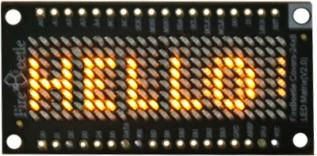
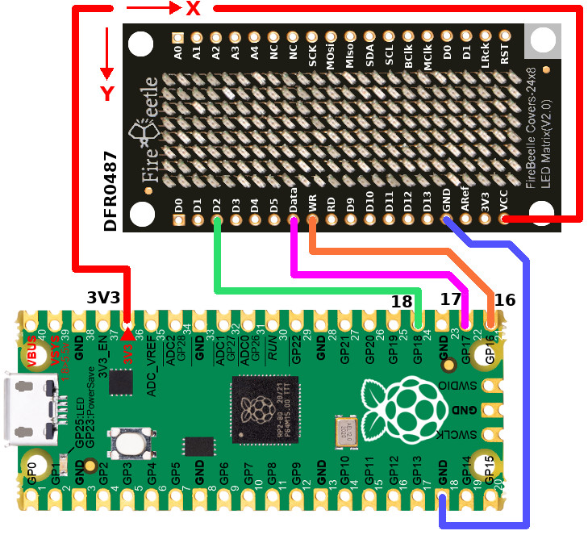

[This file also exists in ENGLISH here](readme_END.md)

# Pilote HT1632C avec contrôle indépendant des LEDs sous MicroPython

Le HT1632 est un contrôleur haute performance pour LEDs conçu pour créer des matrices LEDs. Il permet un contrôle indépendant de chaque LED de la matrice. Ce composant peut gérer une matrice de 24 rangées avec 16 broches communes ou de 32 rangées avec 8 broches communes.

Le HT1632C est utilisé sur le [FireBeetle Covers‑24×8 LED Matrix](https://www.dfrobot.com/product-1596.html) (DFRobot DFR0487).



L'adressage individuel des LEDs permet l'affichage de graphismes, des icônes et des effets de texte flexibles sans circuits externes complexes. La gestion matérielle intégrée au composant réduit la charge du microcontrôleur tout en utilisant une communication série pour le transfert de données entre la carte d'affichage et le contrôleur hôte.

# Bibliothèque

La bibliothèque doit être copiée sur la carte microcontrôleur avant de tester les examples.

Sur une plateforme WiFi:

```
>>> import mip
>>> mip.install("github:mchobby/esp8266-upy/ht1632c")
>>> mip.install("github:mchobby/esp8266-upy/FBGFX")
```

Ou avec l'utilitaire MPRemote :

```
mpremote mip install github:mchobby/esp8266-upy/ht1632c
mpremote mip install github:mchobby/esp8266-upy/FBGFX
```

# Brancher

Brancher le DFR0487 ne nécessite que 3 fils (Data, WR, CS) et une alimentation.

La carte peut être utilisé sous 3.3V ou 5V. Gardez seulement à l'esprit que les broches Data et WR sont équipées de résistance Pull-Up qui ramène le potentiel à la tension d'alimentation!



| Pico | DFR0487  |
| ------- | --- |
| GND | GND |
| 3V3 | VCC |
| GP16 | WR |
| GP17 | DATA |
| GP18 | D2 (ChipSelect CS1) |

__Warning:__ Ne pas utiliser d'afficheurs à base de LEDs BLEUEs ou BLANCHEs avec une alimentation 3.3V. En effet, les LEDs bleues nécessite une tension d'activation de 2.8 à 3.7V (Foward Voltage) tandis que les LEDs blanches on un tansion Vf d'au moins 3.0V. A noter que les LEDs vertes ont, elles, une tension de 1.9 à 3.1V, Par conséquent, les matrices vertes peuvent ou pas fonctionner sous 3.3V et cela dépend uniquement du fabriquant des LEDs Vertes. Pour finir, les LEDs rouge, orange et jaunes sont les meilleurs options en 3.3V puisqque leur tension Vf oscille entre 1.8 et 2.2V.

# Tester

Comme le pilote HT1632C est un dérivé de FrameBuffer, toutes les méthodes de dessin supportée par FrameBuffer s'applique aussi à l'afficheur HC1632C.

Le script d'exemple [bright.py](examples/bright.py) ci dessous dessine des rectangles puis utilise la propriété `brighness` pour modifier la luminosité (et faire pulser l'afficheur).

``` python
from machine import Pin
from ht1632c import HT1632C
import time

# Raspberry-Pi Pico 
# pin will be reconfigured by the driver
wr_pin = Pin( 16 )
data_pin = Pin( 17 )
cs_pin = Pin( 18 )

display = HT1632C( data_pin, wr_pin, cs_pin )

# top,left, width,height Color=1
display.rect( 1,1, display.width-2, display.height-2, 1 )
display.rect( 3,3, display.width-6, display.height-6, 1 )
# Send data to display
display.show()

while True:
	for i in range(11): # 0..10
		display.brightness=i/10
		time.sleep_ms(100)
	for i in range( 9, 0, -1 ): #9..0
		display.brightness=i/10 
		time.sleep_ms(100)
```

Grâce à la classe __FBText__ disponible avec la [bibliothèque FBGFX](https://github.com/mchobby/esp8266-upy/tree/master/FBGFX), il est possible d'afficher du texte de petite taille comme le démontre l'exemple [hello.py](examples/hello.py) .

``` python
from machine import Pin
from ht1632c import HT1632C
from fbtext  import FBText
from font8x4 import Font8X4

# Raspberry-Pi Pico
wr_pin = Pin( 16 )
data_pin = Pin( 17 )
cs_pin = Pin( 18 )

display = HT1632C( data_pin, wr_pin, cs_pin )
text_drawer = FBText( display, display.width, display.height, Font8X4() )

display.fill( 0 )
# Draw some text on the display FrameBuffer
text_drawer.text( "Hello", 0, 0, 1 ) 
# Send data to display
display.show()
```

Encore mieux, étant donné que __FBText__ dessine directement dans le FrameBuffer, il est possible de profiter de la méthode _clipping_ pour faire défiler du texte sur l'afficheyr. Voici le contenu de l'exemple [scroll.py](examples/scroll.py) .

``` python
from machine import Pin
from ht1632c import HT1632C
from fbtext  import FBText
from font5x4 import Font5X4

# Raspberry-Pi Pico
wr_pin = Pin( 16 )
data_pin = Pin( 17 )
cs_pin = Pin( 18 )

display = HT1632C( data_pin, wr_pin, cs_pin )
font = Font5X4()
text_drawer = FBText( display, display.width, display.height, font )

display.fill( 0 )
# Draw some text on the display FrameBuffer
s = "Hello world!"
w = font.text_width(s)
while True:
	for y_pos in range( 28, -w-1, -1 ):
		display.fill(0)
		text_drawer.text( s, y_pos, 2, 1 ) 
		display.show()
		time.sleep_ms(50)
```
