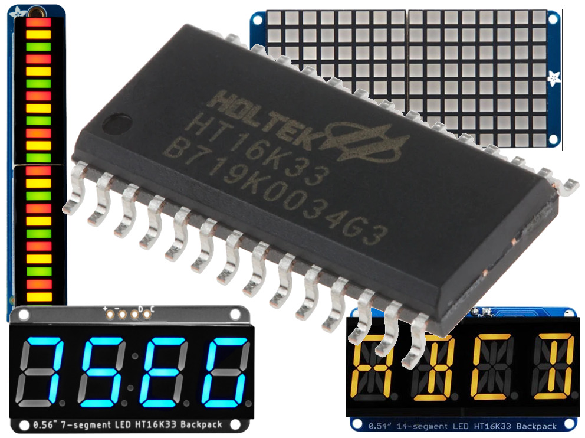
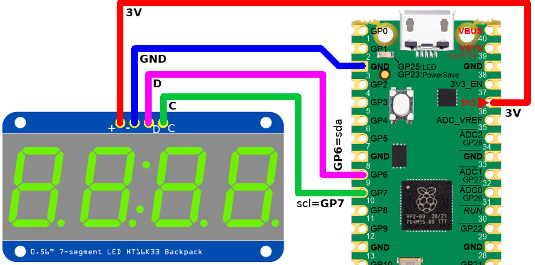
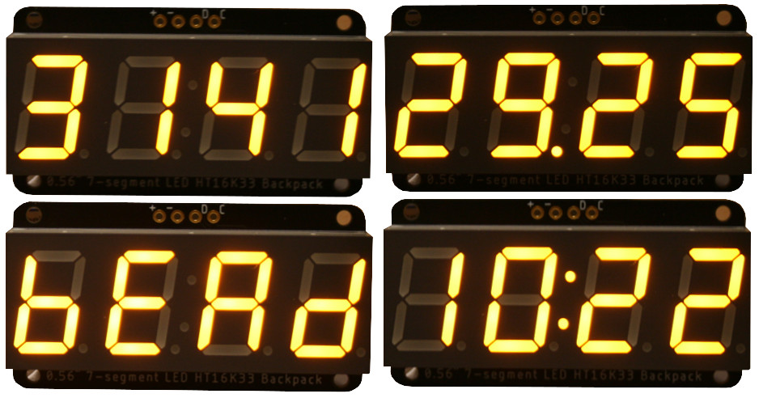

## Bibliothèque HT16K33 controleur de Matrice LED I2C pour MicroPython

Le __ht16k33__ peut être utilisé dans différents produits fabriqué chez différents fabricants de breakouts.



Cette bibliothèque couvre le HT16K33 et les implémentations de breakout chez différents fabricants. 

Malgré l'implémentation minimale, le support matériel pour d'autres breakouts peut toujours être ajouté sur demande.

## Credit

La bibliothèque originale provient de [hybotix/micropython-ht16k33](https://github.com/hybotix/micropython-ht16k33) avant d'être adaptée et documentée en fonction des exigences du présent dépôt.

__Fichier Readme original:__

Micropython Library for the HT16K33-based LED Matrices, ported from Adafruit's Adafruit_CircuitPython_HT16K33 library.

It supports Adafruit's 16x8 and 8x8 matrices, as well as 7-segment numeric and 14-segment alphanumeric displays.

The code for the matrix displays are here and should just work. However, I can not test these because I do not have any of these displays.

NOTE: At this time, only the 14-segment alphanumeric and 7-segment numeric displays have been tested. Others may work but have not been tested. Be warned!

# Bibliothèque

La bibliothèque doit être installée sur la carte MicroPython avant de pouvoir exécuter les exemples.

Sur un plateforme WiFi:

```
>>> import mip
>>> mip.install("github:mchobby/esp8266-upy/ht16k33")
```

Ou via l'utilitaire mpremote :

```
mpremote mip install github:mchobby/esp8266-upy/ht16k33
```

# Brancher
Les produits Adafruit peuvent être raccordés à l'aide d'un câble Qwiic/Stemma ou avec les signaux SDA/SCL branchés sur le bus I2C du microcontroleur.

## Raccorder sur un Pico


# Test
Le __ht16k33__ peut être utilisé sur différents produits LEDs (en provenance de différents fabriquant).

## Afficheur 4x7 segments d'Adafruit



Le contenu ci-dessous présente les fonctionnalités principales de la bibliothèque:

* `fill(0)` : Efface l'écran en le remplissant avec la couleur 0
* `print()` : Peut afficher une valeur entière, décimale ou l'heure (chaîne contenant un :, par exemple 10:21).
* `print_hex()` : Affiche une valeur hexadécimale.
* `marquee()` : Affiche, fait défiler, une chaîne de caractère.

```
from machine import I2C, Pin
from ht16k33.adafruit.segments import Seg7x4 # Seg14x4

i2c = I2C( 1, sda=Pin(6), scl=Pin(7) )
display = Seg7x4(i2c, address=0x70)

display.fill(0)
# Integer
display.print( 3141, auto_round=True )
# Float
display.print( 29.2545, decimal=2 )
# Hexadecimal
display.print_hex( 0xBEAD )
# Time
display.print( '10:22' )
# 
display.marquee("Maison 192.168.100.102", 0.2, loop=False)
```

Voir aussi l'exemple [examples/adafruit/segments_simpletest.py](examples/adafruit/segments_simpletest.py) .