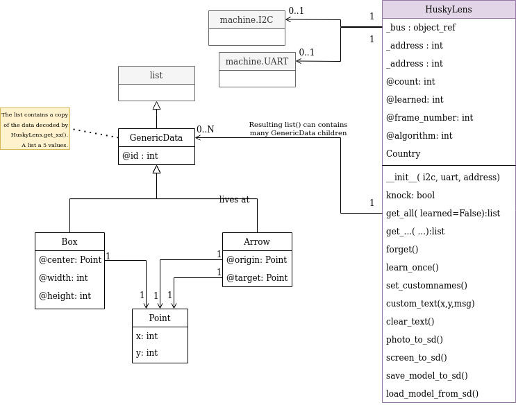

# HuskyLens MicroPython classes

The HuskyLens class is designed as a plateform agnostic driver (so independant of existing plateform).

That means that **user code must create the required I2C or UART** bus to takes care of the specific pin location.

Then the bus instance is provided to the driver. This way, the driver can be used on any MicroPython microcontroler as they includes the `machine.I2C` class.

```
from husky import *
from machine import I2C
i2c = I2C( 0, freq=100000 ) # Pico: SDA=gp8, SCL=gp9
hl = HuskyLens( i2c=i2c )
```

```
from husky import *
from machine import UART
UART(2,baudrate=9600,rx=33,tx=32,timeout=100) # Pico
hl = HuskyLens( uart=uart )
```

# Class diagram



# HuskyLens class

The HuskyLens class takes care of the communication protocol with the HuskyLens board. It can communicates through UART or I2C communication.

## constructor ( i2c=None, address=0x32, uart=None )

Specify an initialised `machine.I2C` object for I2C bus communication. The `address` is used over I2C bus (HuskyLens I2C address).

Specify an initialised `machine.UART` object for UART based communication.

Note: _See code snippets at the top of this file_.

## property count

Count blocks/boxes and arrows.<br />This information is updated after each `get_xx()` call.

## property learned

Count of learned IDs.<br />This information is updated after each `get_xx()` call.

## property frame_number

The HuskyLens frame number at the moment of `get_xx()` call.
        return self._frame_nbr

## property algorithm (getter & setter)
Algorithm/mode can be changed from the script by setting the algorithm property.

One of the following constant can be used to change the HuskyLens mode/algorithm:
* FACE_RECOGNITION
* OBJECT_TRACKING
* OBJECT_RECOGNITION
* LINE_TRACKING
* COLOR_RECOGNITION
* TAG_RECOGNITION
* OBJECT_CLASSIFICATION

```
from husky import *
...
hl = HuskyLens( i2c=i2c )
hl.algorithm = TAG_RECOGNITION
```

Once assigned, the `algorithm` property can be read back by the script to know the last `algorithm` set.

_See [objet_tracking_learn.py](examples/objet_tracking_learn.py) example script_.

Notes:
* The `algorithm` return **None** until the user script set a specific value for the algorithm. In such case, HuskyLens still use the algorithm that the user selected on the HuskyLens User Interface.
* The name of the algorithm
`ALGORTHIM_NAMES[hl.algorithm]` where `hl` is the HuskyLens object.

## method knock
HuskyLens will return True to any `knock()` call. This is the heartbeat like test method.

Note that MicroPython I2C class will raise an exception long before the knock() call when communication issue occurs on the I2C bus.

_See [knock.py](examples/knock.py) example script_.

## method get_all( learned=False )

Query all the objects identified by the HuskyLens and returns a list of  object (Boxes and Arrows).

_See [simple.py](examples/simple.py) and [advanced.py](examples/advanced.py) examples scripts_.

**Parameters:**
* **learned** : Boolean, False by default. When True, it will restrict the request to learned object only.

**Returns:**

List of objects. Objects are instance of `Box` and `Arrow` (see description further). <br />
An empty list is returned when no object is detected by the HuskyLens.

## method get_blocks( learned=False )
Query all the **blocks/boxes** objects identified by the HuskyLens and  returns a list of object (Boxes only).

_See [advanced.py](examples/advanced.py) example script_.

**Parameters:**
* **learned** : Boolean, False by default. When True, it will restrict the request to learned object only.

**Returns:**

List of objects. Objects are instance of `Box` in this case (see description further).<br />
An empty list is returned when no object is detected by the HuskyLens or fitting the request.

## method get_arrows( learned=False )
Query all the **arrows** objects identified by the HuskyLens and returns a list of object (Arrows only).

_See [advanced.py](examples/advanced.py) example script_.

**Parameters:**
* **learned** : Boolean, False by default. When True, it will restrict the request to learned object only.

**Returns:**

List of objects. Objects are instance of `Arrow` in this case (see description further).<br />
An empty list is returned when no object is detected by the HuskyLens or fitting the request.

## method get_by_id( idVal, block=None, arrow=None )

Query an object **by its ID** when it is identified by the HuskyLens. The object is returned into a list of object (one object max).

By default, the any type of object (Box or Arrow) is returned. The request can be restricted by setting the `arrow` or `block` parameter

_See [advanced.py](examples/advanced.py) example script_.

**Parameters:**
* **idVal** : Numeric ID of the object to query (>0).
* **block** : None by default (no restriction). Set it to True to request block/box only.
* **arrow** : None by default (no restriction). Set it to True to request  arrow only

**Returns:**
List of objects. Object is an instance of `Arrow` or `Box` depending of the request.<br />
The list is supposed to contains only one item. An empty list is returned when no object is detected by the HuskyLens or fitting the request.

## method custom_text( x,y, msg )

Place a custom text (20 chars, ASCII only) at position x,y on HUSKYLENS UI.

Several custom text can be displayed on the HUSKYLENS UI.

More information on the [API page](https://github.com/HuskyLens/HUSKYLENSArduino/blob/master/HUSKYLENS%20Protocol.md#command_request_custom_text-0x34) .

_See [custom_text.py](examples/custom_text.py) example script_.

**Parameters:**
* **x,y** : Position of the top/left corner of the text on the HUSKYLENS UI.
* **msg** : string, 20 chars, ASCII only!

## method clear_text()

Clear any of the custom text displayed on HUSKYLENS UI.

_See [custom_text.py](examples/custom_text.py) example script_.

## method forget()

Forget the last learning made by the HuskyLens on the currently selected algorithm/mode. This is convenient for object and line tracking modes.

_See [objet_tracking_learn.py](examples/objet_tracking_learn.py) example script_.

## method learn_once( id )

Starts the learning process for a given object ID.

**Parameters:**
* **id** : ID of the object for wich the learning process must starts. ID must be > 0.

_See [objet_tracking_learn.py](examples/objet_tracking_learn.py) example script_.

## method photo_to_sd()

Take a picture with the camera and save it on the SD Card.
* images are saved on SD:/HUSKYLENS/<increasing-number>.bmp
* images are encoded with PC **bitmap**, Windows 3.x format, 320 x -240 x 24

_See [take_photo.py](examples/take_photo.py) example script_.

**Returns:**

Will always returns False! (No way to know if the picture was taken or not).<br />In case of error (eg: no SD) the HuskyLens will display an error message on UI.

## method screen_to_sd()

Take a picture of UI Screen (including drawed boxes and arrows) and save it on the SD Card.
* images are saved on SD:/HUSKYLENS/<increasing-number>.bmp
* images are encoded with PC **bitmap**, Windows 3.x format, 320 x -240 x 24

_See [take_screenshot.py](examples/take_screenshot.py) example script_.

**Returns:**

Will always returns False! (No way to know if the picture was taken or not).<br />In case of error (eg: no SD) the HuskyLens will display an error message on UI.

## method set_customnames( id, name )

Set a custom name for a learned object.

More information on the [API page](https://github.com/HuskyLens/HUSKYLENSArduino/blob/master/HUSKYLENS%20Protocol.md#command_request_custom_text-0x34)

**Parameters:**
* **id** : ID of the object for wich the name should be set. ID must be > 0.
* **name** : string containing the name of the object (ASCII only, library limits it to 20 chars).

## method save_model_to_sd( filenum )

Save the current algorithm/mode model to the SDCard with a filename based on the current algorithm and the `filenum` .

Eg: with `filenum` set to 103, the "object tracking" algorithm will create a file named `ObjectTracking_Backup_103.bin` on the SDCard (about 2 Mio).

Note: saving a model may take up to 20~25 sec.

_See [model_save.py](examples/model_save.py) example script_.

## method load_model_from_sd( filenum )

Reload a saved model from the SD Card. See `save_model_to_sd` for useful details.

# Class Box

When the **HuskyLens.get_xx()** methods needs to returns identified objects on the camera, it built a list containing either `Box`, either `Arrow` objects.

## property id

Numeric value (integer) identifying the object identified.<br />Inherited from GenericData ancestor class.

## property center

Return a `Point` instance with initialized `x` and `y` properties.

## property width

Numeric value (integer) for the width of the box.

## property height

Numeric value (integer) for the height of the box.

# Class Arrow

When the **HuskyLens.get_xx()** methods needs to returns identified objects on the camera, it built a list containing either `Box`, either `Arrow` objects.

## property id

Numeric value (integer) identifying the object identified.<br />Inherited from GenericData ancestor class.

## property origin

Return a `Point` instance with initialized `x` and `y` properties of the origin of the arrow.

## property target

Return a `Point` instance with initialized `x` and `y` properties of the arrowhead.
