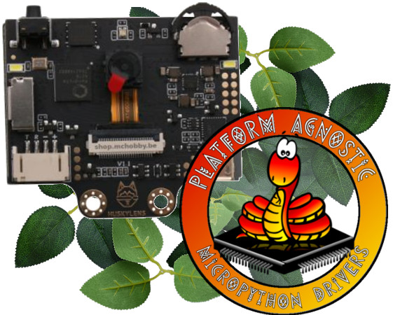
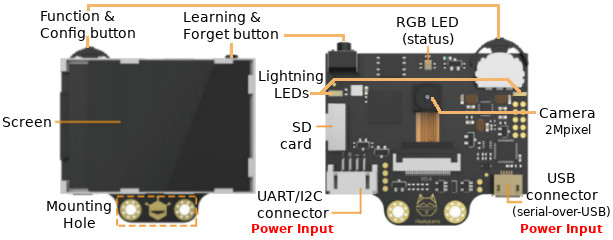
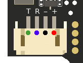
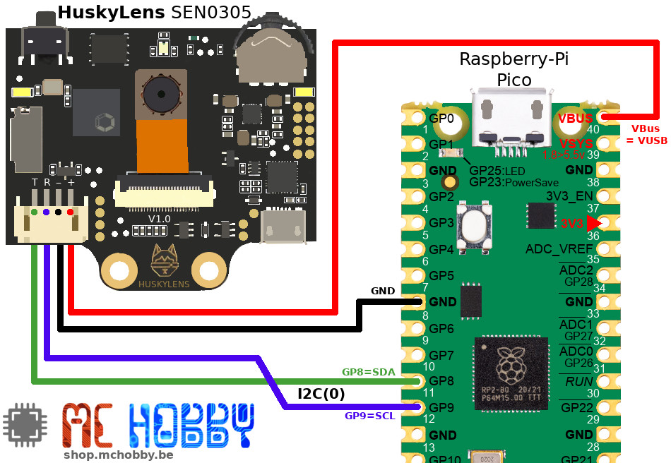
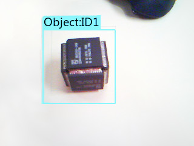
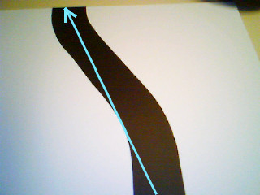

[This file also exists in english HERE](readme_ENG.md)

# Utiliser HuskyLens avec MicroPython

Capteur de vision à intelligence artificielle facile à utiliser et incluant 7 fonctions:
* **Reconnaissance faciale** (face recognition),
* **Suivi d'objet** (object tracking),
* **Reconnaissance d'objet** (object recognition),
* **Suivi de ligne** (line tracking),
* **Identification de couleurs** (color recognition),
* **Localisation et décodage de Tags** (tag recognition et
* **Classification d'objet** (object classification).



Le HuskyLens propose un port de sortie qui peut être configuré soit en UART (port série), soit en I2C. HuskyLens peut être connecté sur un Arduino, Micro:bit en maintenant le **HuskyLens peut aussi être utilisé avec des carte MicroPython** grâce à cette bibliothèque!

HuskyLens permet de créer des projets créatifs sans avoir besoin de programmer et paramétrer des algorithmes d'intelligence artificiel (DFRobot l'a fait pour nous).

## Lisez d'abord le manuel HuskyLens!


Vous devez être capable de configurer/entraîner votre HuskyLens avant d'obtenir des informations pertinente avec cette bibliothèque.

Sélectionner l'algorithme et effectuer l'apprentissage est facile à faire mais reste néanmoins une tâche manuelle!

Donc, s'il vous plaît, **[(RTFM) lisez le manuel du HuskyLens sur le Wiki de DFRobot](https://wiki.dfrobot.com/HUSKYLENS_V1.0_SKU_SEN0305_SEN0336)** !

Ensuite, utilisez cette bibliothèque MicroPython avec votre carte MicroPython préférée pour collecter les blocs(_box_) et flèches (_arrow_) identifiés par la caméra HuskyLens :-)

# Bibliothèque

La bibliothèque [husky.py](lib/husky.py) doit être copiée sur la carte MicroPython avant d'utiliser les exemples. Les classes de la bibliothèque sont décrites dans le document [classes.md](classes.md) (en anglais uniquement)

Sur une plateforme disposant du WiFi:

```
>>> import mip
>>> mip.install("github:mchobby/esp8266-upy/huskylens")
```

Ou via l'utilitaire mpremote :

```
mpremote mip install github:mchobby/esp8266-upy/huskylens
```

## Crédit

La bibliothèque est basée sur cet [article de la communauté DFRobot](https://community.dfrobot.com/makelog-311712.html), Le crédit initial de la bibliothèque revient à [RRoy](https://community.dfrobot.com/makelog-310469.html).<br />A noter que le code initial a été intensivement refactorisé et modifié pour rendre la bibliothèque "*Python friendly*".

# Brancher

## Le connecteur HuskyLens



* **Le HuskyLens DOIT ETRE ALIMENTé EN 5V** (les opérations I2C et UART ne sont pas fiables sur un HuskyLens aliménté en 3.3V)
* **Le port UART/I2C fonctionne toujours en logique 3V3** (donc compatible avec Micro:Bit, Pico, Raspberry-Pi)



| Pin | Label | I2C function | UART function | Remarks           |
|-----|-------|--------------|---------------|-------------------|
| 1   | T     | SDA          | TX            | **Vert**: Logique 3.3V |
| 2   | R     | SCL          | RX            | **Bleu**: Loqique 3.3V |
| 3   | -     | GND          | GND           | **Noir**: Masse      |
| 4   | +     | VCC          | VCC           | **Rouge**: Alim. 5V  |

HuskyLens peut être alimenté soit par l'intermédiaire du connecteur 4 broches (avec 5V), soit depuis le connecteur USB (aussi du 5V).

## HuskyLens vers Pico (I2C)
**Note:** HuskyLens doit être configuré en mode I2C! (voir le [Wiki DFRobot](https://wiki.dfrobot.com/HUSKYLENS_V1.0_SKU_SEN0305_SEN0336)).



| HuskyLens conn. | Broche Pico | Remarque           |
|-----------------|----------|-------------------|
| T     | GP8  | I2C(0).SDA (**Vert**)  |
| R     | GP9  | I2C(0).SCL (**Bleu**)   |
| -     | GND  | Masse (**Noir**)      |
| +     | VBUS | Alim. 5V (**Rouge**) par l'intermédiaire de l'USB du Pico |

# Tester

## Script de test simple

Le script d'exemple [simple.py](examples\simple.py) est utilisé pour contrôler les fonctionnalités de base de cette bibliothèque : interroger le HuskyLens et obtenir la position et taille de **blocs** (Box) -ET- obtenir la position et direction de **Flèches** (Arrow).

Le script [simple.py](examples\simple.py) sera testé avec le mode "Object Tracking" (suivi d'objet) et mode "Line Tracking" (suivi de ligne). Ce script effectue des requêtes pour obtenir tous les "blocs" (_box_) et toutes les "flèches" (_arrow_) identifiés par la caméra du HuskyLens. Le script affiche les information géométrique dans la session REPL.

Voici le contenu du script [simple.py](examples\simple.py) quelque peu simplifié.
```
from husky import *
from machine import I2C
import time

# === Configuration ===============
# Raspberry-Pi Pico: SDA=green(T)=gp8, SCL=blue(R)=gp9
#
# 1. Vérifier le [Protocol Type] dans le HUSKYLENS via le menu
#   (General Settings >> Protocol Type >> I2C)
# 2. Vérifier le câblage en cas de problème de communication
#
i2c = I2C( 0, freq=100000 )
hl = HuskyLens( i2c=i2c )

# === Boucle principale ===========
while True:
	lst = hl.get_all() # Requête de tous les blocs et flèches

	# Rien réceptionné ?
	if not(lst):
		print( "Pas d objet receptionné depuis Huskylens!" )
		continue

	# Afficher les données réceptionnées ?
	print( "-----------------------------------" )
	for item in lst:
		# Les objets dans la liste résultante (lst) sont typés
		if type(item) is Box:
			print( "Element est un BOX. Center est %i,%i. Largeur=%i. Hauteur=%i" % ( item.center.x, item.center.y, item.width, item.height)  )
		elif type( item ) is Arrow:
			print( "Element est un Arrow. Origin est %i,%i, destubatuib est %i,%i" % ( item.origin.x, item.origin.y, item.target.x, item.target.y) )
		else:
			print( 'Element est %r' % (idx,item) ) # %r: affiche la représentation de l'objet

	# Le pas noyer l'écran d'information
	time.sleep( 0.7 )
```

La boucle **for** itère un à un tous les objets contenu dans `lst` (la **list** des résultats).

SI `item` est un objet **Box** (_boite_) ALORS nous pouvons accéder aux propriétés `center` (_centre_), `width` (_largeur_) et `height` (_hauteur_).

SI `item` est un objet **Arrow** (_flèche_) ALORS nous pouvons accéder aux propriétés `origin` (_origine_) et `target` (_destination_).

Les valeurs suivent les règles des axes du HuskyLens:


## Exemple de suivit d'objet (Object Tracking)

Dans cet exemple, le HuskyLens est configuré en "Object Tracking" (suivit d'objet) et l'apprentissage est déjà réalisé pour suivre l'objet en question.<br />
Une fois l'apprentissage réalisé, HuskyLens identifie l'objet sur l'écran. Une boîte (**box**) est dessiné autour de ce dernier son identifiant (ID) est également affiché.



Note: En mode "Object tracking" l'apprentissage est limité à un seul objet qui a donc toujours l'ID 1.

Le script [simple.py](examples\simple.py) produit le résultat suivant:

```
-----------------------------------
item 0 is a BOX. Center is 144,112. Width=134. Height=135
-----------------------------------
item 0 is a BOX. Center is 146,127. Width=131. Height=132
-----------------------------------
item 0 is a BOX. Center is 132,129. Width=132. Height=133
-----------------------------------
item 0 is a BOX. Center is 129,132. Width=131. Height=132
-----------------------------------
item 0 is a BOX. Center is 129,130. Width=133. Height=134
-----------------------------------
item 0 is a BOX. Center is 126,129. Width=135. Height=136
```

## Exemple de suivit de ligne
Dans cet exemple, HuskyLens est configuré en mode "Line Tracking" (suivi de ligne) et l'apprentissage est déjà réalisé pour suivre le parcours (la ligne ou _track_ en anglais).<br />
Une fois l'apprentissage terminé, le HuskyLens identifie le parcours et présente un flèche sur l'écran. La flèche (**arrow** en anglais) -qui n'est rien d'autre qu'une droite- indique un point d'origine (_origin_ en anglais) et le point d'arrivée (__target__) du côté de la flèche.



Le script [simple.py](examples\simple.py) produit le résultat suivant:

```
-----------------------------------
item 0 is an Arrow. Origin is 240,196, Target is 152,0
-----------------------------------
item 0 is an Arrow. Origin is 224,238, Target is 144,0
-----------------------------------
item 0 is an Arrow. Origin is 224,238, Target is 144,0
-----------------------------------
item 0 is an Arrow. Origin is 224,238, Target is 144,0
-----------------------------------
item 0 is an Arrow. Origin is 216,238, Target is 136,0
-----------------------------------
item 0 is an Arrow. Origin is 216,238, Target is 136,0
```

## Tests avancés

Le script [advanced.py](examples\advanced.py) introduit les méthodes et propriétés additionnelles de la classe **HuskyLens** .

Par défaut, la bibliothèque interroge HuskyLens pour obtenir les données du mode/algorithme actuellement sélectionné par l'utilisateur.<br />Il est cependant possible de forcer le HuskyLens vers un mode/algorithme spécifique en assignant la valeur de la propriété `algorithm`.

```
hl.algorithm = FACE_RECOGNITION
hl.algorithm = OBJECT_TRACKING
hl.algorithm = OBJECT_RECOGNITION
hl.algorithm = LINE_TRACKING
hl.algorithm = COLOR_RECOGNITION
hl.algorithm = TAG_RECOGNITION
hl.algorithm = OBJECT_CLASSIFICATION
```

Il existe également plusieurs types de requête sur le HuskyLens. Le script utilisateur peut demander les blocs et flèches -OU- flèches uniquement -OU- objets issus d'un apprentissage (dir _learned object_) -OU- un objet par identifian (par ID), etc.

```
# Obtenir tous les blocs et flèches depuis HUSKYLENS
lst = hl.get_all()

# Obtenir les blocs uniquement depuis HUSKYLENS
lst = hl.get_blocks()

# Obtenir les flèches depuis HUSKYLENS
# lst = hl.get_arrows()

# Obteir les blocs et flèches taggés avec un ID > 0 depuis HUSKYLENS
# ID0 est révervé aux objects sans apprentissage.
lst = hl.get_all( learned=True )

# Obtenir les blocs taggés avec un ID > 0 depuis HUSKYLENS
lst = hl.get_blocks( learned=True )

# Obtenir les flèches taggés avec un ID > 0 depuis HUSKYLENS
lst = hl.get_arrows( learned=True )

# Obtenir le bloc ou flèche taggés avec un ID == ID1 depuis HUSKYLENS
lst = hl.get_by_id( 1 )             

# Obtenir uniquement le bloc  taggés avec un ID == ID1 depuis HUSKYLENS
lst = hl.get_by_id( ID1, block=True )

# Obtenir uniquement la flèche taggées avec un ID == ID1 depuis HUSKYLENS
lst = hl.get_by_id( 1, arrow=True )

# Obtenir le bloc ou flèche taggés avec un ID == ID2 depuis HUSKYLENS
lst = hl.get_by_id( 2 )
```
N'hésitez pas à tester les différentes options offertes par le script [advanced.py](examples\advanced.py).

## Autres tests et fonctionnalités

Les exemples suivants sont utilisés pour tester des fonctionnalités spécigiques.

| Script de test  | Description |
|-------------|-------------|
| [over_uart.py](examples/over_uart.py)   | Etablir une connexion UART (série) avec HuskyLens |
| [take_photo.py](examples/take_photo.py) | Prendre une photo de la caméra et stocker celle-ci sur la carte SD |
| [take_screenshot.py](examples/take_screenshot.py) | Prendre une capture de l'écran du HuskyLens (avec cadre, flèche et annotation) |
| [object_tracking_learn.py](examples/object_tracking_learn.py) | Switcher le HuskyLens sur le mode "Object Tracking". Abandon (_Forget_) du dernier apprentissage. Débuter un nouvel apprentissage. |
| [model_save.py](examples/model_save.py) | Switcher en mode "Object Tracking" puis sauver le modèle sur la carte SD. |
| [model_load.py](examples/model_load.py) | Switcher en mode "Object Tracking" puis charger un modèle depuis la carte SD. |
| [custom_text.py](examples/custom_text.py) | Effacer le contenu de l'écran et y afficher un texte personnalisé. |
| [knock.py](examples/knock.py) | Envoi un "knock" vers HuskyLens qui devrait recevoir une réponse True.<br />En cas de problème de communication, MicroPython lèvera un Exception. |

# Liste d'achat
* [Raspberry-Pi Pico](https://shop.mchobby.be/fr/157-pico-rp2040) @ MCHobby
* [HuskyLens](https://www.dfrobot.com/product-1922.html) @ DFRobot
* [HuskyLens](https://shop.mchobby.be/fr/imprimantes-et-camera/2421-huskylens-capteur-de-vision-ai-uart-i2c-interface-gravity-3232100024212-dfrobot.html) @ MCHobby


# Ressources
* [Arduino API](https://github.com/HuskyLens/HUSKYLENSArduino/blob/master/HUSKYLENS%20Arduino%20API.md) @ DFRobot<br />Contient d'autres informations sur le Protocol, etc.
* [HuskyLens Arduino Lib](https://github.com/HuskyLens/HUSKYLENSArduino/tree/master) @ GitHub
