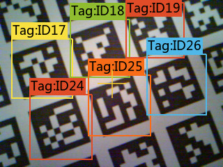
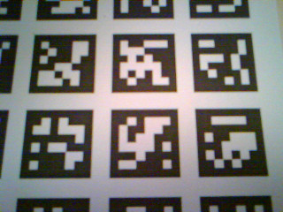
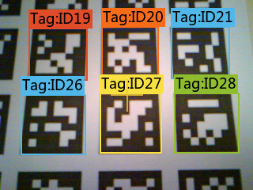

[Ce fichier existe également en Français ICI](readme.md)

# Using a HuskyLens (Easy-to-use AI Machine Vision Sensor) with MicroPython

HuskyLens is an easy-to-use AI machine vision sensor with 7 built-in functions: **face recognition**, **object tracking**, **object recognition**, **line tracking**, **color recognition**, **tag recognition** and **object classification**.


The HuskyLens provides an output port that can be configured either as UART, either as I2C. HuskyLens can connect to Arduino, Micro:bit and now the **HuskyLens can also be used with MicroPython boards** thanks to this library!

HuskyLens will help in creating creative projects without the need of programming and tuning complex algorithms (DFRobot did made it for us).

## Read HuskyLens Manual First !


You must be able to setup your HuskyLens before getting valuable results with this library.

Setting-up algorithm and object learning are easy tasks but manual tasks!

So please, **[Read The Fine Manual (RTFM) of HuskyLens on the DFRobot Wiki](https://wiki.dfrobot.com/HUSKYLENS_V1.0_SKU_SEN0305_SEN0336)** !

Then use this MicroPython library with your prefered MicroPython board to collect the blocks and arrows identified by the HuskyLens Camera :-)

# Library

The [husky.py](lib/husky.py) library must be copied on the MicroPython board before using the examples. Classes of the library are described in the [classes.md](classes.md) document (english only)

On a WiFi capable plateform:

```
>>> import mip
>>> mip.install("github:mchobby/esp8266-upy/huskylens")
```

Or via the mpremote utility :

```
mpremote mip install github:mchobby/esp8266-upy/huskylens
```

## Credit

The library is based on the following [DFRobot community article](https://community.dfrobot.com/makelog-311712.html), initial library credits goes to [RRoy](https://community.dfrobot.com/makelog-310469.html). <br />Please note that initial code have been intensively refactored and updated to make it more "*Python friendly*".

# Wiring

## The HuskyLens connector


* **The HuskyLens MUST BE POWERED with 5V** (I2C and UART operations are not reliable when the HuskyLens is powered with 3.3V)
* **The UART/I2C port always operate in 3V3 logic** (so safe for Micro:Bit, Pico, Raspberry-Pi)


| Pin | Label | I2C function | UART function | Remarks           |
|-----|-------|--------------|---------------|-------------------|
| 1   | T     | SDA          | TX            | **Green**: 3.3V logic |
| 2   | R     | SCL          | RX            | **Blue**: 3.3V logic  |
| 3   | -     | GND          | GND           | **Black**: ground     |
| 4   | +     | VCC          | VCC           | **Red**: 5V power     |

The HuskyLens can be powered either from 4 pin connector (with 5V), either from USB connector (also 5V).

## HuskyLens to Pico (I2C)
**Note:** HuskyLens must be configured as I2C mode! (see [DFRobot wiki](https://wiki.dfrobot.com/HUSKYLENS_V1.0_SKU_SEN0305_SEN0336)).


| HuskyLens conn. | Pico Pin | Remarks           |
|-----------------|----------|-------------------|
| T     | GP8  | I2C(0).SDA (**Green**)  |
| R     | GP9  | I2C(0).SCL (**Blue**)   |
| -     | GND  | ground (**Black**)      |
| +     | VBUS | 5V power (**Red**) throught the Pico USB |

# Testing

## Simple test script

The [simple.py](examples\simple.py) example script is used to check the basic feature of this library : querying the HuskyLens and getting **Box** location & size -AND- getting **Arrow** location & direction.

The [simple.py](examples\simple.py) will be tested with "Object Tracking" and with "Line Tracking". That simple script request all "boxes" and "arrows" identified by the HuskyLens camera. The scripts displays the geometrical information onto the REPL session.

Here is the [simple.py](examples\simple.py) script content (a bit simplified)
```
from husky import *
from machine import I2C
import time

# === Setup ===============
# Raspberry-Pi Pico: SDA=green(T)=gp8, SCL=blue(R)=gp9
#
# 1. Please check the [Protocol Type] in HUSKYLENS via
#   (General Settings >> Protocol Type >> I2C)
# 2. Check wiring in case of communication issue
#
i2c = I2C( 0, freq=100000 )
hl = HuskyLens( i2c=i2c )

# === Main loop ===========
while True:
	lst = hl.get_all() # request all blocks and arrows

	# Nothing received ?
	if not(lst):
		print( "No objects return from Huskylens!" )
		continue

	# Display received data ?
	print( "-----------------------------------" )
	for item in lst:
		# Item in the resulting list are typed.
		if type(item) is Box:
			print( "item is a BOX ID%i. Center is %i,%i. Width=%i. Height=%i" % ( item.id, item.center.x, item.center.y, item.width, item.height)  )
		elif type( item ) is Arrow:
			print( "item is an Arrow ID%i. Origin is %i,%i, Target is %i,%i" % ( item.id, item.origin.x, item.origin.y, item.target.x, item.target.y) )
		else:
			print( 'item is %r' % (idx,item) ) # %r: Print object representation

	# Make a pause to not overflood the screen
	time.sleep( 0.7 )
```

The **for** loop iterates the objects contained within the `lst` (the resulting **list**).

IF the `item` is a **Box** object THEN we can access the `center` property as well as the `width` & `height` properties.

IF the `item` is a **Arrow** object THEN we can access the `origin` and `target` properties.

The coordinates data follows the HuskyLens axis and values.


## Object Tracking example

In this example, the HuskyLens is configured for "Object Tracking" and learn an object to track.<br />
Once learned, the HuskyLens identifies the target object on the screen. The **box** around it also indicates the ID.


Note: Object tracking is limited to only one object so its ID will always be 1.

The [simple.py](examples\simple.py) will produce the following results:

```
-----------------------------------
item 0 is a BOX. Center is 144,112. Width=134. Height=135
-----------------------------------
item 0 is a BOX. Center is 146,127. Width=131. Height=132
-----------------------------------
item 0 is a BOX. Center is 132,129. Width=132. Height=133
-----------------------------------
item 0 is a BOX. Center is 129,132. Width=131. Height=132
-----------------------------------
item 0 is a BOX. Center is 129,130. Width=133. Height=134
-----------------------------------
item 0 is a BOX. Center is 126,129. Width=135. Height=136
```

## Line Tracking example
In this example, the HuskyLens is configured for "Line Tracking" and learns the line to track.<br />
Once learned, the HuskyLens identifies the target path on the screen. The **arrow** indicates the origin and the target of the arrow.


The [simple.py](examples\simple.py) will produce the following results:

```
-----------------------------------
item 0 is an Arrow. Origin is 240,196, Target is 152,0
-----------------------------------
item 0 is an Arrow. Origin is 224,238, Target is 144,0
-----------------------------------
item 0 is an Arrow. Origin is 224,238, Target is 144,0
-----------------------------------
item 0 is an Arrow. Origin is 224,238, Target is 144,0
-----------------------------------
item 0 is an Arrow. Origin is 216,238, Target is 136,0
-----------------------------------
item 0 is an Arrow. Origin is 216,238, Target is 136,0
```

## Tag recognition

By following the [DFRobot tutorial on "Tag Recognition"](https://wiki.dfrobot.com/HUSKYLENS_V1.0_SKU_SEN0305_SEN0336#target_20), you can learn **multiple tags** with most (or all) of the 35 tags available on the tutorial test picture.

As you can see on the following picture, I had learned all the tags of the sheet (see the tag's ID).



Now, lets focus on the following tags... where HuskyLens detected everything possible (IDs 19, 20, 21, 26, 27, 28).



The [simple.py](examples\simple.py) will produce the following results:

```
-----------------------------------
item 0 is a BOX ID19. Center is 80,57. Width=76. Height=66
item 1 is a BOX ID20. Center is 172,55. Width=72. Height=66
item 2 is a BOX ID21. Center is 6,55. Width=74. Height=66
item 3 is a BOX ID26. Center is 75,146. Width=82. Height=76
item 4 is a BOX ID27. Center is 173,144. Width=78. Height=76
item 5 is a BOX ID28. Center is 14,143. Width=82. Height=74
-----------------------------------
item 0 is a BOX ID19. Center is 82,53. Width=76. Height=66
item 1 is a BOX ID20. Center is 176,53. Width=72. Height=66
item 2 is a BOX ID21. Center is 11,53. Width=76. Height=66
item 3 is a BOX ID26. Center is 77,144. Width=82. Height=76
item 4 is a BOX ID27. Center is 178,143. Width=80. Height=78
item 5 is a BOX ID28. Center is 20,142. Width=82. Height=76
-----------------------------------
item 0 is a BOX ID19. Center is 80,53. Width=76. Height=66
item 1 is a BOX ID20. Center is 172,53. Width=72. Height=66
item 2 is a BOX ID21. Center is 7,52. Width=76. Height=64
item 3 is a BOX ID26. Center is 73,142. Width=82. Height=76
item 4 is a BOX ID27. Center is 174,142. Width=80. Height=76
item 5 is a BOX ID28. Center is 16,141. Width=82. Height=74
```

Notes:
* The [simple.py](examples\simple.py) script have been enhanced to displays the ID of recognized tag.
* As the center of each tag is available it is even possible to identify the tag position into the "sequence".
* The 35 tags already available are enough to cover the 27 letter of the alphabet... we could even write words or encode information with the tags
* The complete tag collection cover 500 items!!!   

## Advanced testing

The [advanced.py](examples\advanced.py) script introduce additionnal methods and properties of the **HuskyLens** class.

By default the library query the data from the current mode/algorithm selected by the user.<br />However, it is also possible to force the HuskyLens to switch to a particlar mode/algorithm by setting the `algorithm` property.

```
hl.algorithm = FACE_RECOGNITION
hl.algorithm = OBJECT_TRACKING
hl.algorithm = OBJECT_RECOGNITION
hl.algorithm = LINE_TRACKING
hl.algorithm = COLOR_RECOGNITION
hl.algorithm = TAG_RECOGNITION
hl.algorithm = OBJECT_CLASSIFICATION
```

It also exists many ways to query the data from the HuskyLens. The user can query all boxes and arrows -OR- query arrows only -OR- query learned object -OR- query an object by ID, etc.

```
# Request all blocks and arrows from HUSKYLENS
lst = hl.get_all()

# Request only blocks from HUSKYLENS
lst = hl.get_blocks()

# Request only arrows from HUSKYLENS
# lst = hl.get_arrows()

# Request blocks and arrows tagged with ID > 0 from HUSKYLENS
# ID0 is used for unlearned object.
lst = hl.get_all( learned=True )

# Request blocks tagged ID > 0 from HUSKYLENS
lst = hl.get_blocks( learned=True )

# Request arrows tagged ID > 0 from HUSKYLENS
lst = hl.get_arrows( learned=True )

# Request blocks and arrows tagged ID == ID1 from HUSKYLENS
lst = hl.get_by_id( 1 )             

# Request blocks tagged ID == ID1 from HUSKYLENS
lst = hl.get_by_id( ID1, block=True )

# Request arrows tagged ID == ID1 from HUSKYLENS
lst = hl.get_by_id( 1, arrow=True )

# Request blocks and arrows tagged ID == 2 from HUSKYLENS
lst = hl.get_by_id( 2 )
```
Do not hesitate to test the various options offered by the [advanced.py](examples\advanced.py) script.

## Other tests and features

The following examples are used to test the corresponding features.

| Test Script | Description |
|-------------|-------------|
| [over_uart.py](examples/over_uart.py)   | How to establish an UART communication with HuskyLens |
| [take_photo.py](examples/take_photo.py)  | Take a camera picture and store in on the SD Card  |
| [take_screenshot.py](examples/take_screenshot.py) | Take a capture of the display screen (so with boxes and arrows) |
| [object_tracking_learn.py](examples/object_tracking_learn.py) | Switch HuskyLens to "Object Tracking" mode. Forget last learning. Start a new learning. |
| [model_save.py](examples/model_save.py) | Switch to "Object Tracking" mode then save the model to the SD Card. |
| [model_load.py](examples/model_load.py) | Switch to "Object Tracking" mode then load the saved model from the SD Card. |
| [custom_text.py](examples/custom_text.py) | Clear HuskyLens screen then draw custom text on it. |
| [knock.py](examples/knock.py) | Send a knock to HuskyLens and should receive a True as response.<br />In case of communication trouble, MicroPython will raise an Exception. |

# Shopping List
* [Raspberry-Pi Pico](https://shop.mchobby.be/fr/157-pico-rp2040) @ MCHobby
* [HuskyLens](https://www.dfrobot.com/product-1922.html) @ DFRobot
* [HuskyLens](https://shop.mchobby.be/fr/imprimantes-et-camera/2421-huskylens-capteur-de-vision-ai-uart-i2c-interface-gravity-3232100024212-dfrobot.html) @ MCHobby


# Ressources
* [Arduino API](https://github.com/HuskyLens/HUSKYLENSArduino/blob/master/HUSKYLENS%20Arduino%20API.md) @ DFRobot<br />Also contains information on Protocol, etc.
* [HuskyLens Arduino Lib](https://github.com/HuskyLens/HUSKYLENSArduino/tree/master) @ GitHub
