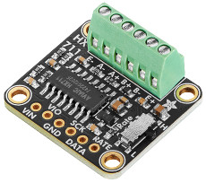
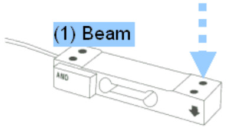
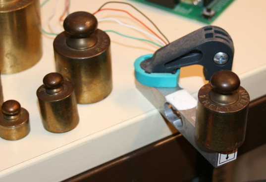
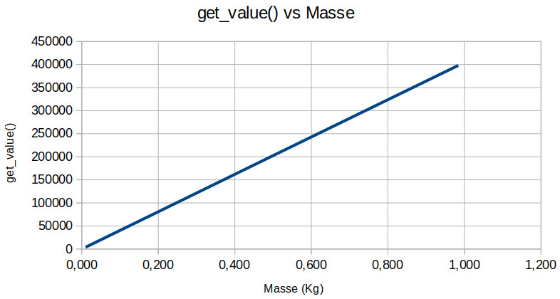

[This file also exists in english HERE](readme_ENG.md)

# Mesurer des poids et forces avec HX711

Le HX711 est un amplificateur analogique 24 bits capable de mesurer de très petites variation de tension. 



Le HX711 est utilisé avec des cellules de charges ou gauge de force.

Une cellule de charge est un élément mécanique conçu pour être tolérant à la déformation... déformation qui dépend de la force appliquée.
Cette déformation résulte soit d'une masse appliquée sur la cellulen soit d'une force directement appliquée sur celle-ci (au bon emplacement et dans la bonne direction).





La cellule de force inclus un pont de Wheatstone, un pont de résistance dont l'une d'entre elle est solidaire de la cellule de force.
Lorsque d'une force déforme la cellule de force, la résistance est également déphormée, ce qui modifie significativement sa valeur.


Le changement de résistance de la cellule de charge modifie le point d'équilibre du pont de Wheatstone. La tension de sortie du pont est modifiée dans une gamme de l'ordre du millivolt.

Le HX711 est utilisé pour amplifier ce changement de tension et retourne une valeur utilisable par un microcontrôleur.

# Calibration requise

Ce type de capteur __DOIT ETRE CALIBRé__ de sorte à pouvoir lire le résultat dans une unité spécifique. Le processus de qualibration doit être effectué pour chaque capteur!

# Bibliothèque
La bibliothèque doit être copiée sur la carte Micropython avant de pouvoir utiliser les exemples.

Sur une plateforme WiFi:

```
>>> import mip
>>> mip.install("github:mchobby/esp8266-upy/hx711")
```

Ou via l'utilitaire mpremote:

```
mpremote mip install github:mchobby/esp8266-upy/hx711
```

Voir aussi la __[documentation de la classe HX711 dans le dépôt de robert-hh](https://github.com/robert-hh/hx711)__.

## Credit

Cette section HX711 est basée sur le formidable travail de robert-hh, une implementation (voir https://github.com/robert-hh/hx711) disponible sous license MIT.

La bibliothèque robert-hh implémente le support hx711 avec gpio, rp2040 pio, spi bus. Cette section et les exemples se focalisent uniquement sur l'implementation GPIO.

La totalité du code source, exemples et documentations est disponible dans le répertoire lib/ , voir l'archive [robert-hh_hx711_full-source.zip](lib/robert-hh_hx711_full-source.zip) .

# Brancher
Le raccordement est très simple. 

Le HX711 utilise une interface similaire au bus SPI pour communiquer avec l'hôte. 
La cellule de charge à 4 fils dont les couleurs sont: rouge (red), noir (black), vert (green), blanc (white).

## HX711 avec Raspberry-Pi Pico

N'hésitez pas à agrandir l'image pour identifier les libellés sur le breakout HX711.


# Tester

Tous les tests sont conduit avec un gain de 128 et l'interrupteur __débit__ (rate) positionné sur H (High rate=Haut débit).

## Lire les valeurs

Le script [test.py](examples/test.py) lit les valeurs retournées par le HX711 et la cellule de charge qui y est branchée.

La méthode `read()` retourne une valeur brute (sans mise à l'échelle, ni compoensation)

La méthode  `get_value()` retourne une valeur filtrée qui tient également compte de l'offset (la compoensation). 

```python
from hx711_gpio import HX711
from machine import Pin
import time

pin_OUT = Pin(12, Pin.IN, pull=Pin.PULL_DOWN)
pin_SCK = Pin(13, Pin.OUT)

hx711 = HX711(pin_SCK, pin_OUT, gain=128)

hx711.tare()
while True:
	print( "---------------------------------" )
	print( "read: ", hx711.read() )
	print( "get_value: ", hx711.get_value() )
	time.sleep_ms( 500 )
```

## A propos de la tare

La méthode `tare()` est utilisé pour calculer le __zéro__ de la cellule de charge (en fixant l'offset/la compensation).

la `tare()` est la première opération effectuée par une balance électronique avant d'afficher le '0' initial. 

La tare est réalisée comme suit:
1. effectue de multiples acquisition de la valeur produite par la cellule de charge. 
2. effectue une moyenne des acquisitions
3. appel la méthode `set_offset()` avec la valeur moyenne calculée.

A partir de là, tous les appels à `get_value()` retournerons la difference entre la valeur brute et l'offset (aussi appelé la "valeur de compensation").

## Calibrer la cellule de charge

La cellule de charge doit être calibrée pour transformer la valeur de `read()` en valeur unitaire (ex: en grammes).

Vous aurez besoin de "références calibrées" pour effectuer une calibration !

Dans cet exemple, j'utilise une collection de poids en laiton qui on préalablement étés étalonnés sur une balance de précision. Je dispose de poids/masses calibrée de 10 gr, 20 gr, 50 gr, 100 gr, 200 gr, 504 gr (au lieu de 500 gr) et 984 gr (au lieu de 1 Kg).


Ensuite, nous utilons la cellule de charge à calibrer (Cellule pour 5 Kg dans le cas présent) et le script d'exemple [test.py](examples/test.py) pour mesurer les valeurs retournées par `get_value()` pour différents poids.


Le graphique ci-dessous présente les résultats des mesures. **Nous avons une relation parfaitement linéaire** et la ligne croise l'origine du graphique!



## Calculer l'échelle (scale)

L'échelle (en grammes) est calculé à partir des échantillons de calibration.

pour 0.984 Kg (984 grammes) nous avons la valeur de 398000. 

Le facteur d'échèlle en gramme (_scale_) est 398000 / 984 = 404.4715 

Pour faire des mesures en grammes, il suffit de fournir le facteur d'échelle à la méthode `set_scale()` .

## Lectures en unités

En fournissant la valeur appropriée à la méthode `set_scale()` alors il devient possible d'obtenir une lecture en grammes via la méthode `get_units()` .

Le script [test_units.py](examples/test_units.py) montre cet usage.

``` python

from hx711_gpio import HX711
from machine import Pin
import time

pin_OUT = Pin(12, Pin.IN, pull=Pin.PULL_DOWN)
pin_SCK = Pin(13, Pin.OUT)

hx711 = HX711(pin_SCK, pin_OUT, gain=128)

hx711.tare()
hx711.set_scale( 404.4715 ) # 5000gr Gauge with 128 bit gain. Output unit will be in grams
while True:
	print( "get_units: %s gr" % hx711.get_units() )
	time.sleep_ms( 500 )
```

Dans l'exemple ci-dessous, le Kilogramme (0.984 Kg) est appliqué sur la cellule de charge.

Plusieurs cycles de lectures sont nécessaires pour atteindre la valeur finale. The résultat n'est pas immédiat.

__Results__

```
get_units: -4.357268 gr  # Tare effectuée. Rien d'appliqué sur la cellule de charge
get_units: -3.604047 gr
get_units: -4.682615 gr
get_units: -4.604581 gr
get_units: -8.71075 gr
get_units: 18.30691 gr
get_units: 58.58892 gr # Placer le poids de 984 gr
get_units: 80.48586 gr
get_units: 78.27495 gr
get_units: 263.9093 gr
get_units: 475.1167 gr
get_units: 615.8622 gr
get_units: 708.4283 gr
get_units: 777.3264 gr
get_units: 829.2479 gr
get_units: 867.9638 gr
get_units: 896.8296 gr
get_units: 918.7194 gr
get_units: 934.871 gr
get_units: 947.2517 gr
get_units: 956.6745 gr
get_units: 963.5883 gr
get_units: 968.6321 gr
get_units: 971.5428 gr
get_units: 974.6895 gr
get_units: 977.1093 gr
get_units: 978.8817 gr
get_units: 980.0651 gr
get_units: 981.0663 gr
get_units: 981.842 gr
get_units: 982.331 gr
get_units: 982.8474 gr
get_units: 983.2507 gr
get_units: 983.2565 gr
get_units: 983.3103 gr
get_units: 983.4044 gr
get_units: 983.4819 gr
get_units: 983.48 gr
get_units: 983.6163 gr
get_units: 983.6889 gr
get_units: 983.7946 gr
get_units: 983.8339 gr
get_units: 983.917 gr
get_units: 983.9597 gr
get_units: 983.8796 gr
get_units: 983.8314 gr
get_units: 983.98 gr
get_units: 983.9612 gr
get_units: 983.96 gr
get_units: 984.0054 gr
get_units: 983.9194 gr
get_units: 983.8694 gr
get_units: 983.9677 gr
get_units: 983.9352 gr
get_units: 984.0208 gr
get_units: 983.8057 gr
get_units: 983.9856 gr
get_units: 984.0765 gr
get_units: 983.9964 gr
get_units: 984.0296 gr
get_units: 984.1484 gr
get_units: 984.0583 gr
get_units: 983.8487 gr
get_units: 984.019 gr
get_units: 984.0038 gr
```

# La constante de temps

Comme visible dans l'exemple test_unit , la cellule de charge à besoin d'un certain temps avant d'atteindre la valeur finale.

En utilisant le script [plot_value.py](examples/plot_value.py), nous avons capturé des mesures horodatées toutes les 200ms. Ensuite, les mesures on été rendues sur un graphique (valeur vs temps).


L'obtention du résultat final nécessite environ 4 à 6 secondes.

A noter que les (2/3)=66% de la valeur finale est atteint après 1.077 sec (ce que l'on appelle la "constante de temps"). 

## Lecture rapide

En effectuant un lecture exactement 1.1sec après la mise en charge de la cellule, nous obtenons une valeur intermédiaire ( _intermediate_value_) particulièrement intéressante.

Multiplier _intermediate_value_ par 1.5 permet d'obtenir une bonne approximation de la valeur finale.

Ex: si _intermediate_value_ est égale à 266666 (comme sur le graphique ci-dessus) alors la valeur finale sera proche de 266666 * 1.5 = 399999


# Liste d'achat
* [HX711 - convertisseur ADC 24 bits pour cellule de charge / gauge de contrainte](https://shop.mchobby.be/product.php?id_product=2710) @ MCHobby
* [HX711 - convertisseur ADC 24 bits pour cellule de charge / gauge de contrainte](https://www.adafruit.com/product/5974) @ Adafruit
* [Cellule de charge 5 Kg, 4 fils](https://shop.mchobby.be/product.php?id_product=2712) @ MCHobby
* [Cellule de charge 10 Kg, 4 fils](https://shop.mchobby.be/product.php?id_product=2711) @ MCHobby
