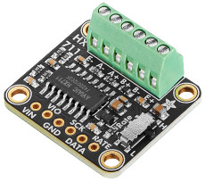
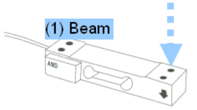
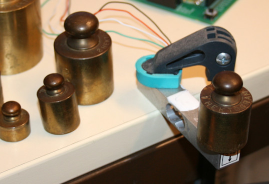
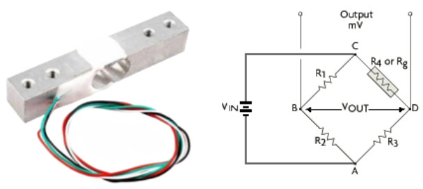
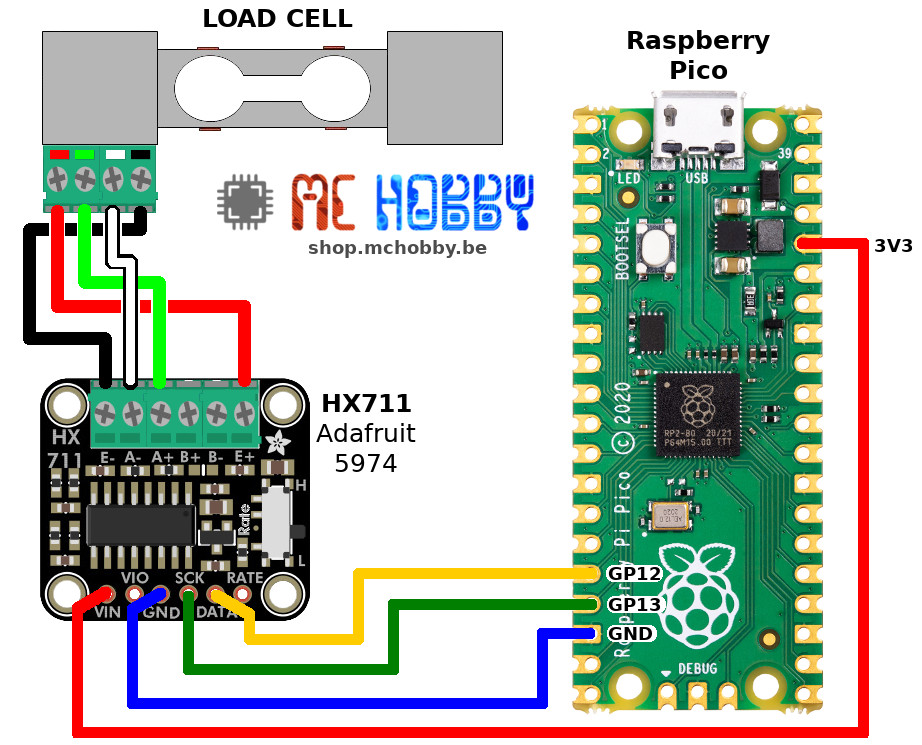
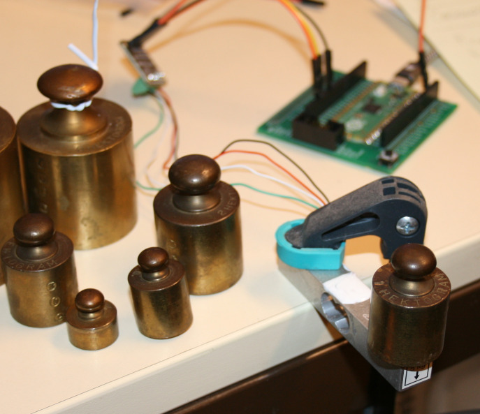
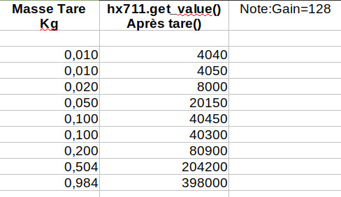
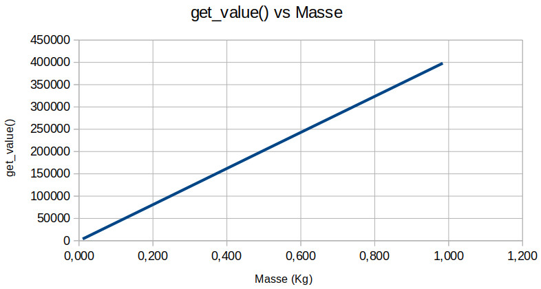
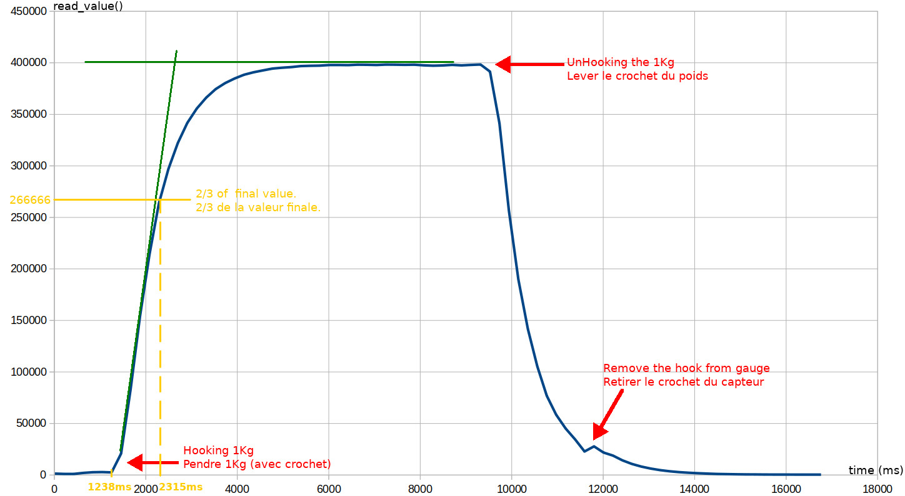

[Ce fichier existe également en Français ICI](readme.md)

# Measure weight and force with HX711

The HX711 is a 24 bits analog amplifier able to measure a very small variation in the voltage. 



Such device is used to with Load-Cell or strain-gauge.

The load cell is a mechanical element designed to tolerate deformation depending on the force applied to it.
This force results either from the weighing of an object or from a force applied directly to the load cell (in the right place and in the right direction).





The load cell includes a Wheatstone bridge, a bridge made up of 4 resistors, one of resistor is physically attached to the load cell.
When a force deforms the load cell, the attached resistance is also deformed and its value changes significantly.



The change of the load cell resistor will modify the equilibrium point of the Wheatstone. The output voltage change by an order of magnitude of a few millivolts.

The HX711  is used to amplify that voltage change and return the value.

# Calibration required

This type of sensor __MUST BE CALIBRATED__ in order to returns the read into a specific unit. The calibration process must be conducted for each sensor.

# Library 
The library must be copied on the MicroPython board before using the examples.

On a WiFi capable plateform:

```
>>> import mip
>>> mip.install("github:mchobby/esp8266-upy/hx711")
```

Or via the mpremote utility :

```
mpremote mip install github:mchobby/esp8266-upy/hx711
```

See the __[HX711 class documentation in robert-hh's repository](https://github.com/robert-hh/hx711)__.

## Library credit

This HX711 section is based on the wonderful work of robert-hh implementation (see https://github.com/robert-hh/hx711) released under MIT license.

The robert-hh library implement support of hx711 with gpio, rp2040 pio, spi bus. This section and examples only focus on the GPIO implementation.

The full library source, examples and documentation are available available in the lib/ folder, see [robert-hh_hx711_full-source.zip](lib/robert-hh_hx711_full-source.zip) .

# Wiring 
The wiring is quite simple. 

The HX711 use a SPI alike interface to return the values. 
Load-cell wires color are: red, black, green, white

## HX711 with Raspberry-Pi Pico

Enlarge the picture to read labels on the HX711 breakout.



# Testing

All the test are conducted with a gain of 128 and __rate__ switch positionned on H (high rate).

## Reading values 

The [test.py](examples/test.py) script just read the value returned by HX711 and the attached load-cell.

The `read()` method returns the raw value (not scaled and without compensation)

The  `get_value()` method returns a filtered value and take care of the offset. 

```python
from hx711_gpio import HX711
from machine import Pin
import time

pin_OUT = Pin(12, Pin.IN, pull=Pin.PULL_DOWN)
pin_SCK = Pin(13, Pin.OUT)

hx711 = HX711(pin_SCK, pin_OUT, gain=128)

hx711.tare()
while True:
	print( "---------------------------------" )
	print( "read: ", hx711.read() )
	print( "get_value: ", hx711.get_value() )
	time.sleep_ms( 500 )
```

## About the tare

The `tare()` method is used to calculate the __zero__ of the load-cell (by setting the offset).

The `tare()` is the first operation performed by an electronic scale before showing the initial '0' digit. 

The tare is done as follow:
1. preformed multiple read of the current load-cell value. 
2. Average the readings
3. `set_offset()` with the calculated average.

From now, any additionnal call to `get_value()` will return the difference of the raw value and the offset.

## Calibrate the load-cell

To load-cell must be calibrate to tranform the `read()` value into units (eg: in grams).

To perform a calibration, you will need "calibrated references" !

For this, I'm using a collection of brass weights that have been weighed on a precision scale. I have calibrated weight of 10 gr, 20 gr, 50 gr, 100 gr, 200 gr, 504 gr (instead of 500 gr) and 984 gr (instead of 1 Kg).



Then, we use a given load-cell (5 Kg Load-cell) and the [test.py](examples/test.py) script to measure the returned `get_value()`.



The chart here below show the results of measurement. **We have a perfect linear relationship** and the line is crossing the origin!



## Calculate the scale

The scale (in grams) is calculated from the calibration samples.

For 0.984 Kg (984 grams) we got the value 398000. 

The scale in grams is 398000 / 984 = 404.4715 


To make the measurement in grams, just provide the calculated scale to the `set_scale()` method.

## Reading with units

When providing the appropriate scale to `set_scale()` then the value can then be read in grams with `get_units()` .

See the [test_units.py](examples/test_units.py) script shows its usage.

``` python

from hx711_gpio import HX711
from machine import Pin
import time

pin_OUT = Pin(12, Pin.IN, pull=Pin.PULL_DOWN)
pin_SCK = Pin(13, Pin.OUT)

hx711 = HX711(pin_SCK, pin_OUT, gain=128)

hx711.tare()
hx711.set_scale( 404.4715 ) # 5000gr Gauge with 128 bit gain. Output unit will be in grams
while True:
	print( "get_units: %s gr" % hx711.get_units() )
	time.sleep_ms( 500 )
```

In the following results, the Kilogram (0.984 Kg) is applied on the load-cell.

Several cycles are requires to reach the values. The result is not immediate.

__Results__

```
get_units: -4.357268 gr  # Tare done. Nothing on the gauge sensor
get_units: -3.604047 gr
get_units: -4.682615 gr
get_units: -4.604581 gr
get_units: -8.71075 gr
get_units: 18.30691 gr
get_units: 58.58892 gr # Placing 984 gr weight
get_units: 80.48586 gr
get_units: 78.27495 gr
get_units: 263.9093 gr
get_units: 475.1167 gr
get_units: 615.8622 gr
get_units: 708.4283 gr
get_units: 777.3264 gr
get_units: 829.2479 gr
get_units: 867.9638 gr
get_units: 896.8296 gr
get_units: 918.7194 gr
get_units: 934.871 gr
get_units: 947.2517 gr
get_units: 956.6745 gr
get_units: 963.5883 gr
get_units: 968.6321 gr
get_units: 971.5428 gr
get_units: 974.6895 gr
get_units: 977.1093 gr
get_units: 978.8817 gr
get_units: 980.0651 gr
get_units: 981.0663 gr
get_units: 981.842 gr
get_units: 982.331 gr
get_units: 982.8474 gr
get_units: 983.2507 gr
get_units: 983.2565 gr
get_units: 983.3103 gr
get_units: 983.4044 gr
get_units: 983.4819 gr
get_units: 983.48 gr
get_units: 983.6163 gr
get_units: 983.6889 gr
get_units: 983.7946 gr
get_units: 983.8339 gr
get_units: 983.917 gr
get_units: 983.9597 gr
get_units: 983.8796 gr
get_units: 983.8314 gr
get_units: 983.98 gr
get_units: 983.9612 gr
get_units: 983.96 gr
get_units: 984.0054 gr
get_units: 983.9194 gr
get_units: 983.8694 gr
get_units: 983.9677 gr
get_units: 983.9352 gr
get_units: 984.0208 gr
get_units: 983.8057 gr
get_units: 983.9856 gr
get_units: 984.0765 gr
get_units: 983.9964 gr
get_units: 984.0296 gr
get_units: 984.1484 gr
get_units: 984.0583 gr
get_units: 983.8487 gr
get_units: 984.019 gr
get_units: 984.0038 gr
```

# The time constant

As demonstrated in the test_unit example, the load-cell requires some time to reach the final value.

By using the [plot_value.py](examples/plot_value.py), we can capture timed measurement every 200ms. The measurement have been drawn in a chart (value vs time).



Obtaining the final value requires 4 to 6 seconds for an exact results.

Notice that (2/3)=66% of the final value is reached after 1.077 sec (namely the "time constant"). 

## Quick read

Make a read exactly 1.1sec after cell loading will provides a perticularly interesting _intermediate_value_ .

Multiplying the _intermediate_value_ by 1.5 will provides an approximation of the final value.

Eg: if _intermediate_value_ is 266666 (like the chart above), the final value should be closed of 266666 * 1.5 = 399999


# Shopping list
* [HX711 - 24 bits ADC for Load Cells / Strain Gauges](https://shop.mchobby.be/product.php?id_product=2710) @ MCHobby
* [HX711 - 24 bits ADC for Load Cells / Strain Gauges](https://www.adafruit.com/product/5974) @ Adafruit
* [5 Kg Load cell, 4 wires](https://shop.mchobby.be/product.php?id_product=2712) @ MCHobby
* [10 Kg Load cell, 4 wires](https://shop.mchobby.be/product.php?id_product=2711) @ MCHobby
