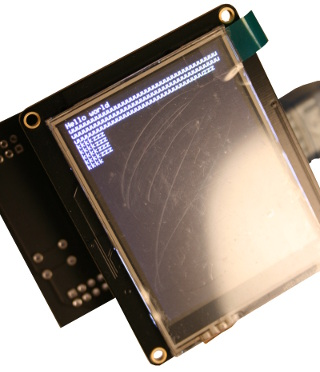
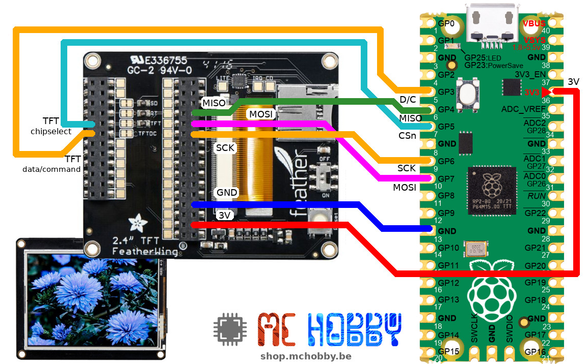
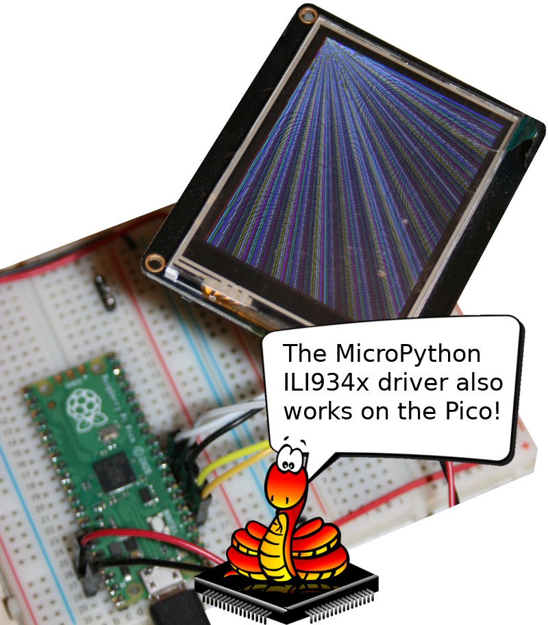
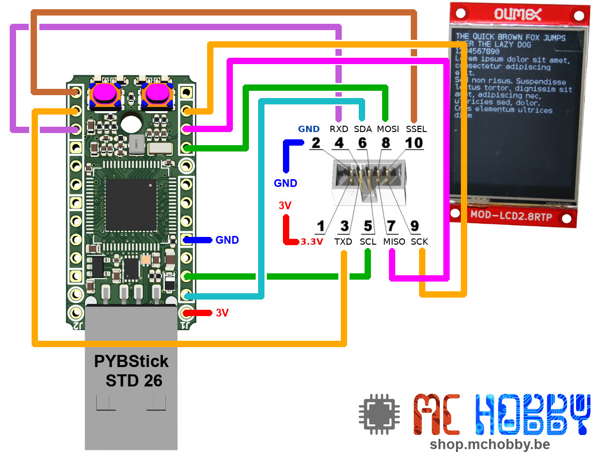
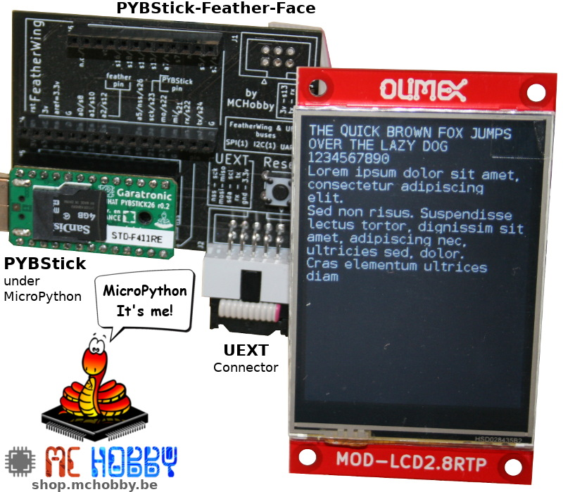
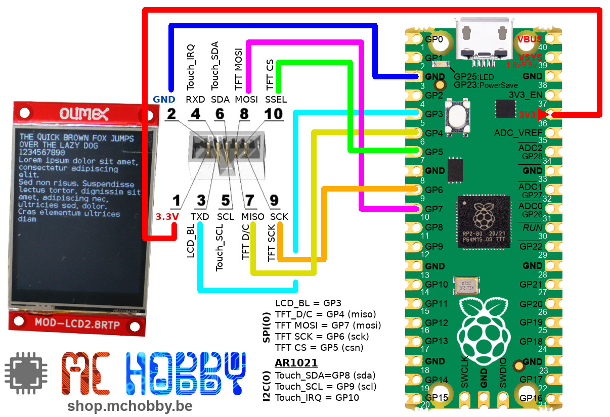
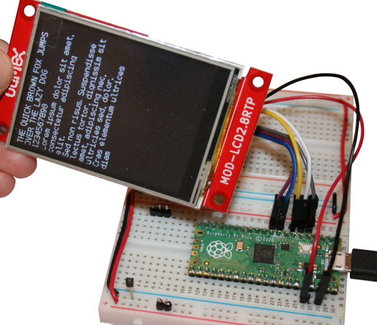
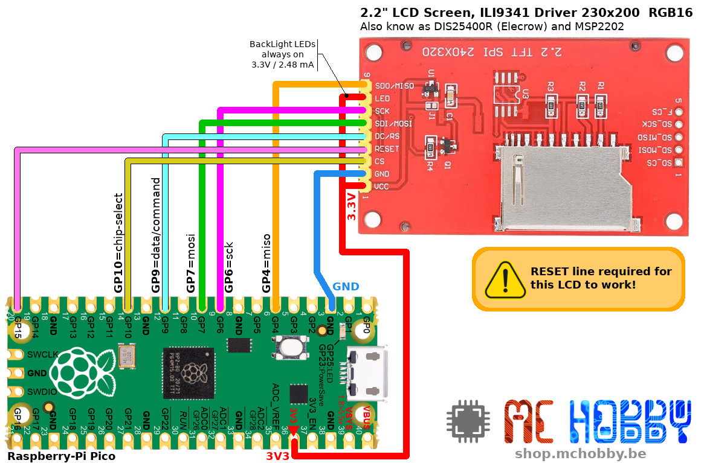

[Ce fichier existe également FRANCAIS](readme.md)

*** Traductino ***
# Generic ILI9341/ILI9340 driver for various TFT - No FrameBuffer



This driver can:
* drive LCD screen based on ILI9341 / ILI9340 driver
* write to the screen embedded memory without using a FramBuffer stored inside the MicroPython SRAM.
* expose the FrameBuffer alike interface __but do not derives from FrameBuffer!__

The [ili934x](lib/ili934x.py) library do expose a programming interface __imitating__ the [FrameBuffer's API](http://docs.micropython.org/en/latest/library/framebuf.html?highlight=framebufer) of MicroPython. The aim is to been able to use the driver as if it was a FrameBuffer.

# API description

The ILI934x driver API [is described in the API.md](api.md)

For the Adafruit LCD screen, the resistive tactile interface is handled by a [stmpe610 and its corresponding MicroPython driver](https://github.com/mchobby/esp8266-upy/tree/master/stmpe610).

# Credit
The driver is based on former works described here below:
* [Micropython Driver for ILI9341 display of Jeffmer](https://github.com/jeffmer/micropython-ili9341) (GitHub)
* [Micropython Driver for ILI9341 of Ropod](https://github.com/mchobby/pyboard_drive/tree/master/ILI9341) (GitHub)
* [FreeType generator (binary font file for MicroControler)](https://github.com/mchobby/freetype-generator) (GitHub, MCHobby)

# Library

The library must be copied on the MicroPython board before using the examples.

On a WiFi capable plateform:

```
>>> import mip
>>> mip.install("github:mchobby/esp8266-upy/ili934x")
```

Or via the mpremote utility :

```
mpremote mip install github:mchobby/esp8266-upy/ili934x
```

# Wiring

## Pico + 2.4" FeatherWing

The [Raspberry-Pi Pico](https://shop.mchobby.be/fr/pico-raspberry-pi/2025-pico-rp2040-microcontroleur-2-coeurs-raspberry-pi-3232100020252.html) board also runs MicroPython.

Here the wiring from the Pico to the [TFT 2.4" FeatherWing from Adafruit](https://shop.mchobby.be/fr/feather-adafruit/1050-tft-featherwing-24-touch-320x240-3232100010505-adafruit.html).



``` python
from machine import SPI, PIN
spi = SPI( 0 )
cs_pin = Pin(5) # PICO GP5
dc_pin = Pin(3) # PICO GP3
rst_pin = None  # PICO

# r in 0..3 is rotation, r in 4..7 = rotation+miroring (Use 3 for landscape mode)
lcd = ILI9341( spi, cs=cs_pin, dc=dc_pin, rst=rst_pin, w=320, h=240, r=0)
```
Here us the results of [test_lines.py](examples/test_lines.py) .



## PYBStick + 2.4" FeatherWing

The [PYBStick board from Garatronic](https://shop.mchobby.be/fr/micropython/1844-pybstick-standard-26-micropython-et-arduino-3232100018440-garatronic.html) do also runs MicroPython (as well as Arduino).

Here is the wiring from the PYBStick to the [TFT 2.4" FeatherWing of Adafruit](https://shop.mchobby.be/fr/feather-adafruit/1050-tft-featherwing-24-touch-320x240-3232100010505-adafruit.html).


``` python
from machine import SPI, PIN
spi = SPI( 1, baudrate=40000000 )
cs_pin = Pin("S15") # PYBStick
dc_pin = Pin("S13") # PYBStick
rst_pin = None      # PYBStick

# r in 0..3 is rotation, r in 4..7 = rotation+miroring (Use 3 for landscape mode)
lcd = ILI9341( spi, cs=cs_pin, dc=dc_pin, rst=rst_pin, w=320, h=240, r=0)
```

## PYBStick + Olimex 2.8" TFT UEXT

The [PYBStick board from Garatronic](https://shop.mchobby.be/fr/micropython/1844-pybstick-standard-26-micropython-et-arduino-3232100018440-garatronic.html) do run MicroPython script and Arduino code.

Here are the wiring from the [TFT 2.8" from Olimex](https://shop.mchobby.be/fr/afficheur-lcd-tft-oled/1866-afficheur-28-tactile-couleur-320x240px-uext-3232100018662-olimex.html).



The UEXT connector do use the following pinout :

```
     Descr    : UEXT Pin  (PYBStick)  (PYBStick)  UEXT Pin : Descr
    ================================================================
                                  UEXT
                                +-------+
                           3.3V | 1   2 | GND
LCD BackLight : uext-tx   (S24) | 3   4 | (S22) uext-rx   : Touch IRQ
        Touch : uext-scl  ( S5) | 5   6 | ( S3) uext-sda  : Touch
      TFT D/C : uext-miso (S21) | 7   8 | (S19) uext-mosi : TFT MOSI
      TFT SCK : uext-sck  (S23) | 9  10 | (S26) uext-cs   : TFT CS
                                +-------+
```

__About the configuration__:

* On the TFT 2.8" display and its UEXT connector, Olimex do only use the the MOSI line to send data to the display (MISO is not used).
* The S21 signal usually reserved for MISO line is attributed to the display's Data/Command signal. Because of this, MicroPython cannot use the Hardware SPI since the S21 must be controled by another part of the software.
* As a result, the data are sent with a SoftSPI bus (_BitBanging_) by using the pins S19, S23, S26. The code do needs a MISO pin (even when not used) so we selected the S16 pin (absolutely not used).

__About performances__:

As this setup is using a Software SPI (_BitBanging_), the data rate will be limited by the MCU processing, this will have an impact on time needed to refresh an entire screen.

``` python
from machine import SPI
from machine import Pin
from ili934x import *

# PYBStick config requires Bit-Banging one-way SPI for Olimex.
# MISO (S26) of UEXT is used for D/C.
# SPI must declare a MISO! So we used a unused in the project (S16 in this case) as fake pin
spi = SPI( -1, mosi=Pin("S19", Pin.OUT), miso=Pin("S16", Pin.IN), sck=Pin("S23", Pin.OUT) )
cs_pin = Pin("S26")
dc_pin = Pin("S21")
rst_pin = None

# r in 0..3 is rotation, r in 4..7 = rotation+miroring # Use 3 for landscape mode
lcd = ILI9341( spi, cs=cs_pin, dc=dc_pin, rst=rst_pin, w=320, h=240, r=0)
```
The display can also be connected to a PYBStick by using a [PYBStick-Feather-Face interfacing board](https://shop.mchobby.be/product.php?id_product=1996) as shown on the picture here below.



## Pico + Olimex 2.8" TFT UEXT

The details explained about the PYBStick + OLIMEX TFT does also applies to Pico.

Here is the wiring between the LCD and the Pico.



``` python
from machine import SPI
from machine import Pin
from ili934x import *

# Using another fake PIN for MISO! EH: GP16
spi = SPI( 0, mosi=Pin(7, Pin.OUT), miso=Pin(16, Pin.IN), sck=Pin(6, Pin.OUT) )
cs_pin = Pin(5) # GP5
dc_pin = Pin(4) # GP4 (MISO PIN of standard UEXT SPI)
rst_pin = None

# r in 0..3 is rotation, r in 4..7 = rotation+miroring # Use 3 for landscape mode
lcd = ILI9341( spi, cs=cs_pin, dc=dc_pin, rst=rst_pin, w=320, h=240, r=0)
```



## Pico + MSP2202 2.2" TFT

Also known as DIS25400R at Elecrow, this MSP2202 display require the __Reset__ pin to be wired!



The driver is created as follows:

``` python
from machine import SPI, Pin
from ili934x import *
spi = SPI( 0, baudrate=40000000 ) # 40 Mhz, can be slowed down
cs_pin = Pin(10, Pin.OUT, value=True)
dc_pin = Pin(9, Pin.OUT)
rst_pin = Pin(15, Pin.OUT, value=1)
lcd = ILI9341( spi, cs=cs_pin, dc=dc_pin, rst=rst_pin, w=320, h=240, r=0)

red = color565(255,0,0)
lcd.fill( red )
```

See the [test_print_msp2202.py](examples/test_print_msp2202.py) example for more information

# Tests

All the drawing tests are tested against the [TFT 2.4" FeatherWing from Adafruit](https://shop.mchobby.be/fr/feather-adafruit/1050-tft-featherwing-24-touch-320x240-3232100010505-adafruit.html). However the drawings code must also with all the TFT showed in this readme (just adapt the SPI & display instance creation).

All the examples are stoerd into the [examples/](examples) subfolder.

# Ressources
* [TFT 2.2" MSP2202 - Elecrow's DIS25400R](https://shop.mchobby.be/product.php?id_product=2380) @ MCHobby
* [TFT 2.2" MSP2202 - Elecrow's DIS25400R](https://www.elecrow.com/2-2inch-tft-lcd-color-screen-display-module-240x320-serial-port.html) @ EleCrow
* [TFT 2.4" FeatherWing from Adafruit](https://shop.mchobby.be/product.php?id_product=1050) @ MCHobby
* [TFT 2.8" from Olimex](https://shop.mchobby.be/product.php?id_product=1866) @ MCHobby
* [PYBStick-Feather-Face adapter board](https://shop.mchobby.be/product.php?id_product=1996) @ MCHobby
* [ILI9341 Datasheet](https://cdn-shop.adafruit.com/datasheets/ILI9341.pdf) _stored at Adafruit Industries_
