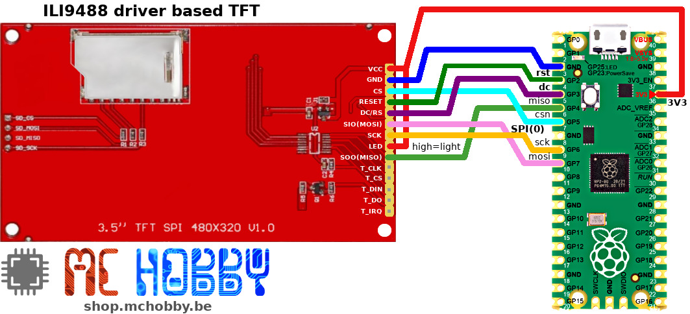
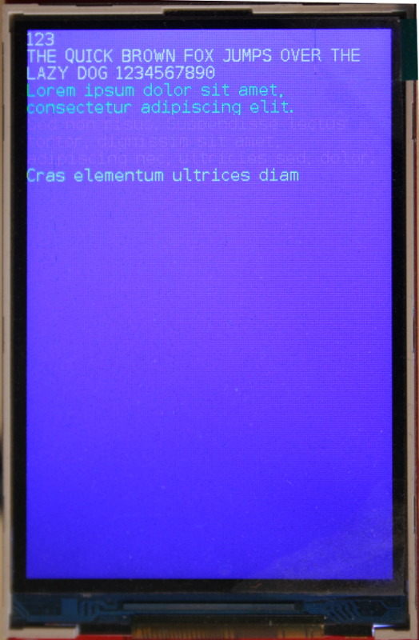
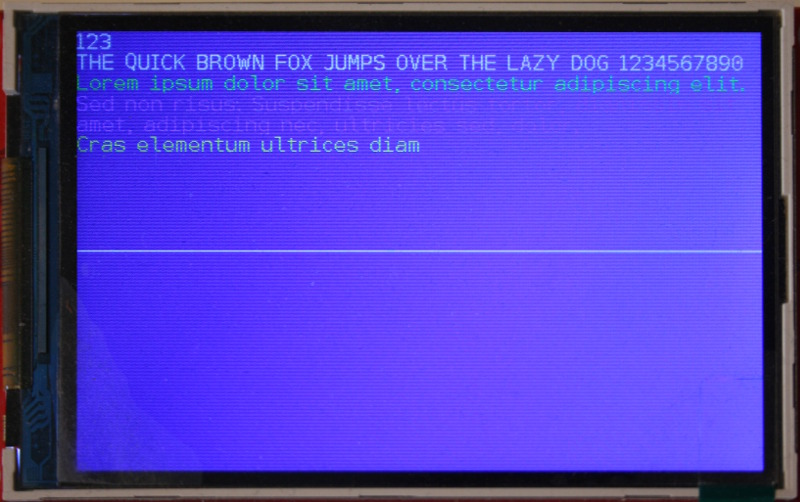

# Utiliser un TFT 480x320 couleur piloté par ILI9488 avec MicroPython

Le présent pilote n'alloue pas de FrameBuffer dans la mémoire du MicroControleur

__MAIS__

expose une interface compatible FrameBuffer (_at the best_) et communique directement dans l'écran.<br />
Il en résulte une importante économie de RAM au coût d'un rafraîchissement d'écran un peu plus lent.


# Brancher



# Bibliothèque

Cette bibliothèque doit être copiée sur la carte MicroPython avant d'utiliser les exemples.

Sur une plateforme connectée:

 ```
 >>> import mip
 >>> mip.install("github:mchobby/esp8266-upy/ili9488")
 ```

 Ou via l'utilitaire mpremote :

 ```
 mpremote mip install github:mchobby/esp8266-upy/ili9488
 ```

# Tester

Voici un exemple simple issu de [test_fill_rect.py](examples/test_fill_rect.py).

Il indique comment créer le bus SPI (et broches de commande) et comment instancier la classe permettant de communiquer avec l'afficheur LCD.

```
from machine import SPI,Pin
from ili9488 import *
import random

# Raspberry-Pi Pico - BUS and Pins for screen
spi = SPI( 0, miso=Pin.board.GP4, mosi=Pin.board.GP7, sck=Pin.board.GP6, baudrate=40_000_000 )
cs_pin = Pin(5, Pin.OUT, value=1 )
dc_pin = Pin(3, Pin.OUT )
rst_pin = Pin(2, Pin.OUT, value=1 )

# Create Screen instance
lcd = ILI9488( spi, cs=cs_pin, dc=dc_pin, rst=rst_pin, r=1) # w=320, h=480, r=0 )
lcd.erase()

colors = [NAVY, DARKGREEN, DARKCYAN, MAROON, PURPLE, OLIVE, LIGHTGREY,
		DARKGREY, BLUE, GREEN, CYAN, RED, MAGENTA, YELLOW, WHITE, ORANGE,
		GREENYELLOW ]

for i in range(300):
for i in range(300):
	lcd.fill_rect( random.randint(0,lcd.width-1),
		random.randint(0,lcd.height-1),
		random.randint(1,50), random.randint(1,50),
		random.choice( colors ) )
```

Ce qui produit le résultat suivant:


# Informations diverses

## Rotation d'affichage

Voici les différentes valeurs de rotation disponibles:
* 0: 0 deg - portrait **Tested**
* 1: 90 deg - paysage (_landscape_)
* 2: 180 deg - portrait **Tested**
* 3: 270 deg - paysage (_landscape_)
* 4: 0 deg - portrait + mirroir
* 5: 90 deg - paysage + mirroir
* 6: 180 deg - portrait + mirroir
* 7: 270 deg - paysage + mirroir

Affichage en portrait:

```
lcd = ILI9488( spi, cs=cs_pin, dc=dc_pin, rst=rst_pin, w=320, h=480, r=0)
```



Affichage en mode paysage:


```
lcd = ILI9488( spi, cs=cs_pin, dc=dc_pin, rst=rst_pin, w=320, h=480, r=3)
```


