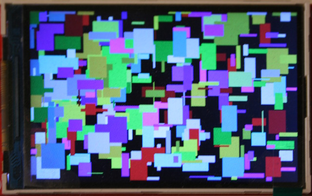
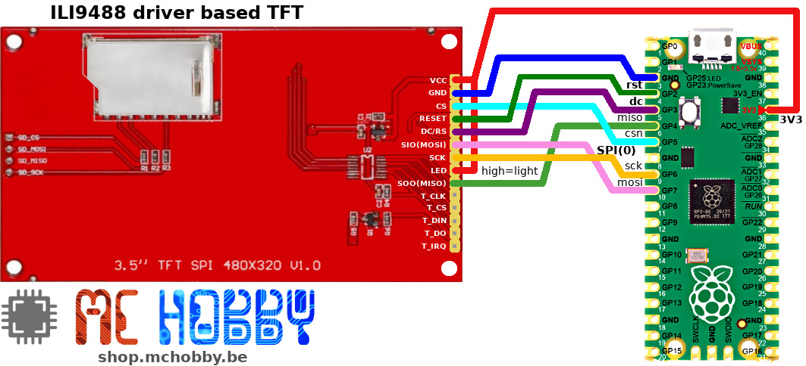
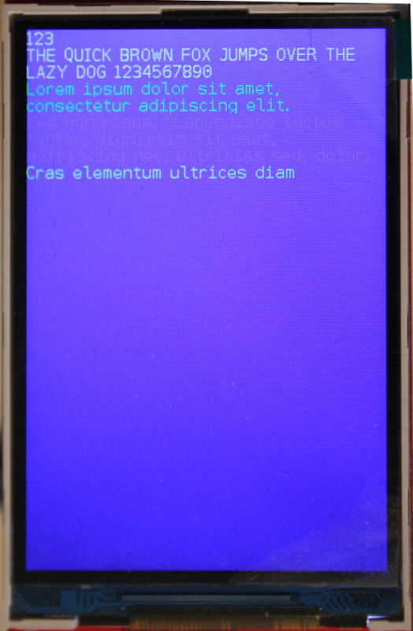

# Using a 480x320 color TFT driven by ILI9488 with MicroPython

This driver DOES NOT ALLOCATE the a FrameBuffer into the MicroControler SRAM

__BUT__

expose a FrameBuffer compatible interface (_compatible at the best_) and communicates updates directly the the screen.<br />
As a result we do spare lot of SRAM with the cost of a bit slower screen refreshing.




# Wiring



# Library

The library must be copied on the MicroPython board before using the examples.

On a WiFi capable plateform:

```
>>> import mip
>>> mip.install("github:mchobby/esp8266-upy/ili9488")
```

Or via the mpremote utility :

```
mpremote mip install github:mchobby/esp8266-upy/ili9488
```

# Testing

Here a simple example comming from [test_fill_rect.py](examples/test_fill_rect.py).

It shows how to create the SPI bus (and required control pins) and how to instanciate the class dealing the communication with the display hardware.

```
from machine import SPI,Pin
from ili9488 import *
import random

# Raspberry-Pi Pico - BUS and Pins for screen
spi = SPI( 0, miso=Pin.board.GP4, mosi=Pin.board.GP7, sck=Pin.board.GP6, baudrate=40_000_000 )
cs_pin = Pin(5, Pin.OUT, value=1 )
dc_pin = Pin(3, Pin.OUT )
rst_pin = Pin(2, Pin.OUT, value=1 )

# Create Screen instance
lcd = ILI9488( spi, cs=cs_pin, dc=dc_pin, rst=rst_pin, r=1) # w=320, h=480, r=0 )
lcd.erase()

colors = [NAVY, DARKGREEN, DARKCYAN, MAROON, PURPLE, OLIVE, LIGHTGREY,
		DARKGREY, BLUE, GREEN, CYAN, RED, MAGENTA, YELLOW, WHITE, ORANGE,
		GREENYELLOW ]

for i in range(300):
for i in range(300):
	lcd.fill_rect( random.randint(0,lcd.width-1),
		random.randint(0,lcd.height-1),
		random.randint(1,50), random.randint(1,50),
		random.choice( colors ) )
```

Which produce the following results:


# Various informations

## Display rotation

Here follows the various values for the rotation parameter:
* 0: 0 deg - portrait **Tested**
* 1: 90 deg - Landscape
* 2: 180 deg - portrait **Tested**
* 3: 270 deg - landscape
* 4: 0 deg - portrait + mirroring
* 5: 90 deg - Landscape + mirroring
* 6: 180 deg - portrait + mirroring
* 7: 270 deg - landscape + mirroring

Portrait display:

```
lcd = ILI9488( spi, cs=cs_pin, dc=dc_pin, rst=rst_pin, w=320, h=480, r=0)
```



LandScape display:


```
lcd = ILI9488( spi, cs=cs_pin, dc=dc_pin, rst=rst_pin, w=320, h=480, r=3)
```


