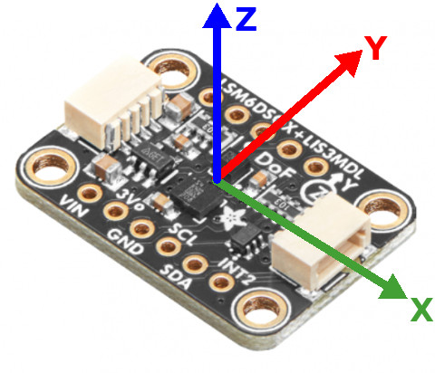
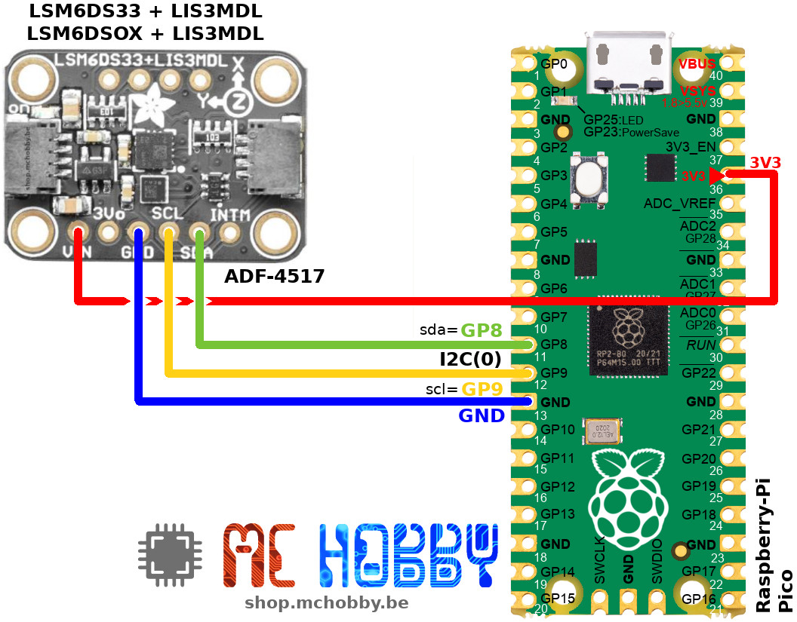

[This file also exists in ENGLISH here](readme_ENG.md)

# Utiliser un IMU 9 Degrés de Libertés basés sur LSM6DSOx et LIS3MDL avec MicroPython

Cette carte IMU contient un gyroscope 3 axes + un magnétomètre 3 axes + accéléromètre 3 axes.


* The __LSM6DSOx__ or __LSM6DS33__ contains a gyroscope and an accelerometer.
* The __LIS3MDL__ is a 3 axis magnetometer.



Cette implémentation de la bibliothèque 9 degrés de liberté utilise la configuration correspondant au attentes des projets robotiques (commme c'est le cas pour le projet [Pico-Zumo Robot](https://github.com/mchobby/micropython-zumo-robot)) avec:
* Valeurs brutes retournées sous forme d'int16 (donc valeur entre -32,768 et 32,767)
* Accéléromètre avec gamme de +/- 2G pleine échelle
* Gyroscope avec gamme de +/- 245dps pleine échelle
* Magnétomètre avec gamme de +/- 4 Gauss pleine échelle


## Remarques

Le code de cet IMU provient de notre projet [micropython-zumo-robot](https://github.com/mchobby/micropython-zumo-robot) qui utilise les mêmes composants que ceux présents sur la carte breakout.

# Bibliothèque

Les bibliothèque doivent être copiées sur la carte MicroPython avant d'utiliser les exemples.

Sur une plateforme microcontrôleur WiFi:

```
>>> import mip
>>> mip.install("github:mchobby/esp8266-upy/imu-a")
```

Ou via l'utilitaire mpremote :

```
mpremote mip install github:mchobby/esp8266-upy/imu-a
```


# Brancher

## Brancher sur le Pico



# Tester

## Tester l'IMU

Les fichiers `imu_a.py` et `compass.py` doivent être copées sur le système de fichier micropython avant de démarer les exemples.

Le script [examples/test_imu.py](examples/test_imu.py) capture toutes les information en provenance des capteur et les affichent dans la session REPL.

``` python
from machine import I2C, Pin
from imu_a import IMU_A # 9DoF Imu based on LSM6DS33 + LIS3MDL
import time

i2c = I2C(0, sda=Pin.board.GP8, scl=Pin.board.GP9 )
imu = IMU_A( i2c )

while True:
	imu.read()
	print( "Acc= %6i, %6i, %6i  :  Mag= %6i, %6i, %6i  :  Gyro= %6i, %6i, %6i  " % (imu.a.values+imu.m.values+imu.g.values) )
	time.sleep( 0.5 )
```

Ce qui produit les données brutes suivantes qui doivent encore être transformées en unité (selon la configuration du capteur, voir l'introduction):

```
Acc=   4867,  -8612,  13667  :  Mag=   -583,   2324,  -3512  :  Gyro=     16,    -73,     69                                                                                        
Acc=   4882,  -8605,  13668  :  Mag=   -513,   2363,  -3533  :  Gyro=     -9,    -68,     65                                                                                        
Acc=   4872,  -8614,  13661  :  Mag=   -568,   2373,  -3518  :  Gyro=    -21,    -70,     58                                                                                        
Acc=   4874,  -8611,  13670  :  Mag=   -560,   2355,  -3481  :  Gyro=      7,    -74,    67                                                                                        
Acc=   4875,  -8616,  13667  :  Mag=   -566,   2337,  -3555  :  Gyro=    -14,    -69,     68                                                                                        
Acc=   4876,  -8612,  13664  :  Mag=   -529,   2345,  -3511  :  Gyro=     -8,    -76,     68  
```

## Bousolle

La classe `Compass` est utilisée pour calculer la position, du nord en utilisant les axes X & Y du magnétomètre.

Le script [examples/test_compass.py](examples/test_compass.py) configure le magnétomètre pour un détection du nord magnétique.
Après une courte calibration où il faut tourner la magnétomètre dans toutes les directions (pour qu'il trouve les minima & maxima sur les deux axes).

``` python
from machine import I2C, Pin
from imu_a import IMU_A
from compass import Compass
import time

i2c = I2C(0, sda=Pin.board.GP8, scl=Pin.board.GP9 )
imu = IMU_A( i2c ) # Start with auto detection
compass = Compass( imu, samples=120 )

print("Starting calibration...")
print("   rotate it on himself to find compass min and max")
compass.calibrate()
print("calibration done")
print( 'Compass min: %s ' % compass.min )
print( 'Compass max: %s ' % compass.max )

while True:
	heading = compass.average_heading()
	print( 'Heading %s degrees' % heading )
	time.sleep( 0.5 )
```

# Où acheter
* [Centrale Interielle 9DOF - LSM6DSOX + LIS3MDL - Qwiic/StemmaQt - ADF-4517](https://shop.mchobby.be/fr/mouvement/2393-centrale-interielle-9dof-lsm6ds33-lis3mdl-3232100023932-adafruit.html) @ MCHobby
* [Centrale Interielle 9DOF - LSM6DSOX + LIS3MDL - Qwiic/StemmaQt - ADF-4517](https://www.adafruit.com/product/4517) @ Adafruit
