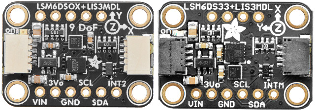
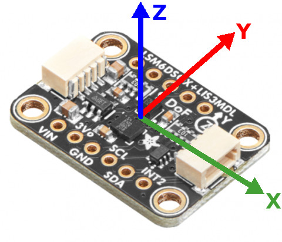
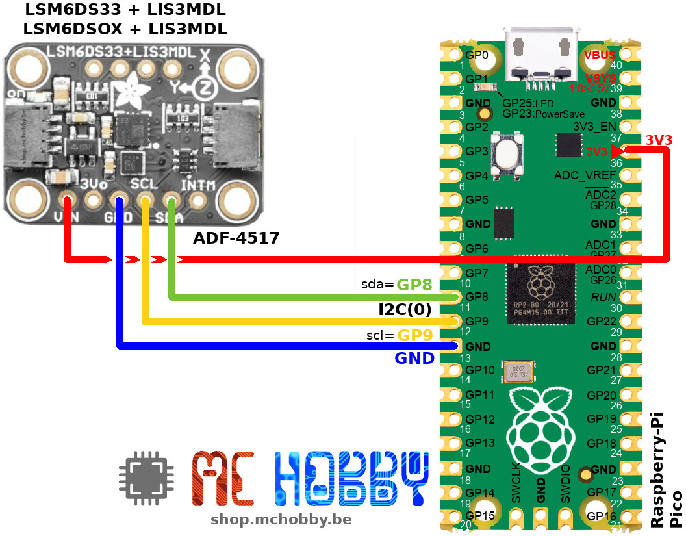

[Ce fichier existe également en FRANCAIS ici](readme.md)

# Using IMU 9 DoF based on LSM6DSOx and LIS3MDL with MicroPython

The IMU board does fit a 3 axis gyroscope + a 3 axis magnetometer + 3 axis accelerometer.




* The __LSM6DSOx__ or __LSM6DS33__ contains a gyroscope and an accelerometer.
* The __LIS3MDL__ is a 3 axis magnetometer.



This implementation of the 9DoF libraries use default settings matching robotic expectation (like it was for the [Pico-Zumo Robot](https://github.com/mchobby/micropython-zumo-robot)) with:
* Raw values returned as int16 (so with between -32,768 to 32,767)
* Accelerometer with range of +/- 2G full scale
* Gyroscope with range of +/- 245dps full scale
* Magnetometer range of +/- 4 Gauss full scale


## Remarks

The code of this IMU is coming from our project [micropython-zumo-robot](https://github.com/mchobby/micropython-zumo-robot) using exactly the same components that this breakout.

# Library

The library must be copied on the MicroPython board before using the examples.

On a WiFi capable plateform:

```
>>> import mip
>>> mip.install("github:mchobby/esp8266-upy/imu-a")
```

Or via the mpremote utility :

```
mpremote mip install github:mchobby/esp8266-upy/imu-a
```


# Wiring

## Wiring to Pico



# Test

## IMU testing

The `imu_a.py` and `compass.py` must be copied on the board filesystem before running the examples.

The [examples/test_imu.py](examples/test_imu.py) read all the data coming from the sensors display the results on REPL session.

``` python
from machine import I2C, Pin
from imu_a import IMU_A # 9DoF Imu based on LSM6DS33 + LIS3MDL
import time

i2c = I2C(0, sda=Pin.board.GP8, scl=Pin.board.GP9 )
imu = IMU_A( i2c )

while True:
	imu.read()
	print( "Acc= %6i, %6i, %6i  :  Mag= %6i, %6i, %6i  :  Gyro= %6i, %6i, %6i  " % (imu.a.values+imu.m.values+imu.g.values) )
	time.sleep( 0.5 )
```

Which produce the following raw value still must be translated to units based on sensor configuration (see intro):

```
Acc=   4867,  -8612,  13667  :  Mag=   -583,   2324,  -3512  :  Gyro=     16,    -73,     69                                                                                        
Acc=   4882,  -8605,  13668  :  Mag=   -513,   2363,  -3533  :  Gyro=     -9,    -68,     65                                                                                        
Acc=   4872,  -8614,  13661  :  Mag=   -568,   2373,  -3518  :  Gyro=    -21,    -70,     58                                                                                        
Acc=   4874,  -8611,  13670  :  Mag=   -560,   2355,  -3481  :  Gyro=      7,    -74,    67                                                                                        
Acc=   4875,  -8616,  13667  :  Mag=   -566,   2337,  -3555  :  Gyro=    -14,    -69,     68                                                                                        
Acc=   4876,  -8612,  13664  :  Mag=   -529,   2345,  -3511  :  Gyro=     -8,    -76,     68  
```

## Compass

The `Compass` class is used to calculate north position by using the X & Y axis of the magnetometer.

The [examples/test_compass.py](examples/test_compass.py) configure the magnetometer for Heading detect.
After a short calibration stage where you should move the magnetometer in every direction to enbale the calibration to find minima & maxima on the both axis.

``` python
from machine import I2C, Pin
from imu_a import IMU_A
from compass import Compass
import time

i2c = I2C(0, sda=Pin.board.GP8, scl=Pin.board.GP9 )
imu = IMU_A( i2c ) # Start with auto detection
compass = Compass( imu, samples=120 )

print("Starting calibration...")
print("   rotate it on himself to find compass min and max")
compass.calibrate()
print("calibration done")
print( 'Compass min: %s ' % compass.min )
print( 'Compass max: %s ' % compass.max )

while True:
	heading = compass.average_heading()
	print( 'Heading %s degrees' % heading )
	time.sleep( 0.5 )
```

# Shopping Lint
* [9DOF Inertial Measurement Unit - LSM6DSOX + LIS3MDL - Qwiic/StemmaQt - ADF-4517](https://shop.mchobby.be/fr/mouvement/2393-centrale-interielle-9dof-lsm6ds33-lis3mdl-3232100023932-adafruit.html) @ MCHobby
* [9DOF Inertial Measurement Unit - LSM6DSOX + LIS3MDL - Qwiic/StemmaQt - ADF-4517](https://www.adafruit.com/product/4517) @ Adafruit
