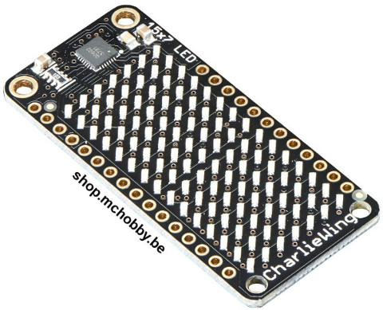
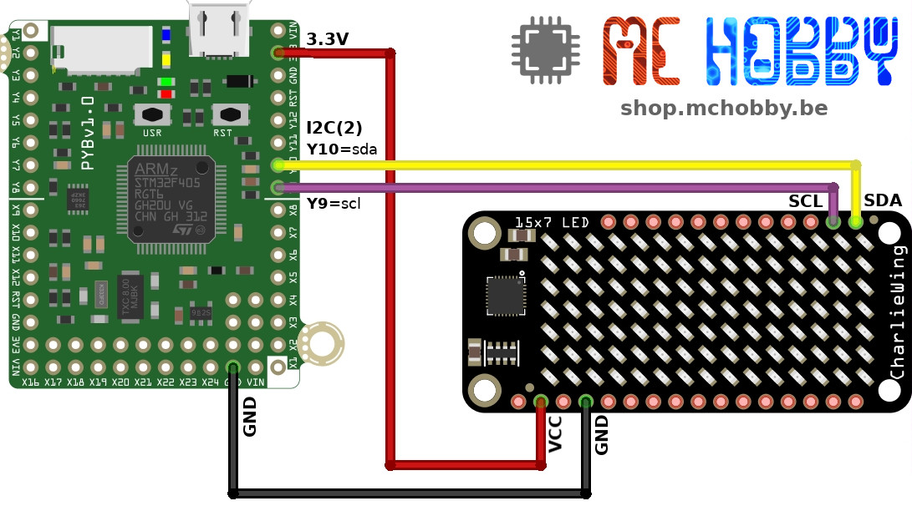
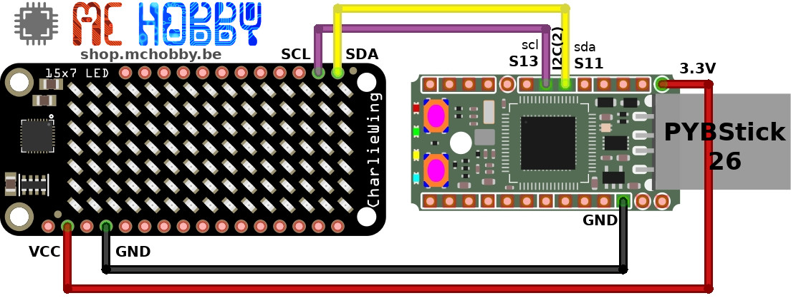
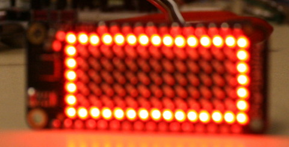
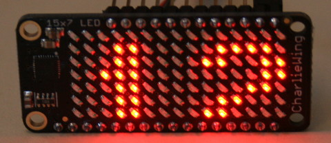
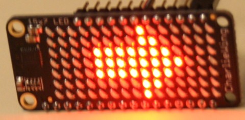

[This file also exists in ENGLISH](readme_ENG.md)

# Faire du CharliePlexing avec IS31FL3731

Le composant IS31FL3731 permet de faire du ChaliePlexing pour commander un grand nombre de LED de façon individuelles et sur 256 niveaux de luminosités grâce au support PWM qu'il offre.

Ce composant fonctionne sous 3V, est commandé via le bus I2C et dispose d'assez de mémoire pour stocker 8 frames, ce qui permet de créer facilement des petites animations.

La démonstration de ce pilote est basé sur la [matrice CharliePlexing 15x7 pour cartes Feather](https://shop.mchobby.be/product.php?id_product=1563) (un FeatherWing).



# Brancher

## sur MicroPython Pyboard


## sur MicroPython PYBStick


# Tester
Le pilote MicroPython `CharlieWing` (is31fl3731.py) doit être présent sur la carte MicroPython pour pouvoir commander la matrice d'affichage.

Il existe plusieurs classes de contrôle:
* `Matrix` : Matrice 16 x 9 pixels (classe de base).
* `CharlieWing` : matrice 15 x 7 pixels
* `CharlieBonnet` : matrice 16 x 8 pixels

Voici le contenu du script d'exemple `[test_simple.py](examples/test_simple.py)` qui dessine un rectangle sur le pourtour de la matrice:



```
from machine import I2C
import is31fl3731 as is31f

# Créer bus I2C
# Y9=scl, Y10=sda (aussi Pyboard-Uno-R3 avec bus I2C au dessus de la broche 13)
i2c = I2C(2)

# Initialize l'afficheur CharliePlewing FeatherWing 15 x 7 LEDs
display = is31f.CharlieWing(i2c)

# Dessine une boîte sur l'afficheur
# D'abord la ligne du haut et celle du bas
for x in range(display.width):
    display.pixel(x, 0, 50)
    display.pixel(x, display.height - 1, 50)
# ensuite les côtés droits et gauche
for y in range(display.height):
    display.pixel(0, y, 50)
    display.pixel(display.width - 1, y, 50)
```  

Ce second exemple montre comment utiliser un `FrameBuffer` (Classe standard de dessin pour les afficheurs).

Le code est disponible dans `[test_text.py](examples/test_text.py)` .



```
from machine import I2C
import framebuf
import is31fl3731 as is31f
import time

i2c = I2C(2) # Y9=scl, Y10=sda (idem pour Pyboard-Uno-R3, le bus I2C au dessus de la broche 13)

# Initialize un FeatherWing CharliePlexing 15 x 7 LED
display = is31f.CharlieWing(i2c)

# Créer un FrameBuffer
# taille pour CharliePlex 15x7 (ADA3134) - 1bit_coleurr * 15 colonnes de 7 pixels = 1bit_color * 15 * 8 bits_par_column = 15 octets de stockage
buf = bytearray(15)
fb = framebuf.FrameBuffer( buf, display.width, display.height,
			framebuf.MVLSB ) # Monochrome couleur 1 bit, bit arrangés verticalement, 1ier bit vers le haut
fb.fill(0)
fb.text( "123", 0, 1) # X,Y, couleur

display.frame( 0 , show=False)
display.fill(0)

# Transférer le FrameBuffer vers l'afficheur
for x in range(display.width):
	# utiliser le résultat du text écrit avec FrameBuffer
	bite = buf[x]
	for y in range(display.height):
		bit = 1 << y & bite
		# si bit > 0 alors fixer la luminosité
		if bit:
			display.pixel(x, y, 50) # x,y,couleur=luminosité(0..255)

# Maintenant que le Frame est rempli -> l'afficher
display.frame(0, show=True)
```

Voila la liste des exemples disponibles:
* [`test_simple.py`](examples/test_simple.py) : dessine un cadre sur l'afficheur.
* [`test_frame.py`](examples/test_frame.py) : dessine coeur qui le déplace sur l'afficheur. Exploite le principe de frame.
* [`test_blink.py`](examples/test_blink.py) : dessine une flèche et la fait clignoter.
* [`test_text.py`](examples/test_text.py) : Exploite un FrameBuffer pour afficher un texte sur l'afficheur.
* [`test_textscroll.py`](examples/test_textscroll.py) : Fait scroller un texte.
* [`test_wave.py`](examples/test_wave.py) : affiche un vague lumineuse qui se déplace sur l'afficheur.

Quelques autres images des différents exemples:
  

# Où acheter
* [matrice CharliePlexing 15x7 pour cartes Feather](https://shop.mchobby.be/product.php?id_product=1563)
* [MicroPython PYBStick](https://shop.mchobby.be/fr/micropython/1844-pybstick-standard-26-micropython-et-arduino-3232100018440-garatronic.html)
* [MicroPython Pyboard](https://shop.mchobby.be/fr/micropython/570-micropython-pyboard-3232100005709.html)
