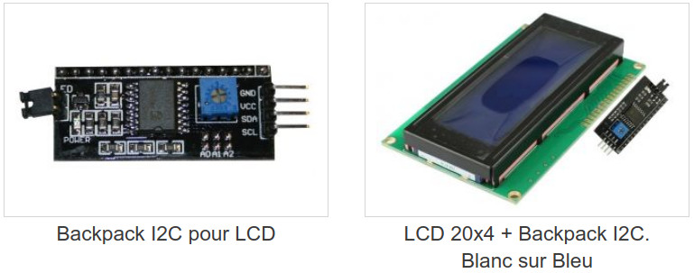
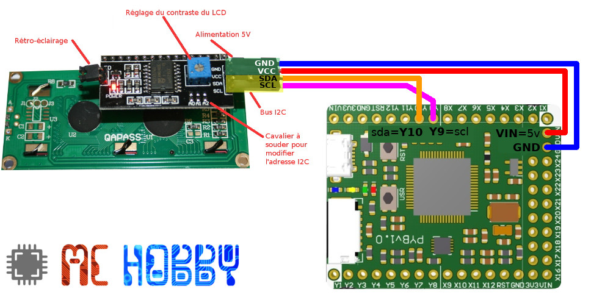
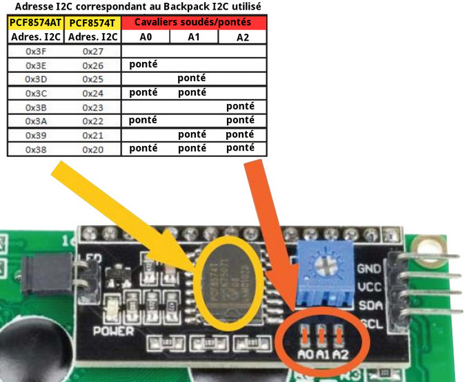
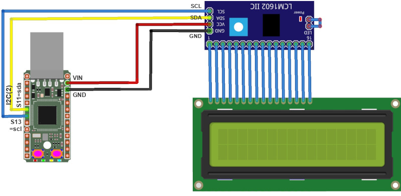
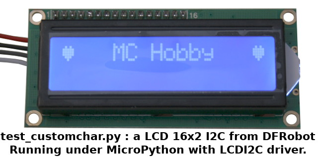
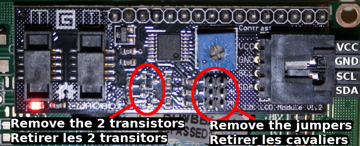
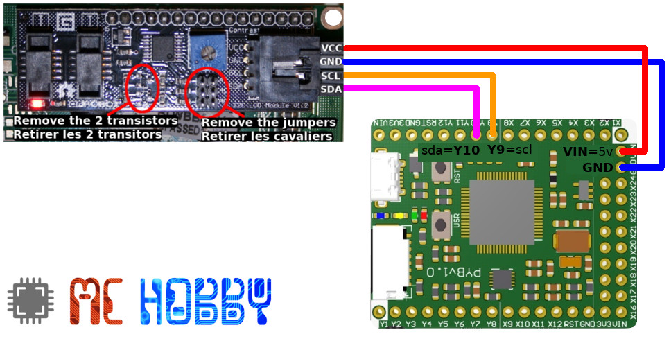

[Ce fichier existe aussi en FRANCAIS](readme.md)

# Using an I2C LCD (liquid crystal) display with MicroPython PyBoard


The library available in this projet does work with a [LCD 16x2](https://shop.mchobby.be/fr/afficheur-lcd-tft-oled/176-lcd-16x2-extra-blanc-sur-bleu-3232100001763.html) + [I2C backpack](https://shop.mchobby.be/fr/afficheur-lcd-tft-oled/882-lcd-20x4-backpack-i2c-blanc-sur-bleu-3232100008823.html), a [LCD 20x4 fitted with I2C backpack](https://shop.mchobby.be/fr/afficheur-lcd-tft-oled/881-lcd-20x4-backpack-i2c-blanc-sur-bleu-3232100008816.html) or with [LCD I2C display from DFRobot](https://shop.mchobby.be/fr/nouveaute/1807-afficheur-lcd-16x2-i2c-3232100018075-dfrobot.html) ([lien vers DFRobot](https://www.dfrobot.com/product-135.html?search=dfr0063&description=true)).



This `lcdi2c.py` library can be used to control thoses displays.

# Library

The library must be copied on the MicroPython board before using the examples.

On a WiFi capable plateform:

```
>>> import mip
>>> mip.install("github:mchobby/esp8266-upy/lcdi2c")
```

Or via the mpremote utility :

```
mpremote mip install github:mchobby/esp8266-upy/lcdi2c
```

# Wiring

## MicroPython Pyboard

The Pyboard is 5V tolerant, so it is possible to wire directly the display to the Pyboard.



The bakcpack address on the I2C bus depend on the following:
* The king of I2C chip used PCF857AT or PCF8574T
* The I2C chip address set with the A0, A1, A2 jumper

You can easily identify such informations from the following picture:



LThe default I2C address of the driver is 0x27. If you want to use a different I2C address then you can mention it when creating the driver instance like demonstrated here below.

```
# Default I2C address (0x27)
lcd = LCDI2C( i2c, cols=16, rows=2 )

# Custom I2C address
lcd = LCDI2C( i2c, cols=16, rows=2, address=0x38 )
```

## Use a PYBStick

As the Pyboard, the PYBStick is 5V tolerant on most of its I/O. So the display can be wired directly on the PYBStick.



## Using the I2C LCD Display of DFRobot

You can also use the [I2C LCD display from DFRobot](https://www.dfrobot.com/product-135.html?search=dfr0063&description=true) with the Pyboard.



The I2C backpack must be slightly modified to remove the two Q1 & Q2 transistor that distrubs the I2C bus communication with the Pyboard.

It will also be necessary to remove the 3 address jumper to configure the 0x27 default address.



then just use few wire the connect it the Pyboard



# Test code

Prior to use the display, it will be necessary to install the `lcdi2c.py` library on the MicroPython board.

The following example script is also available in the [`test_simple.py`](examples/test_simple.py) file. It shows the major feature available in the library.

```
from machine import I2C
from lcdi2c import LCDI2C
from time import sleep

# Pyboard - SDA=Y10, SCL=Y9
i2c = I2C(2)

# Initialize the LCD display
lcd = LCDI2C( i2c, cols=16, rows=2 )
lcd.backlight()

# Display a message (not automatique linefeed)
lcd.print("Hello, from MicroPython !")
sleep( 2 )
# Horizontal scrolling
for i in range( 10 ):
	lcd.scroll_display()
	sleep( 0.500 )

# Backlight control
for i in range( 3 ):
	lcd.backlight(False)
	sleep( 0.400 )
	lcd.backlight()
	sleep( 0.400 )

# Clear the display
lcd.clear()

# Move the cursor + display text
lcd.set_cursor( (4, 1) ) # Tuple avec Col=4, Row=1, index de 0 à N-1
lcd.print( '@' )
# or combine positionning + display with a single print() call
lcd.print( '^', pos=(10,0) )
lcd.print( '!', pos=(10,1) )
sleep( 2 )

# Clear the display
lcd.clear()
lcd.home()  # Cursor @ home position
lcd.cursor() # Show the cursor
lcd.blink()  # Blinking cursor
lcd.print( "Cursor:" )
```

The following example shows how to create a custom char and display it on the LCD. The script is also available in the file ['test_customchar.py'](examples/test_customchar.py)

You can quickly create a custom char by using the following online generator  "[LCD Custom Character Generator](https://maxpromer.github.io/LCD-Character-Creator/)".

```
from machine import I2C
from lcdi2c import LCDI2C

# Pyboard - SDA=Y10, SCL=Y9
i2c = I2C(2)
# ESP8266 under MicroPython
# i2c = I2C(scl=Pin(5), sda=Pin(4))

# LCD display initialization
lcd = LCDI2C( i2c, cols=16, rows=2 )
lcd.backlight()

# Index from 0 to 7. The char definition (charmap) is composed with 8 bytes of 5 bits each.
# Use the charmap generator on https://maxpromer.github.io/LCD-Character-Creator/
lcd.create_char( 0,
	[ 0b00000,
	  0b01010,
	  0b11111,
	  0b11111,
	  0b11111,
	  0b01110,
	  0b00100,
	  0b00000 ] )

# Display the char 0 at position (0,0)
lcd.home()
lcd.write( 0 )
lcd.print( 'MC Hobby', (4,0) )
lcd.set_cursor( (15,0) )
lcd.write( 0 )
```

Other examples:
* [`test_raw.py`](examples/test_raw.py) : demonstrate how to send raw data to the display.
* [`test_autoscroll.py`](examples/test_autoscroll.py) : démonstrate the autoscroll usage.

# Shopping list
* [MicroPython boards](https://shop.mchobby.be/fr/56-micropython) at MC Hobby
* [LCD 16x2](https://shop.mchobby.be/fr/afficheur-lcd-tft-oled/176-lcd-16x2-extra-blanc-sur-bleu-3232100001763.html) + [backpack I2C](https://shop.mchobby.be/fr/afficheur-lcd-tft-oled/882-lcd-20x4-backpack-i2c-blanc-sur-bleu-3232100008823.html) at MC Hobby.
* [LCD 20x4 display with I2C backpack](https://shop.mchobby.be/fr/afficheur-lcd-tft-oled/881-lcd-20x4-backpack-i2c-blanc-sur-bleu-3232100008816.html) at MC Hobby
* [LCD I2C display of DFRobot](https://shop.mchobby.be/fr/nouveaute/1807-afficheur-lcd-16x2-i2c-3232100018075-dfrobot.html) at MC Hobby
* [LCD I2C display of DFRobot](https://www.dfrobot.com/product-135.html?search=dfr0063&description=true) at DFRobot
